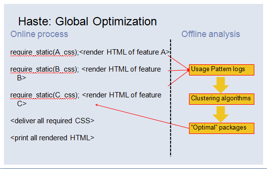

# 让我们再聊聊浏览器资源加载优化

## Old Days

几乎每一个前端程序员都知道应该把script标签放在页面底部。关于这个经典的论述可以追溯到Nicholas的`High Performance Javasript`，在第一章`Loading and Execution`中，他建议这么做的原因如下：

>Put all `<script>` tags at the bottom of the page, just inside of the closing  `</body>`
tag. This ensures that the page can be almost completely rendered before script
execution begins.

简而言之因为单线程的缘故，浏览器加载脚本继而执行脚本，会引起页面的渲染被暂停，甚至还会阻塞其他资源，比如图片。为了更快的给用户呈现网页内容，更好的用户体验。应该把脚本放在页面底部，使它最后才加载。

不仅仅是脚本的位置，包括我们常常聊到的一些优化技巧，比如为了减少HTTP请求，尽可能多的把样式和脚本合并成一个文件比如css sprites那样……其实不知道你有没有想过，时至今日这些做法是否仍然可行？是否有值得商榷的地方，或者说值得改进的地方。这也是我为什么在标题中加使用“再”这个字的原因。`No Silver Bullet`，没有什么是万能的，关键是要看你的业务需要什么，你对性能有什么样的要求。

## Pre-loader

### 什么是pre-loader

首先让我们看一看这样一个资源分布的[页面](http://stevesouders.com/cuzillion/?c0=hc1hfff2_0_f&c1=hj1hfff2_0_f&c2=bi1hfff2_0_f&c3=bi1hfff2_0_f&c4=bi1hfff2_0_f&c5=bi1hfff2_0_f&c6=bi1hfff2_0_f&c7=bi1hfff2_0_f&c8=bi1hfff2_0_f&c9=bi1hfff2_0_f&c10=bj1hfff2_0_f&c11=bj1hfff2_0_f&c12=bj1hfff2_0_f&t=1312331291063)：

```
<head>
    <link rel="stylesheet" type="text/css" href="">
    <script type="text/javascript"></script>
</head>
<body>
    
    
    
    
    
    
    
    
    <script type="text/javascript"></script>
    <script type="text/javascript"></script>
    <script type="text/javascript"></script>
</body>
```

这个页面的特点是，一个外链脚本置于头部，三个脚本放在页面的底部，并且是故意放在一系列img之后，在Chrome中页面加载的网络请求顺序如下：


虽然脚本放在图片之后，但加载仍先于图片（但不会被执行）。为什么会出现这样的情况？为什么故意置后资源能够提前加载？

不同浏览器的制造厂商们(vendor)非常清楚浏览器的瓶颈在哪，虽然实现不同，但原理近似: network, javascript evaluate, reflow, repaint. 针对这些问题，浏览器也在不断的进化，所以我们才能看到更快的脚本引擎，调用GPU的渲染机制等一推陈出新的优化技术和方案。

同样在资源加载上，早在IE8开始，有一种叫做`lookahead pre-parser`(在Chrome中称为pre-loader)的机制就已经开始在不同浏览器中实现。IE8的进步除了将每台host最高并行下载的资源数从2提升至6，并且能够允许并行下载脚本文件，最后就是加入了这种机制

同样以上面的页面为例，我看看IE7下的瀑布图：


很明显底部的脚本并没有提前被加载，并且因为由于单个域名最高并行下载数的限制，资源总是两个两个很整齐的错开并行下载。

但在IE8下，很明显底部脚本被提前：


没有统一的标准描述关于这套机制应该如何实现以及细节应该是什么。但实现原理类似：浏览器通常会准备两个parser，一个(main parser)用于正常的页面解析，而另一个(preload scanner/lookahead pre-parser)则试图去文档中搜寻更多需要加载的资源，但这里的资源通常仅限于外链的js、stylesheet、image；不包括audio、video等，动态插入页面的资源无效。

但细节方面却要加以区分：比如关于preloader的触发时机，并非与解析页面同时开始，而通常是在加载某个head中的外链脚本阻塞了main parser的情况下才启动；也不是所有浏览器的preloader会把图片列为预加载的资源，可能它认为图片加载过于耗费带宽；preloader也并非最优，在某些浏览器中它会阻塞body的解析，有的浏览器将文档被分为head和body两部分进行解析，在head没有解析完之前，body不会被解析，一旦在解析head的过程中触发了preloader，这无疑会导致head的解析时间过长。

### Preloader在响应式设计中的问题

preloader的诞生本是出于一番好意，但好心也有可能办坏事。或者说在我还没来得及告诉你怎么办之前你就把事给办了。

filamentgroup有一种解决响应式设计的图片解决方案[Responsive Design Images](https://github.com/filamentgroup/Responsive-Images/tree/cookie-driven)：

```
<html>
<head>
    <title></title>
    <script type="text/javascript" src="./responsive-images.js"></script>
</head>
<body>
    
</body>
</html>
```

它的工作原理是，当`responsive-images.js`加载完成时，它会检测当前显示器的尺寸，并且设置一个cookie来标记当前尺寸。同时你需要在服务器端准备一个`.htaccess`文件，接下来当你请求图片时，.htaccess中的配置会检测随图片请求异同发送的Cookie是被设置成`medium`还是`large`,这样也就保证根据显示器的尺寸来加载对于的图片大小。


很明显这个方案成功的前提是，js执行先于发出图片请求。但在Chrome下打开，你会发现执行顺序是这样：


`responsive-images.js`和图片几乎是同一时间发出的请求。结果是第一次打开页面给出的是默认小图，如果你再次刷新页面，因为Cookie才种上，服务器返回的是大图。

严格意义上来说在某些浏览器中这不一定是preloader引起的问题，但preloader引起的问题类似：插入脚本的顺序和位置或许是开发者有意而为之的，但preloader的这种“聪明”却可能违背开发者的意图，造成偏差。


如果你觉得上一个例子还不够说明问题的话，最后请考虑使用[`picture`](http://picture.responsiveimages.org/)(或者`@srcset`)的情况：

```
<picture>
    <source src="med.jpg" media="(min-width: 40em)" />
    <source src="sm.jpg"/>
    
</picture>
```

在preloader搜寻到该元素并且试图去下载该资源时，它应该怎么办？一个正常的paser应该是在解析该元素时根据当时页面的渲染情况和布局去下载。而当时这些工作一定还没有完成.

退一步来说，即使不考虑页面渲染的情况，假设preloader在这种情形下会触发一种默认加载策略，那应该是"mobile first"还是"desktop first"？默认应该加载高清还是低清照片？

## JS Loader

理想是丰满的，现实是骨感的。出于种种的原因，我们几乎从不直接在页面上插入js脚本，而是使用第三方的加载器，比如seajs或者requirejs。关于使用加载器和模块化开发的优势在这里不再赘述。但我想回到原点，讨论应该如何利用加载器，就从seajs与requirejs的不同聊起。

如果你还是习惯在部署上线前把所有js文件合并打包成一个文件，那么seajs和requirejs其实对你来说并无差异。但seajs有一点是值得注意的(以下引用都来自于[此贴](http://www.douban.com/note/283566440/)):

>SeaJS只会在真正需要使用(依赖)模块时才执行该模块

|

>而RequireJS会先尽早地执行(依赖)模块, 相当于所有的require都被提前了

你觉得哪一种更合理？比如看一看这个人的回答：

>我个人感觉requirejs更科学，所有依赖的模块要先执行好。如果A模块依赖B。当执行A中的某个操doSomething()后，再去依赖执行B模块require('B');如果B模块出错了，doSomething的操作如何回滚？很多语言中的import,include,useing都是先将导入的类或者模块执行好。如果被导入的模块都有问题，有错误，执行当前模块有何意义？ 

但我想上面的回答忽略了一种可能，是比如B模块并非是对每一用户都必须要加载的，比如只对登陆用户有效：

```
if (user_sign_in) {
    require("dep_B");
}
```

在这种情况下模块A对B的依赖仅限于可能，那是否也应该提前加载B呢？不错，如果不提前加载B模块可能会出现回滚A的问题，但在我看来，这样的风险和提前加载B的成本相比还是值得商榷的。

为什么说值得商榷，举一个实际的例子：比如爱奇艺一个普通的视频播放的页面，我们有没有必要在第一屏加载页面的时候就加载登陆注册，或者评论，或者分享模块呢？因为有非常大的可能用户只是来这里看这个视频，直至看完视频它都不会用到登陆注册功能，也不会去分享这个视频等。加载这些模块不仅仅是前端的问题，还有可能调用后台的接口，并且类似模块的数量也是相当可观的。

如果你同意这么做是合理的，seajs会比requirejs更适合你

由此可见是否提前加载模块取决于用户使用这个模块的概率有多少。Faceboook早在09年的时候就已经注意到这个[问题](http://velocityconf.com/velocity2009/public/schedule/detail/7611)了，只不过他们是以样式碎片来引出这个问题。

假设我们需要在页面上加入A、B、C三个功能，意味着我们需要引入A、B、C对应的html片段和样式碎片(暂不考虑js)，并且最终把三个功能样式碎片在上线前压缩到同一个文件中。但可能过了相当长时间，我们移除了A功能，但这个时候大概不会有人记得也把关于A功能的样式从上线样式中移除。Facebook引入了一套静态资源管理方案(Static Resource Management)解决的方法如下：


具体来说是将样式的“声明”(Declaration)和请求(Delivery)分开，并且决定是否请求一个样式由是否拥有该功能的
html片段决定。

同时也考虑也会适当的合并样式片段，但这完全是基于使用算法对用户使用情况进行分析



这一套系统不仅仅是对样式碎片，对js，对图片sprites的拼合同样有效。

## Delay Execution

脚本最致命的不是加载，而是执行。因为何时加载毕竟是可控的，甚至是异步的，比如通过调整外链的位置，动态的创建脚本。一旦脚本加载完成，它就会被立即执行(Evaluate Script)，页面的渲染也就随之停止，甚至导致在低端浏览器上假死。

更加充分的理由是，大部分的页面不是Single Page Application，不需要依靠脚本来初始化页面。大部分情况下服务器返回的页面是立即可用的，可以想象我们初始化脚本的时间都花在用户事件的绑定，页面信息的丰满(用户信息，个性推荐)。[Steve Souders](http://www.stevesouders.com/)发现在Alexa上排名前十的美国网站上的js代码，只有29%在window.onload事件之前被调用，其他的71%的代码与页面的渲染无关。

Steve Souders的[ControlJS](http://stevesouders.com/controljs/)是我认为一直被忽视的一个加载器，它与Labjs一样能够控制的脚本的异步加载，甚至(包括行内脚本，但不完美)延迟执行。它延迟执行脚本的思路非常简单：既然只要在页面上插入脚本就会导致脚本的执行，那么在需要执行的时候才把脚本插入进页面。但这样一来脚本的加载也被延迟了？不，我们会通过其他元素来加载脚本，比如img或者是object标签，或者是非法的mine type的script标签。这样当真正的脚本被插入页面时，只会从缓存中读取。而不会发出新的请求。

[Stoyan Stefanov](http://www.phpied.com/)在它的博客中详细描述了这个技巧, 如果判断浏览器是IE就是用image标签，如果是其他浏览器，则使用object元素。：

```
window.onload = function () {
 
    var i = 0,
        max = 0,
        o = null,
 
        preload = [
            // list of stuff to preload    
        ],

        isIE = navigator.appName.indexOf('Microsoft') === 0;
 
    for (i = 0, max = preload.length; i < max; i += 1) {
        
        if (isIE) {
            new Image().src = preload[i];
            continue;
        }
        o = document.createElement('object');
        o.data = preload[i];
        
        // IE stuff, otherwise 0x0 is OK
        //o.width = 1;
        //o.height = 1;
        //o.style.visibility = "hidden";
        //o.type = "text/plain"; // IE 
        o.width  = 0;
        o.height = 0;
        
        
        // only FF appends to the head
        // all others require body
        document.body.appendChild(o);
    }
    
};
```
同时它还列举了其他的一些尝试，但并非对所有的浏览器都有效，比如：

- 使用`<link>`元素加载script，这么做在Chrome中的风险是，在当页有效，但是在以后打开需要使用该脚本的页面会无视该文件为缓存

- 改变script标签外链的type值，比如改为`text/cache`来阻止脚本的执行。这么做的风险是在某些浏览器(比如FF3.6)压根连请求都不会发出


### `type=prefetch`

延迟执行并非仅仅作为当前页面的优化方案，还可以为用户可能打开的页面提前缓存资源，如果你对这两种`link`熟悉的话：

-  `<link rel="subresource" href="jquery.js">`: `subresource`类型用于加载当前页面将使用(但还未使用)的资源(预先载入缓存中)，拥有较高优先级

-  `<link rel="prefetch" href="http://NextPage.html">`: `prefetch`类型用于加载用户将会打开页面中使用到的资源，但优先级较低，也就意味着浏览器不做保证它能够加载到你指定的资源。

那么上一节延迟执行的方案就可以作为`subresource`与`prefeth`的回滚方案。同时还有其他的类型：

- `<link rel="dns-prefetch" href="//host_name_to_prefetch.com">`: `dns-prefetch`类型用于提前dns解析和缓存域名主机信息，以确保将来再请求同域名的资源时能够节省dns查找时间，比如我们可以看到淘宝首页就使用了这个类型的标签:


- `<link rel="prerender" href="http://example.org/index.html">`: `prerender`类型就比较逆天了，它告诉浏览器打开一个新的标签页(但不可见)来渲染指定页面，比如这个[页面](http://prerender-test.appsp0t.com/):


这也就意味着如果用户真的访问到该页面时，就会有“秒开”的用户体验。

但现实并非那么美好，首先你如何能预测用户打开的页面呢，这个功能更适合阅读或者论坛类型的网站，因为用户有很大的概率会往下翻页；同时提前渲染页面的网络请求和优先级和GPU使用优先级都比其他页面的要低，浏览器对提前渲染页面也有一定的要求，具体可以参考[这里](http://www.igvita.com/posa/high-performance-networking-in-google-chrome/#prerendering)

### localstorage


