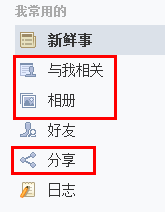
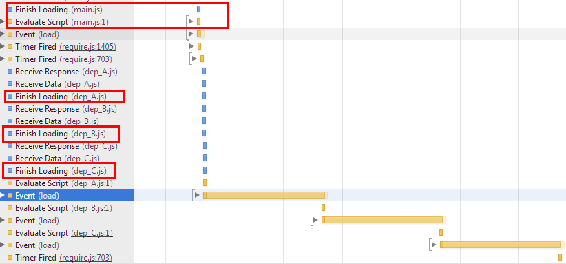
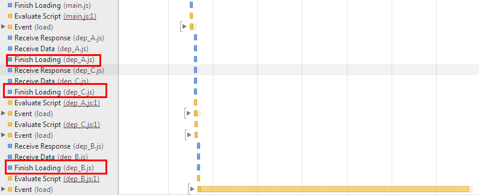

http://www.zhihu.com/question/20342350/answer/14828786
http://www.douban.com/note/283566440/

https://github.com/cmdjs/specification/blob/master/draft/module.md
https://github.com/amdjs/amdjs-api/blob/master/AMD.md

个人认为玉伯聊的比较抽象和宏观，比如标准，概念，机制，社区等。在这里我从业务和操作出发，就自己的经验谈谈require.js和sea.js的异同。这两个加载器和标准没有优劣之分，这里指出的只是差别。具体还是要根据实际情况进行选择

在开始之前我已经假设你对requirejs与seajs语法已经基本熟悉了，如果还没有，请移步这里：

- CMD标准：https://github.com/cmdjs/specification/blob/master/draft/module.md
- AMD标准：https://github.com/amdjs/amdjs-api/blob/master/AMD.md


对比require.js与sea.js，某种意义上说就是对比[AMD](https://github.com/amdjs/amdjs-api/blob/master/AMD.md)与[CMD](https://github.com/cmdjs/specification/blob/master/draft/module.md)标准，两个类库在模块和factory的书写上其实无太大差异，差异在于

- **模块的加载**
- **factory函数**的执行。

这里提前说一句，如果你的网站再上线前习惯把所有的模块打包压缩，其实requirejs和seajs并无太大差别。

## 加载差异

这一小节请允许我照搬一个帖子

玉伯转过的一个帖子[SeaJS与RequireJS最大的区别](http://www.douban.com/note/283566440/)，这个帖子原始(不包括后记)的最后结论是

>RequireJS你坑的我一滚啊, 这也就是为什么我不喜欢RequireJS的原因, 坑隐藏得太深了.

|

>SeaJS是异步加载模块的没错, 但执行模块的顺序也是严格按照模块在代码中出现(require)的顺序, 这样才更符合逻辑吧! 你说呢, RequireJS?

而RequireJS会先尽早地执行(依赖)模块, 相当于所有的require都被提前了, 而且模块执行的顺序也不一定100%就是先mod1再mod2
因此你看到执行顺序和你预想的完全不一样! 颤抖吧~ RequireJS!


因为他认为他的测试代码

```
define(function(require, exports, module) {
    console.log('require module: main');

    var mod1 = require('./mod1');
    mod1.hello();
    var mod2 = require('./mod2');
    mod2.hello();

    return {
        hello: function() {
            console.log('hello main');
        }
    };
});
```

运行结果应该是顺序的(sea.js下的结果)：

```
require module: main
require module: mod1
hello mod1
require module: mod2
hello mod2
helo main
```

而不应该是异步的require.js下：

```
require module: mod2
require module: mod1
require module: main
hello mod1
hello mod2
helo main
```

但问题是，为什么`执行模块的顺序`应该是`严格按照模块在代码中出现(require)的顺序`? 并且`这样才更符合逻辑吧`?

如果他以seajs的运行结果来要求requirejs，那requirejs肯定吃亏了。AMD标准从来都没有规定模块的加载顺序，它只是需要保证：

>The dependencies must be resolved prior to the execution of the module factory function, and the resolved values should be passed as arguments to the factory function with argument positions corresponding to indexes in the dependencies array.

评论下方有人(jockchou)的回复更切中要害：

>我个人感觉requirejs更科学，所有依赖的模块要先执行好。如果A模块依赖B。当执行A中的某个操doSomething()后，再去依赖执行B模块require('B');如果B模块出错了，doSomething的操作如何回滚？ 
很多语言中的import, include, useing都是先将导入的类或者模块执行好。如果被导入的模块都有问题，有错误，执行当前模块有何意义？ 

|

>楼主说requirejs是坑，是因为你还不太理解AMD“异步模块”的定义，被依赖的模块必须先于当前模块执行，而没有依赖关系的模块，可以没有先后。

|

>想像一下factory是个模块工厂吧，而依赖dependencies是工厂的原材料，在工厂进行生产的时候，是先把原材料一次性都在它自己的工厂里加工好，还是把原材料的工厂搬到当前的factory来什么时候需要，什么时候加工，哪个整体时间效率更高？显然是requirejs，requirejs是加载即可用的。为了响应用户的某个操作，当前工厂正在进行生产，当发现需要某种原材料的时候，突然要停止生产，去启动原材料加工，这不是让当前工厂非常焦燥吗？ 

这样看来其实两者并无太大差别。

但考虑这样一种业务情况，考虑某一个功能只对登陆用户开放，这样的话requirejs提前把模块加载是否有必要(因为来到你页面的用户到离开也不会登陆)。

这是非常实际的问题，一个页面可以有非常多的功能，比如登陆、分享、留言、收藏……但不一定每一个来到页面的用户都会使用这些功能，如果都作为页面模块的依赖提前加载的话，对页面一定是一个不小的负担。

但seajs可以即用即加载，比如代码可以这么写

```
define(function () {

    if (user_login) {
        require(login_feature_module)
    }    

    document.body.onclick = function () {
        require(show_module)
    }
})
```

我同意这句话：

>很多语言中的import, include, useing都是先将导入的类或者模块执行好。如果被导入的模块都有问题，有错误，执行当前模块有何意义？ 

但个人觉得考虑到页面的性能，可以考虑将要导入模块的懒加载。

你会不会觉得我上面说的懒加载是一种天方夜谭？

但然不是，你去看看现在的人人网个人主页看看



图中标注的“与我相关”、“相册”、“分享”都是在点击之后才加载对于的模块

Facebook的情况更为严重，不仅要考虑内部不同团队的功能模块，还要考虑第三方的功能模块。

早在09年，他们就是用了一套静态资源管理方案(Static Resource Management)，用于管理一个功能所需要的js/css静态文件：


简单来说，就是由页面上有没有功能所需的html片段，来决定是否加载和打包功能所需的js与style。也就是说静态文件需要通过html“声明”之后才可用。

具体可以参考这里：http://velocityconf.com/velocity2009/public/schedule/detail/7611


## 执行差异

为了增强对比，我们在定义依赖模块的时候，故意让它的factory函数要执行相当长的时间，比如1秒：

```
// dep_A.js定义如下，dep_B/dep_C定义同理

define(function(require, exports, module) {
    
    (function(second) {
        var start = +new Date();
        while (start + second * 1000 > +new Date()) {}
    })(window.EXE_TIME);

    // window.EXE_TIME = 1；此处会连续执行1s

    exports.foo = function() {
        console.log("A");
    }
})

// main中同时加载三个相同模块

//require.js
require(["dep_A", "dep_B", "dep_C"], function(A, B, C) {

});


//sea.js
define(function(require, exports, module) {

    var mod_A = require("dep_A");
    var mod_B = require("dep_B");
    var mod_C = require("dep_C");
});

```

requirejs加载的瀑布图：



seajs加载的瀑布图：



如果把一个模块的执行拆分为执行define和执行factory函数的话(对requirejs和seajs都适用)，从上图可以看出：

- requirejs：一个模块的factory函数执行是紧跟随在define(也就是Evaluate Script脚本模块文件)之后

- seajs: 执行一个模块的factory函数需要等待所有模块define完毕。

重点不是这些，我想说的是我在seajs中看到一个闪光点。

在上面一节中我提到了懒加载模块，在加载模块的时候需要临时请求模块文件，执行factory函数。

但如果我们在载入页面时把懒加载的模块仅仅是执行define(从上面两个图可以看出define的代价是非常小的)，而设法让它不执行factory函数。

在真正需要懒加载的时候只要执行factory函数即可。这样不是能够让模块响应更及时，更靠谱？

这是可以实现的。但技术细节就不赘述了。这可以作为优化模块加载的一种方案。


