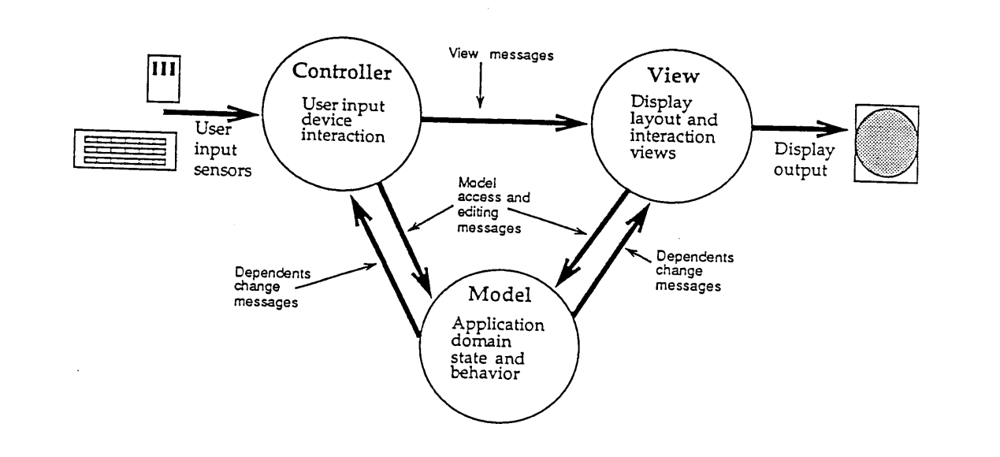
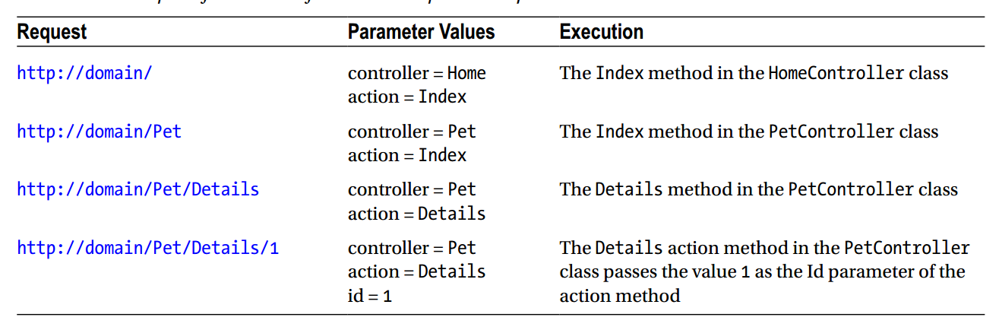

# What is maintainable code?

http://singlepageappbook.com/:

- it is easy to understand and troubleshoot
- it is easy to test
- it is easy to refactor

# What is hard-to-maintain code?

- it has many dependencies, making it hard to understand and hard to test independently of the whole
- it accesses data from and writes data to the global scope, which makes it hard to consistently set up the same state for testing
- it has side-effects, which means that it cannot be instantiated easily/repeatably in a test
- it exposes a large external surface and doesn't hide its implementation details, which makes it hard to refactor without breaking many other components that depend on that public interface

# SOC

Separation of concerns

# OOD&OOP原则

S.O.L.I.D

- **S**: The Single Responsibility Principle 
    - 单一功能原则: 让一个类只做一种类型责任，当这个类需要承当其他类型的责任的时候，就需要分解这个类。

- **O**: The Open Closed Principle 
    - 开放封闭原则: 软件实体应该是可扩展，而不可修改的。也就是说，对扩展是开放的，而对修改是封闭的。

- **L**: The Liskov Substitution Principle
    - 里氏替换原则: 一个子类的实例应该能够替换任何其父类的实例


- **I**: The Dependency Inversion Principle
    - 依赖反转原则/依赖倒置/注入依赖: 1. 高层模块不应该依赖于低层模块，二者都应该依赖于抽象; 2. 抽象不应该依赖于细节，细节应该依赖于抽象


- **D**: The Interface Segregation Principle
    - 接口分离原则: 多个特定客户端接口要好于一个宽泛用途的接口

# Traditional MVC

## Model(domain Model)

http://st-www.cs.illinois.edu/users/smarch/st-docs/mvc.html:

- **The model manages the behavior and data of the application domain**, 
- **responds to requests for information about its state (usually from the view)**, 
- **and responds to instructions to change state (usually from the controller).**

http://www.itu.dk/courses/VOP/E2005/VOP2005E/8_mvc_krasner_and_pope.pdf

The model of an application is the domain-specific(domain model) software simulation or implementation of the 
application's central structure. **This can be as simple as an integer (as the model of a counter) or 
string (as the model of a text editor), or it can be a complex object that is an instance of a subclass 
of some Smalltalk-80 collection or other composite class**.

## View

**http://st-www.cs.illinois.edu/users/smarch/st-docs/mvc.html:**

The view manages the graphical and/or textual output to the portion of the bitmapped display that is allocated to its application.

**http://www.itu.dk/courses/VOP/E2005/VOP2005E/8_mvc_krasner_and_pope.pdf**

In this metaphor, views deal with everything graphical; **they request data from their model, and 
display the data.** They contain not only the components needed for displaying but can also 
contain subviews and be contained within superviews. 

## Controller

**http://st-www.cs.illinois.edu/users/smarch/st-docs/mvc.html:**

The controller interprets the mouse and keyboard inputs from the user, commanding the model and/or the view to change as appropriate.

## Communication

In the **Passive Model**, the controller can assume responsibility for notifying the view of any changes because it interprets the user's requests.

1. simply notify the view that something has changed -- the view could then request the current state of the string from its model
2. or the controller could specify to the view what has changed.

The model is totally "unaware" of the existence of either the view or the controller and of its participation in an MVC triad.

**But all models cannot be so passive.** Suppose that the data object changes as a result of messages from objects other than its view or controller. In that case the object which depends upon the model's state -- its view -- must be notified that the model has changed.

**View and Controller**

**Each view is associated with a unique controller and vice versa. Instance variables in each maintain this tight coupling. A view's instance variable controller points at its controller, and a controller's instance variable view points at its associated view. And, because both must communicate with their model, each has an instance variable model which points to the model object.**

Each view may be thought of as being closely associated with a 
controller, each having exactly one model, but a model may have many view/controller pairs.

**Broadcasting Change**

http://www.itu.dk/courses/VOP/E2005/VOP2005E/8_mvc_krasner_and_pope.pdf

**In the scheme described above, views and controllers have exactly one model, but a model can 
have one or several views and controllers associated with it.** To maximize data encapsulation and 
thus code reusability, views and controllers need to know about their model explicitly, but models 
should not know about their views and controllers.
A change in a model is often triggered by a controller connecting a user action to a message sent 
to the model. This change should be reflected in all of its views, not just the view associated with 
the controller that initiated the change.

**Dependents**

http://www.itu.dk/courses/VOP/E2005/VOP2005E/8_mvc_krasner_and_pope.pdf

To manage change notification, the notion of objects as dependents was developed. **Views and 
controllers of a model are registered in a list as dependents of the model, to be informed whenever 
some aspect of the model is changed. When a model has changed, a message is broadcast to notify 
all of its dependents about the change.** This message can be parameterized (with arguments), so 
that there can be many types of model change messages. Each view or controller responds to the 
appropriate model changes in the appropriate manner

## Workflow



# The most importent thing

- Responsibility
- Communication

# Autonomous View & Model1

Puts all presentation state and behavior for a window in a single class.

# Other:

- MVP
- MVVM

# Model2

## Controller:

**In the world of the MVC pattern, controllers process incoming HTTP requests from 
users. Each HTTP request is handled by a specific controller.** ASP.NET MVC implements the concept of controllers 
with .NET classes that have **methods** to process such requests. The methods in a controller are called action methods
because they return an object of type ActionResult.



## Action

- ViewResult: Used to return a view to render HTML in the browser. This is the most common 
ActionResult.
- FileResult: Used to return binary content (e.g., if you want to download a file).
- JsonResult: Used to return an object in JavaScript Object Notation (JSON) format.
- JavaScriptResult: Used to return JavaScript code.


```
public ActionResult Display()
{
	var name = (string)RouteData.Values["id"];
	var model = PetManagement.GetByName(name);
	if (model == null)
		return RedirectToAction("NotFound");
	return View(model);
}

public ActionResult NotFound()
{
	return View();
}
```


File result

```
public FileResult DownloadPetPicture()
{
	var name = (string)RouteData.Values["id"];
	var picture = "/Content/Uploads/" + name + ".jpg";
	var contentType = "image/jpg";
	var fileName = name + ".jpg";
	return File(picture, contentType, fileName);
}
```

## Model

- Data model:The objects in the data model represent classes that interact with a database.
- **Business model**: The classes in the business model normally implement functionality that represents business 
rules or processing (for example, the calculation of a particular shipping cost for a shopping cart 
item based on the weight of the item being purchased).
- View model: The view model classes provide information passed in from controllers to views, so that the views 
know what to render in the user’s browser. For example, a view model class can contain product 
information that is used by a view to display the product name, price, and images. The function 
of a view model class is not to process anything; rather, its only function is to contain data and 
optional metadata for the view to render properly.

## View

```
	<header>
	<div class="content-wrapper">
		<div class="float-left">
			<p class="site-title">
				@Html.ActionLink("your logo here", "Index", "Home")
			</p>
		</div>
		<div class="float-right">
			<section id="login">
				@Html.Partial("_LoginPartial")
			</section>
			<nav>
				<ul id="menu">
					<li>@Html.ActionLink("Home", "Index", "Home")</li>
					<li>@Html.ActionLink("About", "About", "Home")</li>
					<li>@Html.ActionLink("Contact Us", "Contact", "Home")</li>
				</ul>
			</nav>
		</div>
	</div>
	</header>
```

# Other:

- fat model skinny controller
- "贫血" VS "充血"
