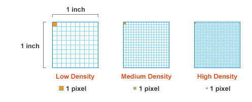

如果你是一个像我一样刚开始接触移动Web开发的前端工程师，那么你或许也遇到了和我同样遇到的问题：有太多相似的概念需要掌握和区分，并且还可能牵涉到具体的设备和硬件。没关系，这篇文章我把他们一一列举和联系起来。我们从最简单的需求出发，把这些概念串联起来。

## CSS像素是相对的

假设我们有一台非常普通的显示器，最佳分辨率为1280x800。此时我们用浏览器打开一个测试页面，浏览器最大化，页面上有一个320x200(单位：px)的红色容器，那么我们只要复制这个容器四份，从左至右依次排列，便能在宽度上占满整个浏览器，也就占据了整个屏幕。

假设情况变的复杂一点，我们将浏览器页面放大至200%（“Ctrl键”加上“+号键”）。此时会发生什么？本来只占页面四分之一宽度的容器已经占据了屏幕的一半。需要注意的是，我们既没有增加容器的宽度，也没有改变屏幕的分辨率。放大页面实际上操作的是页面的像素，**也就是我们把像素拉伸到原来的两倍了**。 这里被拉伸的像素，也就是容器的长和宽单位，我们称之为CSS像素(CSS pixel)。

CSS像素与屏幕像素1：1同样大小时：

CSS像素(黑色边框)开始被拉伸，此时1个CSS像素大于1个屏幕像素

那么在未被拉伸的情况下，原始像素的大小是应该是多大呢？这是由设备的屏幕像素决定的，这里我们可以称之为物理像素（physical pixel）或者设备像素（device pixel）。大部分显示器都是基于点阵的，也就是说通过一系列的小点排成一个大矩形，每个小点显示不同的颜色来形成图像。在上面的例子中，显示器分辨率宽度为1280，也就意味着显示器上有1280个设备物理像素点。当然这里的考虑只是最佳分辨率的情况。

这里例子说明了一件非常重要的事：CSS像素从来只是一个**相对值**。 W3C从来就没有规定过一个单位的CSS像素值需要和一个设备像素值相等。那么设备像素和CSS像素之间应该是具备什么样的关系呢，请允许我再引入一个概念：PPI，再继续我们下面的讨论。

## PPI

这个概念在不同上下文中意义是不同的，在这里我们只讨论在显示器上的情况。并且它经常和DPI混淆。文章的最后会介绍PPI的在其他语境中的一些情况和对DPI的区别。

PPI全称为Pixel Per Inch，译为每英寸像素取值，更确切的说法应该是像素密度，也就是衡量单位物理面积内拥有像素值的情况。

我们当然希望PPI值越高越好，因为更高的PPI意味着在同一物理屏幕上能够展现更多的画面细节，也就意味着更平滑的画面。

注意在上一节我们讨论的时候，我故意遗漏一种像素情况，我称之为分辨率下像素。在Windows下，一台23寸显示器的最佳分辨率可以是1920x1080，也就意味着显示器上有1920x1080个物理像素。但显示器的分辨率是可以调节的，我们当然可以降低显示器的分辨率至1440x900。于是这个时候情况变得更复杂了，多个物理像素组成一个分辨率像素，多个分辨率像素组成一个CSS像素。

OK，现在我们认识了三种像素，CSS像素，分辨率下像素，物理像素。那么PPI中的pixel究竟指的是哪一种像素？

**PPI中的pixel指的应该是物理像素**。

**但是**在维基百科对[PPI](http://en.wikipedia.org/wiki/Pixel_density)的解释中，pixel被解释为了分辨率下像素：

>The apparent PPI of a monitor depends upon the screen resolution (that is, the number of pixels) and the size of the screen in use; a monitor in 800×600 mode has a lower PPI than does the same monitor in a 1024×768 or 1280×960 mode.

上面这段话是在说，同一尺寸的显示器在800x600分辨与1024x768分辨率下的像素密度明显是不同的，明显后者单位面积内的像素更多，当然后者的像素密度更高。

**但问题是**，我们在通常比较设备PPI时，一定是比较最优或者是极限情况，这样才能体现出设备的优势。换句话说也就一定是最佳分辨率状态下，也就是等于物理分辨率的情况下。

但PPI过高同样也会带来问题，相同的图片素材，在越高的设备上会显示的越小，以下是一个像素(1 pixel)在不同PPI设备上的可见情况：

像素Pixel的本意就是Picture Element，是图片的最小描述单位，像素过小也就意味着图片素材被小时过小。也就是说如果你想让你的图片在同样屏幕尺寸大小，但PPI不同的设备上看到的大小是一致的话，在高PPI设备上你的图片必须具有更高的像素和更大的尺寸。

那么可以预见一种很糟糕的情况是，假设PPI提高了一倍（长宽各一倍），很可能程序界面缩小了4倍（因为长和宽同时是原来的两倍）。以Surface Pro 3为例，它的默认分辨率是2160x1440，也就是说Surface这台设备的屏幕物理像素有2160x1440个点，同时默认分辨率情况下，一个点物理像素点对应于一个分辨率像素。 但因为屏幕只有12寸，像素密度非常高，于是就出现了上面的问题，各个文字和图标被缩的太小了，电脑是完全不可用的。但Windows默认将所有的文本和素材（实际上就是分辨率像素）都放大了1.5倍（在“屏幕分辨率”-“放大或缩小文本和其他项”中进行了设置），原来是一个物理像素对应一个分辨率像素，现在则是1.5个物理像素对应一个分辨率像素，因为物理像素数量是固定的，也就意味着分辨率像素缩小了，那么实际上现在的分辨率已经变成了1440(2160/1.5)x900(1440/1.5)。

官方告诉我们在2160x1440的分辨率下的原始PPI为216（由此我们可以推算出屏幕的长为10英寸），因此在放大1.5倍之后的像素密度应该是144PPI(1440/10)。但是这样的话视觉体验会不会差了很多，其实是不一定的。这个问题我们聊到DPI的时候可以再谈。同时是因为微软的历史包袱过于沉重，放大之后仍然存在问题，比如大部分软件如果使用的是点阵字体而非适量字体的话（点阵在这里可以理解为与位图类似），强制拉伸会出现字体虚化的情况（基本上大部分软件都有这样的情况）。

这里可以拿来相提并论的是Retina版本的Macbook Pro，它使用的也是同样解决办法，显示器的物理像素点实际上有2880x1880，但默认的最优分辨率只有1440x900，刚好是物理像素的一半，也就是说操作系统默认就使用了4:1的缩放（iPhone也是这么处理的）。	但是这就意味一个分辨率下像素面积被拓展了放大了四倍，那么和Windows一样会导致图片模糊虚化问题，导致像素的颗粒增大和肉眼可见。 那么如何继续发挥Retina的优势呢，苹果鼓励开发者准备两份素材，普通和高清素材（通过文件名称来区分，比如普通素材名称为apple.png，那么高清素材名称就为apple@2x.png），自然高清素材是普通素材面积的四倍，系统会优先使用高清素材，但自动缩小到普通素材的大小，这样图像也就更加细腻了，也就解决了图片被拉伸的问题。

## 番外篇

## CSS Reference Pixel

退一步来说，即使我们规定了CSS像素值需要与设备像素大小相等，但当随着手持设备距离人的远近不同， 都会导致设备上的CSS像素的可见大小也会发生变化（类似于巨大的月亮因为离地球遥远在人眼看来也不过像硬币一样大小），甚至还未每台设备上物理像素的大小不同。为了保证CSS像素在不同设备和不同距离上观测到的大小保持一致保持连贯性。W3C定义了一个CSS相对像素（CSS reference pixel）的概念

> It is recommended that the reference pixel be the visual angle of one pixel on a device with a pixel density of 96dpi and a distance from the reader of an arm's length. For a nominal arm's length of 28 inches, the visual angle is therefore about 0.0213 degrees.

W3C把距离自己一个手臂长度（约28英寸），像素密度为96dpi设备上的一个物理像素设为参考像素。同时可以算出眼睛看到参考像素的视野角度为0.0213度

有了这一系列参照，通过三角函数关系，我们可以算出同样一台设备在不同距离下CSS像素理想的大小。 当远离观察者时像素应该增大，当靠近观察者时像素应该减小。

这么做的优势在于无论设备距离观察者距离是多少，也无论设备的像素密度和物理像素大小是多少，观察者看到的CSS像素是一致的，保证了用户体验的一致性：

这个概念已经推出相当长一段时间了，但是一直得到很少的注意。当然不得不承认也缺少一定的可行性

