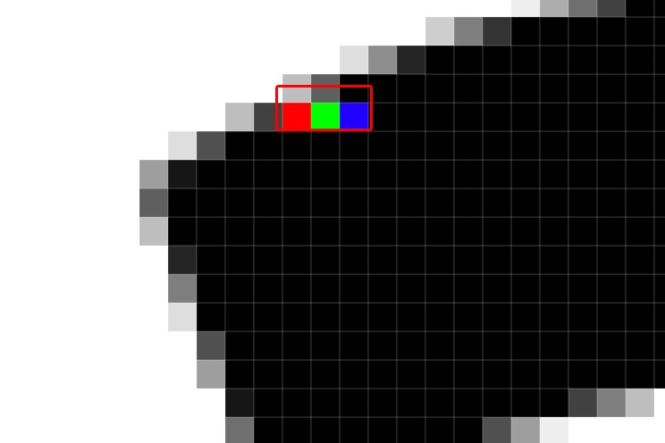
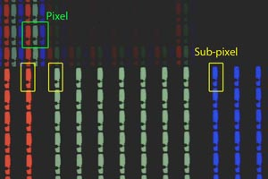
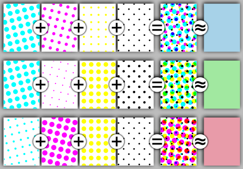

如果你是一个像我一样刚开始接触移动Web开发的前端工程师，那么你或许也遇到了和我同样遇到的问题：有太多相似的概念需要掌握和区分，并且还可能牵涉到具体的设备和硬件。没关系，这篇文章我把他们一一列举和联系起来。我们从最简单的需求出发，把这些概念串联起来。


我们将从一个泛滥的概念开始谈论起，PPI

## PPI

### 什么是PPI

PPI的复杂之处在于他所属的上下文环境不同，意义会完全不一样。就好像”师傅“这个词在西游记里可以指唐僧，可以是正在询问的路人，也可以是公交车司机，也可以是你学艺的老师。同理，当我们谈论显示设备时可以是指像素密度，可以和图片打印相关一个参数，也可以和dpi互换。

这个概念在不同上下文中意义是不同的，在这里我们只讨论在显示器上的情况。并且它经常和DPI混淆。文章的最后会介绍PPI的在其他语境中的一些情况和对DPI的区别。

首先我们先谈论PPI处于描述显示设备参数的情况。

PPI全称为Pixel Per Inch，译为每英寸像素取值，更确切的说法应该是像素密度，也就是衡量单位物理面积内拥有像素值的情况。


如上图所示，在1英寸单位内面积内拥有的像素越多，PPI值就越高。

但像素密度的实际意义是什么？或高或低对设备显示来说有什么影响？

一般来说，我们当然希望PPI值越高越好，因为更高的PPI意味着在同一物理屏幕上能够展现更多的画面细节，也就意味着更平滑的画面。原理就如下图所示：


### 什么是Pixel

#### 设备像素

这里我中断一下，上面我提到过非常多次的像素（pixel）。你有没有考虑过，Pixel Per Inch中的pixel究竟值的是什么？

无论是早期的CRT显示器还是如今的LCD显示器，都是基于点阵的。也就是说通过一些列的小点排列成一个大的矩形，不同的小点通过显示不同的颜色来显示成图像。比如下图就是LCD显示器上一个6x6个小点排列成的矩阵：


注意每一个点（dot，也可以称之为pixel）又是由三个子像素(subpixel，注意早期的CRT显示器是不存在subpixel的)红绿蓝组合而成。当需要显示图片信息时，它的工作原理可以如下图所示：




OK。那么这样一个显示器上的像素我们就称之为物理像素(physical pixel)或者设备像素(device pixel)

#### CSS像素

作为一个Web开发者，我们接触的更多是给元素一个以像素为单位的宽度值。这里的像素我们称之为CSS像素。

CSS像素有什么特别的地方？我们看看下面这个例子：

假设我们用PC浏览器打开一个页面，浏览器此时的宽度为800px(这里的px我们可以假设为设备像素)。页面上同时又一个400px宽的块级元素容器。很明显此时块状容器应该占页面的一半。

但如果我们把页面放大（通过“Ctrl键”加上“+号键”），放大为200%，也就是原来的两倍。此时块状容器则横向占满了整个浏览器。

吊诡的是此时我们既没有调整浏览器窗口大小，也没有改变块状元素的css宽度，但是它看上去却变大了一倍。这是为什么？——原来我们刚刚把CSS像素放大为了原来的两倍。

CSS像素与屏幕像素1：1同样大小时：


CSS像素(黑色边框)开始被拉伸，此时1个CSS像素大于1个屏幕像素


也就是说默认情况下通常一个CSS像素等于一个物理像素，但是浏览器的放大操作让一个CSS像素等于了两个设备像素。在后面你会看到更复杂的情况，在高PPI设备或者移动设备上，CSS像素甚至在默认状态下就由多个物理像素组成。

通过上面这个例子我想传递一个非常重要的概念，就是CSS像素从来都只是一个相对值。W3C也从来都是如此规定的。

#### 正确答案

回到PPI上来，现在我们有了两种像素，设备像素和CSS像素。那么PPI中的像素是指哪一种？答案是设备像素

**PPI中的pixel指的应该是物理像素**。

**但是**在维基百科对[PPI](http://en.wikipedia.org/wiki/Pixel_density)的解释中，pixel被解释为了分辨率下像素：

>The apparent PPI of a monitor depends upon the screen resolution (that is, the number of pixels) and the size of the screen in use; a monitor in 800×600 mode has a lower PPI than does the same monitor in a 1024×768 or 1280×960 mode.

上面这段话是在说，同一尺寸的显示器在800x600分辨与1024x768分辨率下的像素密度明显是不同的，明显后者单位面积内的像素更多，当然后者的像素密度更高。

这里考虑了另一种情况，即在同一显示器下因为分辨率调整导致显示器的像素密度不同。这里的像素虽然是不是在浏览器中显示，但原理也类似于CSS像素，即由多个物理像素组成一个指定分辨率下的像素，仍然算作一个类型的像素。

**但问题是**，这样的比较是没有任何意义的，我们在通常比较PPI时，首先是夸设备比较，在这一定是比较最优或者是极限情况，这样情况下分辨率通常是与物理像素意义匹配。这样才能体现出设备的优势。换句话说也就一定是最佳分辨率状态下，也就是等于物理分辨率的情况下。不能说一台23寸的2k显示器和一台1080p显示器因为都能调整到1440x960的分辨率，那么他们的PPI就相同了，即使在这种分辨率模式下真的是相同。

**在再进一步，当我们谈论在谈论一台设备的PPI时，它是一个定值，是一个固定的参数。**

那么PPI怎么计算呢？没错，就和你想的一模一样，用屏幕边的物理像素除以物理尺寸即可，以Samsung Galaxy S4为例：


### Bad Part

但PPI过高同样也会带来问题，相同的图片素材，在越高的设备上会显示的越小，以下是一个像素(1 pixel)在不同PPI设备上的可见情况，随着PPI的增高可视度越来越小：


那么可以预见一种很糟糕的情况是，同一尺寸的屏幕下假设PPI提高了一倍，很可能程序界面缩小了4倍（因为在屏幕尺寸不变的情况下物理像素点面积是原来的1/4）。

以Surface Pro 3为例，它的默认分辨率是2160x1440，也就是说Surface这台设备的屏幕物理像素有2160x1440个点，同时默认分辨率情况下，一个点物理像素点对应于一个分辨率像素。 但因为屏幕只有12寸，像素密度非常高，于是就出现了上面的问题，各个文字和图标被缩的太小了，电脑是完全不可用的。

解决方法是，Windows默认将所有的文本和素材（实际上就是分辨率像素）都放大了1.5倍（在“屏幕分辨率”-“放大或缩小文本和其他项”中进行了设置），原来是一个物理像素对应一个分辨率下的像素，现在则是1.5个物理像素对应一个分辨率下的像素，也就意味着分辨率像素变大了，那么实际上现在的分辨率已经变成了1440(2160/1.5)x900(1440/1.5)（此时如果你尝试用window.screen.width/window.screen.height去检测返回结果也会是1440x900）。


这里留给读者一个问题，这样和直接将PC的分辨率调整为1440x900有什么区别呢？

【待续】

官方告诉我们在2160x1440的分辨率下的原始PPI为216（由此我们可以推算出屏幕的长为10英寸），因此在放大1.5倍之后的像素密度应该是144PPI(1440/10)。但是这样的话视觉体验会不会差了很多，其实是不一定的。这个问题我们聊到DPI的时候可以再谈。同时是因为微软的历史包袱过于沉重，放大之后仍然存在问题，比如大部分软件如果使用的是点阵字体而非适量字体的话（点阵在这里可以理解为与位图类似），强制拉伸会出现字体虚化的情况（基本上大部分软件都有这样的情况）。

这里可以拿来相提并论的是Retina版本的Macbook Pro，它使用的也是同样解决办法，显示器的物理像素点实际上有2880x1880，但默认的最优分辨率只有1440x900，刚好是物理像素的一半，也就是说操作系统默认就使用了4:1的缩放（iPhone也是这么处理的）。	但是这就意味一个分辨率下像素面积被拓展了放大了四倍，那么和Windows一样会导致图片模糊虚化问题，导致像素的颗粒增大和肉眼可见。 那么如何继续发挥Retina的优势呢，苹果鼓励开发者准备两份素材，普通和高清素材（通过文件名称来区分，比如普通素材名称为apple.png，那么高清素材名称就为apple@2x.png），自然高清素材是普通素材面积的四倍，系统会优先使用高清素材，但自动缩小到普通素材的大小，这样图像也就更加细腻了，也就解决了图片被拉伸的问题。

## DevicePixelRatio

接下来进入我们的主角手机身上： 有了物理像素，分辨率像素，CSS像素——那么问题来了，当你在手机上使用浏览器打开一张网页时，网页的宽度应该是多少？

还记得上面说过的Surface和Macbook上应用的缩放技术吗？如何形容缩放后的分辨率与实际的设备分辨率之间的关系呢？DevicePixelRatio就是干这个的，DevicePixelRatio定义如下：

```
window.devicePixelRatio = physical pixels / dips
```

分母dips全称为device-independent pixels，意为*与设备无关像素*。以iPhone4为例，在垂直状态下手机的物理像素宽度有640px，但是因为2:1缩放的关系，手机的分辨率像素只有320px。此时的DevicePixelRatio就为 640 / 320 = 2; 几乎所有的1080P手机都采用了类似的缩放技术，所以大部分手机都有DevicePixelRatio，

## 番外篇：PPI VS DPI

DPI全称为Dots per inch。译为每英寸点数。当你听到人们在谈一台显示设备的DPI时，他们其实仍然是在谈论这台设备的的PPI，此时的dots就代表设备的物理像素，此时的DPI就是设备的像素密度。

如果你查看一张JPG格式的图片属性中的详情，或者使用PHOTOSHOP打开新建一些图 片你会发现在其中有一个以dpi为单位的分辨率的字段。但这个字段对图片来说是没有意义的，在图片生成的时候它是以文件的形式存储在硬件设备上的，换句话说，你能告诉我你八百万像素的图片有多少寸吗？只有当图片被显示，被打印出来时，dpi才有它的意义。

判断一张数码照片的质量好坏只与下面几个因素相关：

1. 文件的大小（像素多少）
2. 生成照片的设备好坏（照相机的传感器或者扫描仪）
3. 照片存储的格式（是否有损）
4. 拍摄者的水平


但是DPI真正的意义是体现在印刷行业中。首先我们要解释DPI中dots是一个什么概念

当一张显示器上的图片打印在图片上的时候，便不再有像素这个观念，取而代之的是印刷设备的每一个“点”：


当你尝试去用放大镜去查看彩色印刷物品上的图片时，从小到大你看到的结果应该是这样的：


为什么会这样？简而言之，印刷的原理是通过半色调(halftone)技术，通过控制CMYK四种颜色点印刷时的每一个印刷点的大小，角度，间隙来模拟出一种颜色的感觉：



那么DPI也就意味着印刷产品中点的稀疏程度，点的密度。

但DPI是否与印刷品的质量有什么关系呢。这个问题比较复杂。

【待续】

【为什么大型显示器和电视的dpi都非常低】

但是当我们谈论一张图片的PPI或者DPI的时候又是另外一回事了。


## CSS Reference Pixel

我们规定了CSS像素值需要与设备像素大小相等，但当随着手持设备距离人的远近不同，设备像素密度的不同，都会导致我们看见的设备上的CSS像素的可见大小发生变化（类似于巨大的月亮因为离地球遥远在人眼看来也不过像硬币一样大小）。为了保证CSS像素在不同设备和不同距离上观测到的大小保持一致保持连贯性。W3C定义了一个CSS相对像素（CSS reference pixel）的概念

> It is recommended that the reference pixel be the visual angle of one pixel on a device with a pixel density of 96dpi and a distance from the reader of an arm's length. For a nominal arm's length of 28 inches, the visual angle is therefore about 0.0213 degrees.


W3C规定，把人眼辨别到，距离自己一个手臂长度（约28英寸），像素密度为96dpi设备上的一个物理像素设为参考像素。同时可以算出眼睛看到参考像素的视野角度为0.0213度


有了这一系列参照，通过三角函数关系，我们可以算出同样一台设备在不同距离下CSS像素理想的大小。 当远离观察者时像素应该增大，当靠近观察者时像素应该减小。


这么做的优势在于无论设备距离观察者距离是多少，也无论设备的像素密度和物理像素大小是多少，观察者看到的CSS像素是一致的，保证了用户体验的一致性：


## `<meta name="viewport">`

接下来进入到这期的主角：手机设备上

我们有了物理像素，分辨率像素，CSS像素——那么问题来了，当你再手机上使用浏览器打开网页时，网页的宽度应该是多少？

首先我们需要了解一个概念：viewport，我常见到的中文译为视口，但个人觉得这个翻译有一些晦涩。 Viewport是用于限制Html元素——“限制”这两个字不是那么好理解。quirksmode上有一篇[文章](http://www.quirksmode.org/mobile/viewports.html)谈到这个概念时打了一个非常形象的比方：

假设body标签内有一个块状元素宽度为10%: `div {width:10%;}`，我们知道当我们缩放浏览器时这个块状元素的宽度也会跟着变化。 这是因为它的宽度占它父元素的10%。那么它的父元素，也就是body元素的宽度是由谁决定的呢？

我们知道一个块状元素默认宽度为它父元素的100%，也就是body元素的宽度与包裹它的html元素宽度相同。那么问题又变成了html元素的宽度是由谁决定的？

答案是浏览器窗口。现在我们可以归纳起来，html元素是被浏览器限制并且包裹起来的。html的宽度就是浏览器的宽度。

但事实上，html元素宽度是占据viewport的100%，而在桌面浏览器中，viewport与浏览器窗口大小刚好相等。**注意，这仅仅是在桌面浏览器上**

OK，在于是我们得到了一个结论，html宽度是由viewport决定的，但是 在桌面浏览器中，viewport大小与浏览器窗口大小相等。

但这一套规则在手机则是无法被执行的。大部分手机的屏幕分辨率目测为400px，如果页面上真的有某一个页面元素仅占10%，也就是40px的话，肉眼几乎是无法分辨的。实际情况应该会更糟糕，iPhone4的Safari默认是以980px来渲染网页的。如果你在Chrome以桌面版的方式访问stackoverflow，那么结果会是这样的:


体验非常糟糕吧，所以的链接几乎都无法准确点击。OK，那么如何解决这个问题？

第一个办法，放大页面。

我们会很习惯的用手势去放大页面。但是要注意我们这里做的仅仅是放大页面，改变的是页面的缩放(scale)，效果与PC上浏览器的Ctrl+"+"类似。但是没有改变页面的布局，此时用于渲染页面布局的layout仍然是980px


第二个办法是，改变布局。
比如下面一个页面上有一张320px宽的图片，如果我们以默认的980px去渲染的话，它会显得过于窄小：


但如果我们可以将渲染它的布局设为320px的话，看上去就会好很多了，同时此时我们也未对页面进行缩放：


当然你也可以结合上一步，同时对页面进行缩放：


不仅仅是放大，即使是在320px的像素下，我们也可以进行缩小：


回归到技术上，以上这些都可以通过viewport标签来解决，比如说上面那个需求，把布局设定为320px，同时进行1.5倍的缩放

```
<meta name="viewport" content="width=320, initial-scale=1.5">
```

具体的设置方法如上图所示，所见即所得，需要设置的属性在content以逗号分割开来，`width`表示页面布局宽度，`initial-scale`代表页面初始状态的缩放比例，如果你不想让用户进行缩放，还可以添加`user-scalable=no`字段来保证用户无法进行缩放。

更重要的是，我们还可以通过设置布局宽度等于手机分辨率宽度来更好的利用响应式设计，比如`width=device-width`，注意这里的`device-width`表示手机的分辨率宽度，而并非手机物理像素宽度。iPhone4在垂直状态下物理像素宽度为640，这里的`device-width`代表的则应该是它的dip像素320px。

给viewport标签添加`width=device-width`适用于这样一种情况：你为移动设备开发的响应式网页，首先你会面临多重分辨率，但是你又没有必要使用到重量级的mediaquery，同时也为了避免手机浏览器使用桌面分辨率宽度去渲染页面，造成可用性的问题。这样让你的响应式页面能够适用大多数的移动设备。

你可能会进一步的以为在iPhone下设置`width=device-width`其实就是与`width=320`一个意思吧？不，你还需要考虑当用户将手机横握时，此时设备宽度就变成了480。但如果你将`width`设置成一个固定的数值时。如论用户手持设备的方向如何，都能保证用于渲染网页的宽度不变。

写到这里我们可以做一个总结，viewport标签的作用是什么？它能够让你撇开设备的干扰，告诉设备你想用什么样的宽度渲染网页。让它听命于你，而不是你听命于他。

上面我们谈到viewport有个半专业的名词成为layout viewport，顾名思义这个viewport专用于页面渲染的控制。还有一种viewport称之为visual viewport可以译为可视窗口。两种viewport的区分如下：


由此可以看出visual viewport就好比是浏览网页的一个窗口，网页正是这窗外的景色。当然我们还会遇见layout viewport与visual viewport大小相等的情况。比如像下面这样：


这也就是我上面描述的`width=device-width`的情况了


HDPI and MDPI phones.


