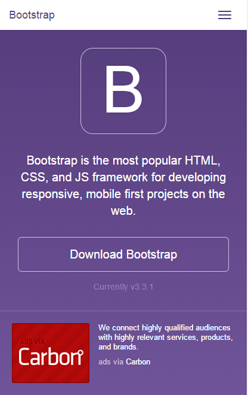
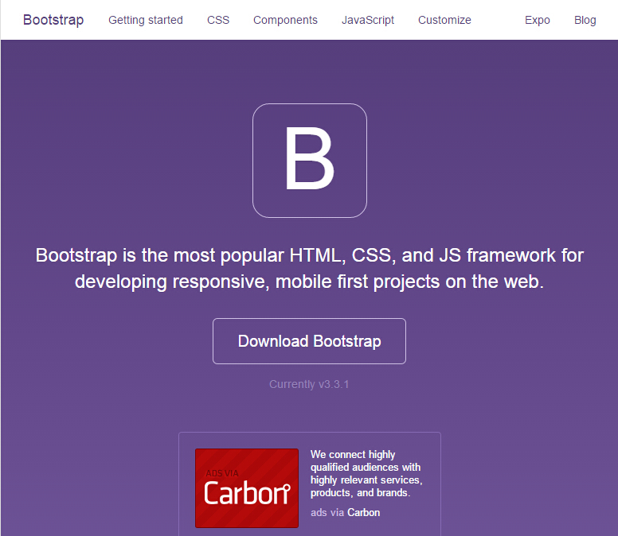

#使用node.js搭建简易的RESS架构服务

上一节中我们谈论了很多有关RESS的主题：我们反思了纯粹利用前端技术来解决响应式问题的局限性，并着眼于这些局限开始思考如何解决这些问题。最后我们把目光投向了后端，尝试利用各端的优势相互结合来给出新的解决方案。 

但是上述的林林总总多少有些纸上谈兵的嫌疑，这一节我们要做的就是让梦想照进现实。使用我们熟悉的Node.js来实现上述的设计，搭建一个RESS简易框架。

## 从最简单的需求开始

我们即将改造的目标对象是一个简易的使用Node.js编写的Web服务：使用Express框架，使用EJS作为页面的渲染模板引擎，并假设我们已经有了一个可以通过检测请求信息来判断用户设备的模块`deviceDectection`。

```
// app.js:

var express = require("express");
var device = require("deviceDetection");
 
var app = express();
app.set('view engine', 'ejs'); // 设置模板渲染引擎为ejs
app.use(express.static(__dirname + "/assets")); // 配置静态文件目录为assets目录
app.listen(80); 

```
没有比这更简洁的代码了。

这是我们的目录结构：
```
app.js
|----views // 页面模板目录
|----assets // 静态文件目录
		|----css
		|----js
		|----video

```


让我们忘了RESS蓝图上各式的模块和复杂的关系，清空大脑，来解决第一个问题：不同的设备的提供不同模板的页面：




上图是为移动设备提供的页面，下图是为PC设备提供的页面。如果将页面结构划分为导航和内容两个区域的话，我们的页面模板`index.ejs`应该是这个样子的：

```
<body>
	<% include header %>
	<% include content %>
</body>
```
从图中继续可以看出，很明显内容区域使用流式布局可以同时为移动和桌面公用，但导航区域却大相径庭。于是我们想到可以复用内容区域部分，而将导航部分使用不同的模板渲染。此时此刻暂且不需要media query，因为用户某时某刻单台设备上访问的页面不应该有兼容多台设备的代码。

这是RESS解决的第一个问题，我们就可以利用服务端检测出设备的性质，在渲染返回给浏览器的页面时，就决定使用哪一种类型的导航模板：
```
<body>
	<% if (isMobile) {%>
		<% include header_mobile %>
	<% } else { %>
		<% include header_desktop %>
	<% } %>
	<% include content %>
</body>
```
根据之前的描述我们已经准备好了两个导航栏模板，分别为`header_mobile.ejs`,`header_desktop.ejs`。那么在后台接收到请求后，我们首先需要对发出请求的设备类型进行判断，再把设备类型传递给渲染引擎，让它自行判断应该选用什么样的头模板文件

```
app.on("/", function (req, res) {
	var isMobile = device.isMobile(req);
	res.render("index", {
		'isMobile': isMobile
	});
});
```

Done!我们的第一个需求完成了。这就是一个RESS框架的雏形和核心，利用服务端技术来针对设备来解决问题。

## 事情可能会变得复杂了一些

让我们走的更远，尝试做一些细节上的优化。

假如你需要在上一节页面中安放一个视频来进一步表达你的想法，那么你的HTML代码可能会是这个样子：
```
<video>
 	<source src="sample.mp4" type="video/mp4">
 	<source src="sample.webm" type="video/webm">
 	<source src="sample.ogg" type="video/ogg" />
	<object data="sample.mp4" width="320" height="240">
		<embed src="sample.swf" width="320" height="240" />
	</object>
</video>
```

为了兼容不同平台支持的视频格式，视频代码也不得不准备一式三份。如果能够知道用户设备支持视频格式的情况，那么同样在后台渲染页面时就可以避免累赘的代码传递给用户：
```
<video>
	<% if (videoFormatSupport == 'mp4') { %>
		<source src="/video/sample.mp4" type="video/mp4">
	<% } else if (videoFormatSupport == 'webm') { %>
 		<source src="/video/sample.webm" type="video/webm">
 	<% } else if (videoFormatSupport == 'ogg') { %>
 		<source src="/video/sample.ogg" type="video/webm">
 	<% } else { %>
 		<object type="application/x-shockwave-flash" data="/assets/video/sample.swf">
 		</object>
 	<% } %>
</video>
```
这便是我想强调的有关RESS的第二个特性。如果把上一节的内容称之为设备检测(device dectection)的话，那么这里可以称之为特性检测(feature dectection)。

我们不仅可以针对特性返回特定的标记代码，甚至可以针对特性来给用户返回特定的样式和脚本。

例如我们会使用到CSS3动画来增添一些特效。注意这里是增添，也就是做加法。通常我们会准备两份样式，一份名为`content.css`，也就是通用的基础样式，关于配色关于布局，这都不重要——同时我们也会准备另一份样式`animate.css`，仅包含我们利用CSS3写的动画特效。

大部分情况我们会把这两份样式同时返回给用户，但很明显并非所有用户的浏览器都支持CSS3动画，即使不支持也是无害的，可代价就是用户可能白白多承受几KB的流量。要知道CSS3的动画代码同样是一式三份（甚至四份）极其臃肿的：
```
.classname {
	-webkit-animation: cssAnimation 1s 16 ease;
	-moz-animation: cssAnimation 1s 16 ease;
	-o-animation: cssAnimation 1s 16 ease;
}
@-webkit-keyframes cssAnimation {
	from { -webkit-transform: rotate(4deg) scale(1) skew(1deg) translate(10px); }
	to { -webkit-transform: rotate(4deg) scale(1) skew(1deg) translate(10px); }
}
@-moz-keyframes cssAnimation {
	from { -moz-transform: rotate(4deg) scale(1) skew(1deg) translate(10px); }
	to { -moz-transform: rotate(4deg) scale(1) skew(1deg) translate(10px); }
}
@-o-keyframes cssAnimation {
	from { -o-transform: rotate(4deg) scale(1) skew(1deg) translate(10px); }
	to { -o-transform: rotate(4deg) scale(1) skew(1deg) translate(10px); }
}
```

特性检测登场了。我们通过检测用户的设备是否支持CSS3动画来决定返回给用户的样式中是否包含动画样式：

```
// 首先我们需要拦截用户的样式请求
// 通过一定的策略来决定返回给用户的是什么样的样式

app.get("/css/style.css", function (req, res) {
	// 检测用户是否支持CSS3动画	
	var cssAnimationSupoort = device.cssAnimationSupoort(req);
	var result;
	
	// 需要返回的样式都会压入数组中，最后串联并压缩为单个样式文件返回给用户
	// `content.css`基础样式务必会返回给用户
	var concatStyleArr = ['./assets/css/content.css'];
	
	// 如果用户支持动画
	// 那么把动画样式压入数组中，待打包返回
	if (cssAnimationSupoort) {
		concatStyleArr.push('./assets/css/animate.css');
	}
	// 打包多个样式文件
	var result = uglifycss.processFiles(concatStyleArr);

	// 返回结果
    res.format({
	    'text/css': function(){
	    	res.send(result);
	 	}
	});
})
```
注意在上述代码的倒数第二步中我们并没有把打包结果存为一个样式文件，而是将内存中的结果直接返回。因为处于性能的考虑，我们应该尽可能避免IO操作。

## 性能！性能！

看上去似乎大功告成了？No.别忘了高性能永远是响应式开发定义的一部分，接下来我们在满足业务需求的基础开始进一步优化工作。

### 缓存

在我们通过检测动画特性返回特定样式一节中，不知道你有没有考虑过这样一个问题：假设一段时间内访问我们页面的用户设备都是支持的CSS3动画的，那么每一位用户访问时我们都必须重新生成一遍相同的样式文件，为什么不把上一次生成的结果暂存下来等到这次返回？这就是我们需要的缓存机制，将上一次打包结果缓存起来，以便下一次直接使用。

用精确的语言描述的业务流程应该是这样的：当我们需要临时生成打包一份样式时，我们会先在在缓存中查找，如果能找到并且没有过期（考虑到样式可能需要更新，需要设定过期时间），那么我们直接从缓存（也就是存于内存中）中取用；如果没有找到，那么我们就生成一份，并且存入缓存中，以供下一次使用。

有了思路之后就好办了，我们来构建一个cache模块`cache.js`。首先，我们需要一个空对象来作为缓存池：
```
var cache = {}; 
```
缓存将以key-value的形式来存储，例如我们支持动画的样式的打包结果为`str`的话，那么在`cache`中存储的形式为
```
cache["animateSupportedStyle"] = { 
	content: 'str', 
	expireDate: ''
}
```
注意我们添加了一个字段用于设置缓存的过期时间，防止缓存无法及时更新。

接下来我们提供缓存的存储方法：
```
function setCache (key, value, expire) {
	cache[key] = {};
	cache[key]['content'] = value;
	// 用户可以手动的设置缓存的生命周期，默认为1分钟
	cache[key]['expireDate'] = (+new Date) + (expire || 1000 * 60)
}
```
和缓存的读取方法：
```
function getCache (key) {
	var result = "";

	// 如果不存在用户提供的某key缓存，则直接返回
	if (!cache[key]) {
		return result;
	}

	var expireDate = cache[key]['content'];
	// 如果缓存已经过期
	if ((+new Date) >= expireDate) {
		return result;
	}
	
	// 经过两次考验才将正确的缓存返回
	result = cache[key]['content'];
	return result;
}
```
最后只需要改造打包样式和返回样式的部分代码即可：
```
var supportedKey = 'animateSupportedStyle';
var unSupportedKey = 'unAnimatedSupportStyle';
var result;

if (cssAnimationSupoort) {
	// 如果缓存中暂无数据可以提供
	if (!(result = cache.getCache(supportedKey))) {
		concatStyleArr.push('./assets/css/animate.css');
		// 临时打包生成
		result = uglifycss.processFiles(concatStyleArr);
		// 存入缓存中
		cache.setCache(unSupportedKey, result);
	}
} else {
	if (!(result = cache.getCache(unSupportedKey))) {
		result = uglifycss.processFiles(concatStyleArr);
		cache.setCache(unSupportedKey, result);
	}
}

return result;
```
代码中的逻辑基本上和本节开头所述是一致的。唯一有一个使用技巧的地方是，在判断缓存是否存在的`if`语句中，我使用的是赋值表达式`if (!(result = cache.getCache(supportedKey)))`。这么做的是为了将两步合并成一步：
1. 我将从缓存中读取到的缓存结果返回给`result`
2. 同时，赋值表达式也是有返回结果的，返回值就是result的值，这样一来我就能判断缓存结果是否存在`!result`

### 利用Bigpipe提高页面展现

未完待续

