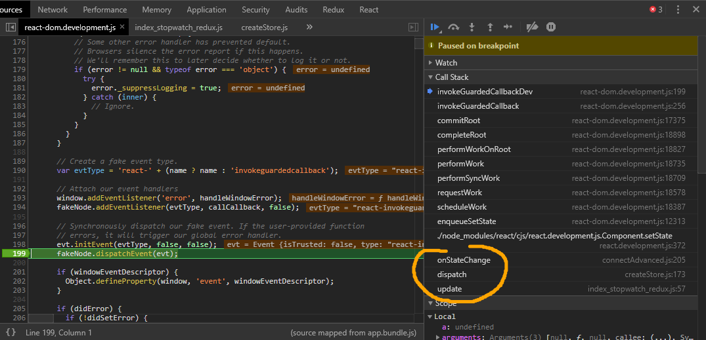

# Mobx 与 Redux 的性能对比

我无意挑起战争

在本文中你将看到我最终得出的结论是 Mobx 的性能优于 Redux。但很明显这样的结论是片面的，甚至是有失偏颇的，因为我只选取了有限的场景对两者进行测试。可能真实的情况恰恰相反，Mobx 仅仅在我测试的这几个场景中优于 Redux，但是在我所有没有测试到的场景中都劣于 Redux，这都是有可能的。性能跑分这类东西从来都不要放在心上，「鲁大师」不也是被戏称为「娱乐大师」嘛。

本文的重点不在于让两者拼个你死我活，而是在对比性能的过程中探索优劣可能是由什么原因造成的，并且我们能从中学习到什么

退一万步说，即使 Redux 性能确实略逊一筹，也无伤大雅。当我们在评价一个框架，或者在为产品做技术选型时，性能只是其中的一个方面。比如 Redux 天生的 event sourcing 机制能够帮助我们方便的回溯状态，如果你的产品里需要这样的业务场景，那么 Redux 当然是不二之选。通常在低于某个阈值下性能不会出现大的差别。

## 和谁比，怎么比

让我们从一个 stackoverflow 上关于 Mobx 的[有趣的性能问题](https://stackoverflow.com/questions/38460113/mobx-performance)开始

提问者做了一个测试，往`observable.array`装饰过的数组（Mobx 自己的数据结构）中`push`200个元素，计算总共花费的时间，并且和原生的操作进行能比较。结果是使用 Mobx 的方式一共花费了 120ms, 而原生的操作只花费了不到 1ms。这是不是说明了 Mobx 性能非常糟糕？

理论上来说提问者的测试方法没有错，测试的结果也是正确的。但问题在于单纯数值上的对比是有失公允的，虽然原生数组`push`方法更快，但是它无法提供单向数据流、无法提供状态管理不是？同时 Mobx 也能与React 进行配合优化组件的渲染。所以我们不能仅仅考量数值上的大小，还要考虑整体利益的得失。Mobx 在这项操作上慢了 120 倍，首先 120ms 的差距用户几乎是感知不到的，其次它换来的是给我们开发项目带来便利，为以后的维护节省成本，要知道这些花费可是按照人月计算的。

在我做优化工作的早期，我习惯于使用工程上的指标，比如 DOMContentLoaded 时间，onLoad 时间，软性一点的是 Speed Index。但目前我更倾向于使用业务性质的指标，因为你要想清除一个问题是，工程的指标真的和业务指标正相关吗？如果 onLoad 时间边长，bounce rate 就真的会升高吗？理论上是，但并不一定，相反如果你顽皮一点，你完全能够做到让 onLoad 的时间边长，但是 bounce rate 下降，只要保证 above fold content 足够快和可用就好了

说到底技术还是为业务服务的。最后以一篇阅读到的论文[Seven Rules of Thumb for Web Site Experimenters](https://www.exp-platform.com/Documents/2014%20experimentersRulesOfThumb.pdf)上的一个例子来结束这个小节。简单来说我只想强调两点：1) 不要盲目的、绝对的衡量性能的好坏；2) 多从业务出发考虑问题

>At Bing, we use multiple performance metrics for diagnostics, but
our key time-related metric is Time-To-Success (TTS) [24], which
side-steps the measurement issues. For a search engine, our goal is
to allow users to complete a task faster. For clickable elements, a
user clicking faster on a result from which they do not come back
for at least 30 seconds is considered a successful click. TTS as a
metric captures perceived performance well: if it improves, then
important areas of the pages are rendering faster so that users can
interpret the page and click faster. This relatively simple metric
does not suffer from heuristics needed for many performance
metrics. It is highly robust to changes, and very sensitive. Its main
deficiency is that it only works for clickable elements. For queries
where the SERP has the answer (e.g., for “time” query), users can
be satisfied and abandon the page without clicking.

## 性能对比

为什么需要进行比较是因为我在为下一个项目寻找技术选型。在新的项目中有一个重要的用户场景类似于 Photoshop，屏幕中央有很大一块区域用于拖拽和摆放物品。当某个物品被选中之后，四周的属性面板现实该物品的各种相关属性，当物品在实时被拖动时，面板的显示内容也要实时进行修改。

这个场景可以抽象为：多个对象订阅同一个对象的属性并且展示。我分别使用 Mobx 和 Redux 通过实现一个实时的显示的秒表来模拟这个场景

Mobx 版本：

```javascript
class StopWatch {
  @observable
  currentTimestamp = 0;

  @action
  updateCurrentTimestamp = value => {
    this.currentTimestamp = value;
  };
}

const stopWatch = new StopWatch();

@inject("store")
@observer
class StopWatchApp extends React.Component {
  constructor(props) {
    super(props);
    const stopWatch = this.props.store;
    setInterval(() => stopWatch.updateCurrentTimestamp(Date.now()));
  }
  render() {
    const stopWatch = this.props.store;
    return <div>{stopWatch.currentTimestamp}</div>;
  }
}

ReactDOM.render(
  <Provider store={stopWatch}>
    <div>
      <StopWatchApp />
    </div>
  </Provider>,
  document.querySelector("#app")
);
```

Redux 版本：

```javascript
const UPDATE_ACTION = "UPDATE_ACTION";

const createUpdateAction = () => ({
  type: UPDATE_ACTION
});

const stopWatch = function(
  initialState = {
    currentTimestamp: 0
  },
  action
) {
  switch (action.type) {
    case UPDATE_ACTION:
      initialState.currentTimestamp = Date.now();
      return Object.assign({}, initialState);
    default:
      return initialState;
  }
};

const store = createStore(
  combineReducers({
    stopWatch
  })
);

class StopWatch extends React.Component {
  constructor(props) {
    super(props);
    const { update } = this.props;
    setInterval(update);
  }
  render() {
    const { currentTimestamp } = this.props;
    return <div>{currentTimestamp}</div>;
  }
}

const WrappedStopWatch = connect(
  function mapStateToProps(state, props) {
    const {
      stopWatch: { currentTimestamp }
    } = state;
    return {
      currentTimestamp
    };
  },
  function(dispatch) {
    return {
      update: () => {
        dispatch(createUpdateAction());
      }
    };
  }
)(StopWatch);

ReactDOM.render(
  <Provider store={store}>
    <div>
      <WrappedStopWatch />
    </div>
  </Provider>,
  document.querySelector("#app")
);
```

注意在上面的 Redux 版本代码中，每一个 `StopWatch` 直接订阅 store 中的 currentTimestamp 状态。在后面我们会尝试另一种方式

如果你分别运行这两个版本的代码，你不会感受到任何的差异。但是如果我们把需要展示的 Mobx 中最终渲染的 `<StopWatchApp />` 实例和 Redux 中最终渲染的 `<WrappedStopWatch />` 实例扩展为 20 个（这里也就有了 20 次对 store 状态的订阅）：

```javascript
ReactDOM.render(
  <Provider store={store}>
    <div>
      <WrappedStopWatch />
      <WrappedStopWatch />
      <WrappedStopWatch />
      <WrappedStopWatch />
      <WrappedStopWatch />
      // ...省略后面的15个
    </div>
  </Provider>,
  document.querySelector("#app")
);
```

你会感受到 Redux 明显出现了卡顿（通过肉眼就能观察出来，这里就不需要使用精确的时间显示差别了），或者说变化速率明显比 Mobx 版本更慢。这里就不贴视频或者是 gif 图了。各位运行代码就能一目了然

为什么呢，通过 Chrome 的开发工具我们就能看出端倪，这是运行中的脚本的执行情况：


注意下方源码中最耗时的可以追溯的`Event`操作，追溯到源码中，我们能够看到它的调用栈本质上来自`dispatch`：



也就是说，我们有理由怀疑，Redux 的 `dispatch` 会造成性能的损耗（该死，这可是最核心的机制）。我们不妨先做一个假设:在上面的代码中，因为我们使用了独立订阅 store 的 20 个组件，间接使用了`disaptch`，最终导致性能下降。接下来我们要验证这个假设是否正确，原理非常简单，我们实现相同的效果，即同时在页面上显示20个秒表，但是只使用一个订阅——我们使用一个父容器订阅 store，然后把状态传递给子组件。store 部分不用修改，组件部分修改如下：

```javascript
const StopWatch = ({ currentTimestamp }) => {
  return <div>{currentTimestamp}</div>;
};

class Container extends React.Component {
  constructor(props) {
    super(props);
    const { update } = this.props;
    setInterval(update);
  }
  render() {
    const { currentTimestamp } = this.props;
    return (
      <div>
        <StopWatch currentTimestamp={currentTimestamp} />
        // 省略剩下的 19 个
      </div>
    );
  }
}

const WrappedContainer = connect(
  function mapStateToProps(state, props) {
    const {
      stopWatch: { currentTimestamp }
    } = state;
    return {
      currentTimestamp
    };
  },
  function(dispatch) {
    return {
      update: () => {
        dispatch(createUpdateAction());
      }
    };
  }
)(Container);

ReactDOM.render(
  <Provider store={store}>
    <div>
      <WrappedContainer />
    </div>
  </Provider>,
  document.querySelector("#app")
);
```
这段代码验证了我们的想法，修改之后变得健步如飞了，达到了和 Mobx 相同的显示速率。

## 参考资料

- [Seven Rules of Thumb for Web Site Experimenters](https://www.exp-platform.com/Documents/2014%20experimentersRulesOfThumb.pdf)