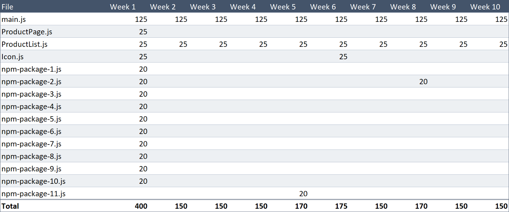

为你的用户找到最佳的文件加载方式是一件麻烦的事。因为有非常多的不同的场景，技术栈，专业术语需要考虑。

在这篇文章里我希望呈现给你所需要的一切，然后你就可以：

- 知道什么样的文件分离策略最适合你的站点和你的用户
- 知道如何实现它

根据 [Webpack 术语表](https://webpack.js.org/glossary/)，有两类文件的分离。这些名词听起来是可以互换的，但实际上不行：

- 打包分离 (Bundle splitting)：为了更好的缓存创建更多、更小的文件（但仍然以每一个文件一个请求的方式进行加载）
- 代码分离 (Code splitting)：动态加载代码，所以用户只需要下载当前他正在浏览的站点的这部分代码

第二种策略听起来更吸引人是不是？事实上许多的文章也假定认为这才是唯一值得将 JavaScript 文件进行小文件拆分的场景。

但是我在这里告诉你第一种策略对许多的站点来说才更有价值，并且应该是你首先为页面做的事

让我们来深入这件事

## 打包分离 (Bundle splitting)

打包分离背后的思想非常简单。如果你有一个体积巨大的文件，并且只改了一行代码，用户仍然需要重新下载整个文件。但是如果你把它分为了两个文件，那么用户只需要下载那个被修改的文件，而浏览器则可以从缓存中加载另一个文件。

值得注意的是因为打包分离与缓存相关，对站点的首次访问者来说没有区别

（我认为太多的性能讨论都是关于站点的首次访问。或许部分原因是因为“第一映像”很重要，另一部分因为这部分性能测量起来简单和讨巧）

当谈论到频繁访问者时，量化性能提升带来的影响会稍有棘手，但是我们必须量化！

这将需要一张表格，所以我们将每一种场景与每一种策略的组合结果都记录下来

这是我在前一段中提到的场景：

- Alice 连续10周每周访问站点一次
- 我们每周更新站点一次
- 我们每周更新“产品列表”页面
- 我们也有一个“产品详情”页面，但是我们目前不需要对它进行更新
- 在第5周的时我们给站点新增了一个 npm 包
- 在第8周时我们更新了现有的一个 npm 包

当然包括我在内的某些人希望场景尽可能的逼真。不要那么做，实际的场景其实无关紧要，我们随后会解释为什么。

## 基线

假设我们的 JavaScript 打包后的总体积时400KB, 并且目前我们以但文件的形式加载它，命名为`main.js`

我们有一个类似如下的 Webpack 配置（我已经移除了无关的配置项）：

```javascript
const path = require('path');

module.exports = {
  entry: path.resolve(__dirname, 'src/index.js'),
  output: {
    path: path.resolve(__dirname, 'dist'),
    filename: '[name].[contenthash].js',
  },
};
```

（对那些刚接触缓知识的人我解释一下：存任何时候我提及`main.js`的时候，我实际上是在说类似于`main.xMePWxHo.js`这种类似于这种包含一堆带有文件内容哈希字符串的文件名。这意味着当你应用中的代码发生更改时就会生成一个新的文件名，这样就能迫使浏览器下载新的文件）

当每周我向站点发布新的变更时，包的`contenthash`就会发生更改。所以每周 Alice 访问我们站点时不得不下载一个全新的 400KB 大小的文件


连续十周**也就是 4.12MB**

我们能做的更好

## 分离vender包

让我们把我们的打包文件划分为`main.js`和`vendor.js`

很简单，类似于：

```javascript
const path = require('path');

module.exports = {
  entry: path.resolve(__dirname, 'src/index.js'),
  output: {
    path: path.resolve(__dirname, 'dist'),
    filename: '[name].[contenthash].js',
  },
  optimization: {
    splitChunks: {
      chunks: 'all',
    },
  },
};
```

在你没有告诉它你想如何拆分打包文件的情况下， Webpack 4 在尽它最大的努力把这件事最的最好

这就导致一些声音在说：“太惊人了，Webpack 做的真不错！”

而另一些声音在说：“你对我的打包文件做了什么！”

无论如何，添加`optimization.splitChunks.chunks = 'all'`配置也就是再说“把所有`node_modules`里的东西都放到`vendors~main.js`的文件中去”

在实现基本的打包分离条件后，Alice 在每次访问时仍然需要下载 200KB 大小的 `main.js` 文件， 但是只需要在第一周、第五周、第八周下载 200KB 的 `vendors.js`脚本


**也就是 2.64MB**

体积减少了 36%。对于配置里新增的五行代码来说结果还不错。在继续阅读之前你可以立刻就去试试。如果你需要将 Webpack 3 升级到 4，也不要着急，升级不会带来痛苦（而且是免费的！）

## 分离每一个 npm 包

我们的 `vendors.js`承受着和开始`main.js`文件同样的问题——部分的修改会意味着重新下载所有的文件

所以为什么不把每一个 npm 包都分割为单独的文件？做起来非常简单

让我们把我们的`react`，`lodash`，`redux`，`moment`等分离为不同的文件

```javascript

const path = require('path');
const webpack = require('webpack');

module.exports = {
  entry: path.resolve(__dirname, 'src/index.js'),
  plugins: [
    new webpack.HashedModuleIdsPlugin(), // so that file hashes don't change unexpectedly
  ],
  output: {
    path: path.resolve(__dirname, 'dist'),
    filename: '[name].[contenthash].js',
  },
  optimization: {
    runtimeChunk: 'single',
    splitChunks: {
      chunks: 'all',
      maxInitialRequests: Infinity,
      minSize: 0,
      cacheGroups: {
        vendor: {
          test: /[\\/]node_modules[\\/]/,
          name(module) {
            // get the name. E.g. node_modules/packageName/not/this/part.js
            // or node_modules/packageName
            const packageName = module.context.match(/[\\/]node_modules[\\/](.*?)([\\/]|$)/)[1];

            // npm package names are URL-safe, but some servers don't like @ symbols
            return `npm.${packageName.replace('@', '')}`;
          },
        },
      },
    },
  },
};
```

[这份文档](https://webpack.js.org/guides/caching/) 非常好的解释了这里做的事情，但是我仍然需要解释一下其中精妙的部分，因为它们花了我相当长的时间才搞明白

- Webpack 有一些那么智能配置的默认“智能”配置，比如当分离打包输出文件时只允许最多3个文件，并且最小文件的尺寸是30KB（如果存在更小的文件就把它们拼接起来）。所以我把这些配置都覆盖了
- `cacheGroups`是我们用来制定规则告诉 Webpack 应该如何组织 chunks 到打包输出文件的地方。我在这里对所有加载自`node_modules`里的 module 制定了一条名为 "vendor" 的规则。通常情况下，你只需要为你的输出文件的 `name`定义一个字符串。但是我把`name`定义为了一个函数（当文件被解析时会被调用）。在函数中我会根据 module 的路径返回包的名称。结果就是，对于每一个包我都会得到一个单独的文件，比如`npm.react-dom.899sadfhj4.js`
- 为了能够正常发布[npm 包的名称必须是合法的URL](https://docs.npmjs.com/files/package.json#name)，所以我们不需要`encodeURI`对包的名词进行处理。但是我遇到一个问题是.NET服务器不会给名称中包含`@`的文件提供文件服务，所以我在代码片段中进行了替换
- 整个步骤的配置设置之后就不需要维护了——我们不需要使用名称引用任何的类库

Alice 每周都要重新下载 200KB 的 `main.js` 文件，并且再她首次访问时仍然需要下载 200KB 的 npm 包文件，但是她再也不用重复的下载同一个包两次


也就是**2.24MB**

相对于基线减少了 44%，这是一段你能够从文章里粘贴复制的非常酷的代码。

我好奇我们能超越 50%？

那不是很棒吗

## 把应用代码进行分离

现在让我们把目光转向 Alice 一遍又一遍下载的 `main.js` 文件

我之前提到过我们的站点里又两个完全不同的部分：一个产品列表页面和一个详情页面。每个页面独立的代码提及大概是 25KB（共享 150KB 的代码）

我们的“产品详情”页面目前不会进行更改，因为它非常的完美。所以如果我们把它划分为独立文件，大部分时候它都能够从缓存中进行加载

并且你知道我们还有一个用于渲染 icon 用的 25KB 的几乎不发生修改的 SVG 文件吗？

我们应该对做些什么

我们仅仅手动的增加一些 entry 入口，告诉 Webpack 给它们都创建独立的文件：

```javascript


module.exports = {
  entry: {
    main: path.resolve(__dirname, 'src/index.js'),
    ProductList: path.resolve(__dirname, 'src/ProductList/ProductList.js'),
    ProductPage: path.resolve(__dirname, 'src/ProductPage/ProductPage.js'),
    Icon: path.resolve(__dirname, 'src/Icon/Icon.js'),
  },
  output: {
    path: path.resolve(__dirname, 'dist'),
    filename: '[name].[contenthash:8].js',
  },
  plugins: [
    new webpack.HashedModuleIdsPlugin(), // so that file hashes don't change unexpectedly
  ],
  optimization: {
    runtimeChunk: 'single',
    splitChunks: {
      chunks: 'all',
      maxInitialRequests: Infinity,
      minSize: 0,
      cacheGroups: {
        vendor: {
          test: /[\\/]node_modules[\\/]/,
          name(module) {
            // get the name. E.g. node_modules/packageName/not/this/part.js
            // or node_modules/packageName
            const packageName = module.context.match(/[\\/]node_modules[\\/](.*?)([\\/]|$)/)[1];

            // npm package names are URL-safe, but some servers don't like @ symbols
            return `npm.${packageName.replace('@', '')}`;
          },
        },
      },
    },
  },
};
```

并且 Webpack 为它们之间的共享代码也创建了独立的文件，也就是说`ProductList`和`ProductPage`不会拥有重复的代码

这回 Alice 在大多数周里都会节省下 50KB 的下载量



**只有 1.815MB 了**

我们已经为 Alice 节省了 56% 的下载量，并且节省工作一直会持续下去（在我们的理论场景中）

并且所有这些都是通过修改 Webapck 配置实现的——我们还没有修改任何一行应用程序的代码。

我之前提到测试之下是什么样具体的场景并不重要。因为无论你遇见的是什么场景，结论始终是一致的：把你的代码划分为更多更有意义的小文件，用户需要下载的代码也就越少

---

很快我们就将谈到“代码分离”——另一种分割文件的方式——但是首先我想首先解决你现在正在考虑的问题

### 网络请求变多的时候是不是会变得更慢？

答案非常明确是否定的

在 HTTP/1.1 的情况下确实会如此，但是在 HTTP/2 中不会

尽管如此，[这篇来自 2016 年的文章](https://medium.com/@asyncmax/the-right-way-to-bundle-your-assets-for-faster-sites-over-http-2-437c37efe3ff)和来自于[Khan Academy 2015 年的文章](http://engineering.khanacademy.org/posts/js-packaging-http2.htm)都得出结论说即使有 HTTP/2 下载太多文件的话仍然会导致变慢。但是在这两篇文章里“太多”意味着上百个文件。所以只要记住如果你有上百个文件，你或许达到了并行的上限

如果你在好奇如何在 Windows 10 的 IE11 上支持 HTTP/2。我对那些还在使用古董机器的人做了调查，他们出奇一致的让我放心他们根本不关心网站的加载速度

### 每一个 webpack 打包后的文件里会不会有多余的模板代码？

有的

### 如果我有多个小文件的话是不是压缩的效果就减弱了

是的

事实确实是：

- 多文件 = 多 Webpack 模板代码
- 多文件 = 压缩减小

让我们把其中的损耗的都明确下来

我刚刚做了一个测试，一个 190 KB 的站点文件被划分为了19个文件，发送给浏览器的字节数大概多了 2%

所以……首次访问的文件提及增加了 2%  但是直到世界末日其他的每次访问文件体积都减小了 60%

所以损耗的正确数字是：一点都不。

当我在测试 1 个文件对比 19 个文件情况时，我想我应该赋予测试一些不同的网络环境，包括 HTTP/1.1

下面这张表格给予了“文件越多越好”的有力支持


在 3G 和 4G 的情况下当有19个文件时加载实践减少了 30%

但真的是这样吗？

这份数据看上去“噪点”很多，举个例子，在 4G 场景下第二次运行时，网站加载花费了 646ms，但是之后的第二轮运行则花费了 1116ms——时间增加了73% 。所以宣称 HTTP/2 快了 30% 有一些心虚

我创建这张表格是为了试图量化 HTTP/2 究竟能带来多大的差异，但是我唯一能说的是“并没有太大的区别”

真正令人惊喜的是最后两行，旧版本的 Windows 和 HTTP/1.1 我本以为会慢非常多。我猜我需要更慢的网络环境

---

故事时间！我从[微软网站](https://developer.microsoft.com/en-us/microsoft-edge/tools/vms/)下载了一个 Windows 7 的虚拟机来测试这些东西

我想把默认的 IE8 升级至 IE9

所以我前往微软下载 IE9 的页面然后发现：


最后提一句 HTTP/2，你知道它已经集成进 Node 中了吗？如果你想尝试，我[用100行写了一段 HTTP/2 服务](https://gist.github.com/davidgilbertson/e5690c04e06c4882cf5761f8acff36ec)，能够为你的测试带来缓存上的帮助

---

以上就是我想说的关于打包分离的一切。我想这个实践唯一的坏处是需要税赋人们加载如此多的小文件是没有问题的

## 代码分离（不必加载你不需要的代码）

这个特殊的实践只对某些站点有效

我乐意重申一下我发明的 20/20 理论：如果站点的某些部分只有 20% 用户会访问，并且这部分的脚本量大于你整个站点的 20% 的话，你应该考虑按需加载代码了

你可以对数值进行调整来适配更复杂的场景。重点是平衡使用是存在的，需要决策将对站点无意义的代码分离出来

### 如何决策 

假设你有拥有一个购物网站，你在纠结是否应该把“结账”功能的代码分离出来，因为只有 30% 的用户会走到那一步

**首先是要让卖的更好**

其次计算出“结账”功能的独立代码有多少。因为在做“代码分离”之前你常常做“打包文件分离”，你或许已经知道了这部分代码量有多少

（它可能比你想象的还要小，所以计算之后你可能获得惊喜。如果你有一个 React 站点，你的 store，reducer，routing，actions 可能会被整个网站共享，独立的部分可能大部分是组件和帮助类库）

假设你注意到结算页面独立代码一共只有 7KB，其他部分的代码 300KB。看到这种情况我会建议不把这些代码分开，有以下几个原因

- 它并不会让加载变得更慢。记得你之前并行的加载这些文件，你可以试着记录加载 300KB 和 307KB 的文件是否有变化
- 如果你延迟加载这部分代码，用户在点击“付款”之后仍然需要等待文件的加载——你并不希望给用户带来任何的阻力
- 代码分离会导致程序代码的更改，这需要将之前同步逻辑的地方改为异步逻辑。这并不复杂，但是对于改善用户体验这件事的性价比来说还是过于复杂了

这些就是我说的“这项令人振奋的技术或许不适合你”

让我们看看两个代码分离的例子

### 回滚方案（Polyfills）

我们从这个例子开始是因为它适用于大多数站点，并且是一个非常好的入门

我给我的站点使用了一堆酷炫的功，所以我使用了一个文件导入了我需要的所有回滚方案。它只需要八行代码：

```javascript
require('whatwg-fetch');
require('intl');
require('url-polyfill');
require('core-js/web/dom-collections');
require('core-js/es6/map');
require('core-js/es6/string');
require('core-js/es6/array');
require('core-js/es6/object');
```


我在我的入口文件`index.js`顶部引入了这个文件

```javascript
import './polyfills';
import React from 'react';
import ReactDOM from 'react-dom';
import App from './App/App';
import './index.css';

const render = () => {
  ReactDOM.render(<App />, document.getElementById('root'));
}

render(); // yes I am pointless, for now
```


在 Webpack 配置关于打包分离的小节配置中，我的回滚代码会自动被分为四个不同的文件因为有四个 npm 包。它们一共大小 25KB 左右，并且 90% 的浏览器都不需要它们，所以它们值得动态的进行加载。

在 Webpack 4 以及 `import()` 语法（不要和`import`语法混淆了）的支持下，有条件的加载回滚代码变得非常简单了

```javascript
import React from 'react';
import ReactDOM from 'react-dom';
import App from './App/App';
import './index.css';

const render = () => {
  ReactDOM.render(<App />, document.getElementById('root'));
}

if (
  'fetch' in window &&
  'Intl' in window &&
  'URL' in window &&
  'Map' in window &&
  'forEach' in NodeList.prototype &&
  'startsWith' in String.prototype &&
  'endsWith' in String.prototype &&
  'includes' in String.prototype &&
  'includes' in Array.prototype &&
  'assign' in Object &&
  'entries' in Object &&
  'keys' in Object
) {
  render();
} else {
  import('./polyfills').then(render);
}
```


现在是不是更有意义了？如果浏览器支持所有的新特性，那么渲染页面。否则加载回滚代码渲染页面。当代码在运行在浏览器中时，Webpack 的运行时会负责这四个包的加载，并且当它们被下载并且解析完毕时，`render()`函数才会被调用，并且其它工作继续运行

（顺便说一声，如果需要使用`import()`的话，你需要 [Babel 的 dynamic-import 插件](https://babeljs.io/docs/en/babel-plugin-syntax-dynamic-import/) 。并且如 Webpack 文档解释的，`import()`使用 Promises，所以你需要把这部分的回滚代码独立出来）

非常简单不是吗？

有一些更棘手的场景

### 基于路由的动态加载（针对 React）

回到 Alice 的例子，假设网站现在多了一个“管理”页面，产品的卖家可以登陆并且他们卖的产品

这个页面有很多有用的功能，很多的图表，需要安装一个来自 npm 的表单类库。因为我已经实现了打包代码分离，目测至少已经节省了100KB 的大小文件

现在我设置了一份当用户访问呢`/admin`时渲染`<AdminPage>`的路由。当 Webpack 把一切都打包完毕之后，它会去查找`import AdminPage from './AdminPage.js'`，并且说“嘿，我需要把它包含到初始化的加载文件中”

但是我们不想这么做，我们希望在动态加载中加载管理页面，比如`import('./AdminPage.js')`，这样 Webpack 就知道需要动态加载它。

非常酷，不需要任何的配置

与直接引用`AdminPage`不同，当用户访问`/admin`时我使用另外一个组件用于实现如下功能：

核心思想非常简单，当组件加载时（也就意味着用户访问`/admin`时），我们动态的加载`./AdminPage.js`然后再组件 state 中保存对它的引用

在渲染函数中，在等待`<AdminPage`>加载的过程中我们简单的渲染出`<div>Loading...</div>`，一旦加载成功则渲染出`<AdminPage>`

为了好玩我想自己实现它，但是在真实的世界里你只需要像[React 关于 代码分离的文档](https://reactjs.org/docs/code-splitting.html)描述的那样使用 `react-loadable`即可

---

以上就是所有内容了。以上我说的每一个观点，还能说的更精简吗？

- 如果人们会不止一次的访问你的站点，把你的代码划分为不同的小文件
- 如果你的站点有很大一部分用户不会访问到，动态的加载它们

谢谢阅读，祝你有愉快的一天

完蛋了我忘记提 CSS 了


