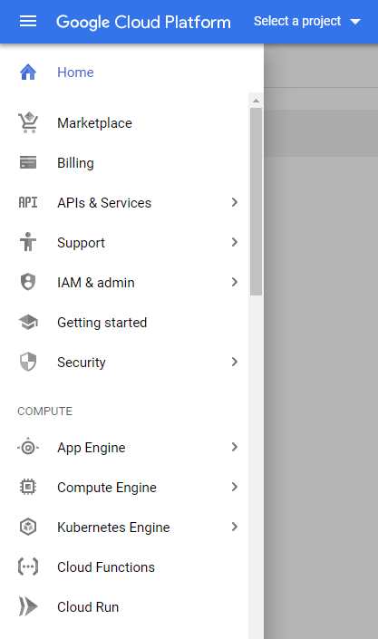

# 微前端说明书

## 为什么写

> 互联网公司技术选型三定律
> 1. 流行即正义
> 2. 新鲜即正义
> 3. 复杂即正义
> —— 我

因为最近被问起当前公司的前端产品有没有聚合为微前端的可能性，所以又重新开始审视“微前端”这个话题。差不多一年前写过一篇[反驳美团微前端方案的文章](https://zhuanlan.zhihu.com/p/50358444)。那篇文章更多的是关于“没有必要这么做”，但是“应该如何做”我也并没有给出更好的方案。最近在参考了很多资料之后，对这个问题终于有了答案

本文分为两个部分：“战略”和“战术”。前者关于为什么以及在什么场景下使用微前端，后者关于采用什么的技术实施微前端。这篇文章里我会反对某些方案，赞成某些方案，仅代表个人意见

本文开头的“互联网公司技术选型三定律”是我个人总结的，也是我在这篇文章里极力反对的。这三条定律的产生有行业的原因也有程序员这个职业的原因。三定律的存在导致了某些技术的被曲解和滥用，其中就有微前端。在本文中也会引用这三定律做一些驳斥和说明

## 战略篇

实现微前端一点都不难，你也看过无数种方案的微前端实施方案。但问题不在于我们能不能做，而是我们为什么要做。

Dan Abramov [在 Twitter 上提出过一个问题](https://twitter.com/dan_abramov/status/1132495687957012481?s=20)，他认为微前端解决的问题通过好的组件模式就能解决，为什么需要微前端

有时候甚至不用通过组件，通过一个门户网站将不同功能的站点收集在一个页面上某种意义上也算微前端是不是。所以我们谈论的微前端究竟是什么？

微前端的概念衍生自微服务。在我看来微服务带来的改进是是架构上的解耦，比如灵活替换和独立部署发布。注意这样的解耦是架构上的而不是功能上的，在实际的的工作中，常常一个功能的迭代会带来多个微服务的链式修改。在一个恶劣设计的极端情况下，你划分了十个微服务，但是每次功能修改都需要对十个微服务同时修改，然后发布上线，那么这和一个单体应用有什么区别？在单体应用中如果你设计的足够优秀，单体内部也可以存在好的功能解耦。所以在当今微服务作为标配的情况下，微服务也并不是绝对的正义

微前端和微服务相似，它带来的也是仅仅是架构上的解耦。就功能解耦而言它比微服务还难以划分，这一点我在战术部分详述

组件化的确是目前前端普遍的开发模式，但并不是所有的前端功能都需要走组件化这一条路。比如文档性质的站点可以通过 static site generator 生成；绚烂的活动页面更适合利用动画特效类库进行编程。我想表达的是：**微前端不是跨世代的通用解决方案，它也不是用于代替先用的组件模式。它只是给了我们一个让不同技术栈不同团队开发同一个产品的机会**。这个定义来自于 Luca Mezzalira 对 Dan Abramov 质疑的回复，我非常赞同:

> Let’s start with this, Micro-frontends are not trying to replace components, it’s a possibility we have that doesn’t fit in all the projects like components are not the answer for everything.

微前端更适用于不同技术栈不同团队需要对同一产品进行修改的开发模式，比如 Google Cloud:

从菜单栏我们可以看出谷歌云提供不同类型的服务，但是这些服务之间都相互独立，有的是通用性质的有的是云计算相关的，即使是在云计算一栏下又划分了不同类型的计算服务。我猜测不同的服务来自不同的团队进行开发，虽然它们不相互干扰，但是又需要同一个产品予以体现。那么使用微前端是最好的方式

注意这里的“同一产品”的定义，仅仅是从视觉形态和用户体验方面考虑。如果 A 网站只是要用到 B 网站的数据，那么通过接口提供就好了。

你可能会注意到腾讯旗下的所有站点的登陆框都是使用 iframe 集成。这也算是一种微前端：其他的团队只负责自己业务相关的页面，而“登陆框”团队负责维护统一的登陆框供大家调用。他们之间不需要关心对方的技术栈，迭代周期，甚至甩锅也变得方便了。如果有一天 iframe 变成了统一的 Web Component，这种微前端关系仍然成立

在[美团的的微前端方案](https://tech.meituan.com/2018/09/06/fe-tiny-spa.html)里，我们看看他们做微前端的诉求:

> 美团已经是一家拥有几万人规模的大型互联网公司，提升整体效率至关重要，这需要很多内部和外部的管理系统来支撑。由于这些系统之间存在大量的连通和交互诉求，因此我们希望能够按照用户和使用场景将这些系统汇总成一个或者几个综合的系统。

> 因为美团的HR系统所涉及项目比较多，目前由三个团队来负责。其中：OA团队负责考勤、合同、流程等功能，HR团队负责入职、转正、调岗、离职等功能，上海团队负责绩效、招聘等功能

> 这种团队和功能的划分模式，使得每个系统都是相对独立的，拥有独立的域名、独立的UI设计、独立的技术栈。但是，这样会带来开发团队之间职责划分不清、用户体验效果差等问题

这里我对他们要做微前端的动机感到有一些疑惑：

- “系统汇总”的方式有很多，除了门户以外，我们曾经尝试过通过给每一个系统添加一个公共的导航栏来让系统之间的导航和跳转更方便，效果也不错
- “独立的域名、独立的UI设计、独立的技术栈”——这不就是相互独立的站点吗？如果这么多年用户都能正常使用，为什么现在要把它们聚合在一起？
- “这样会带来开发团队之间职责划分不清、用户体验效果差”，我不认为微前端能够解决团队之间职责划分的问题；用户体验效果不是更应该从交互体验和统一设计 guideline 入手吗？

我不是针对美团，但就微前端而言，就事论事我认为这是一个好的反面例子，能够让我们从不同的角度进行反思。在后面的内容里我也会再引用其中的内容。当然他们也不是这篇文章中唯一的反面教材。

我在阅读 Martin Fowler 的 《Patterns Of Enterprise Application Atchitecture》时，最大的一点感触是他从来不排斥任何的技术方案：如果你想做业务相关的数据存储，你当然可以选择 ORM 来实现 Domain Model 模式；你同样可以选择简单至极的 Transaction Script 模式 (A Transaction Script organizes all this logic primarily as a single procedure)：

> However much of an object bigot you become, don’t rule out Transaction Script. There are a lot of simple problems out there, and a simple solution will get you up and running much faster.

很多人（曾经包括我自己在内）在技术选型方面喜欢追求一种“宏大叙事感”：如果技术不够复杂，不够新，开发周期不够长，动员团队不够多，怎么在公司内彰显我的影响力？我们之所以敢这么放肆是因为环境鼓励我们这么做，每个团队都在这么做。我们一直在被暗示，项目的风险和可维护性不重要，反正三年之后我也不一定在这个公司，三年之后我可能成了管理人员，三年之后接手维护系统的人不是我。无论如何三年之后项目一定会推倒重来。我们的简历上总是强调我们做过**多少**系统，而不是把它们做的**多好**

从职业素养的要求上说作为开发人员我们应该关心风险和可维护性。减少项目风险和增加可维护性的措施之一就是让代码变得简单。**微前端从本质上说只是给了我们一个解决选项而非标准答案**。如果你有留意的微服务的发展趋势的话，微服务生态已经非常的庞大，几乎每一个环节都能找到对应的第三方组件来完成工作。微前端也一样，如果你愿意你可以找到无数种方案让项目看上去高精尖，但是为什么呢？明明一个 React 就能解决的问题，一定要上 React + Redux + Appllo 才甘心。

准确且谨慎的使用微前端，这是我的建议

在上面的所有例子中，我都暗含了一种假设：微前端至少是以应用为单位的。以页面或者组件为单位的如何？我们在下一节战术篇中再解答

## 战术篇
