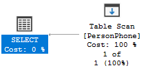
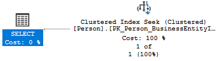
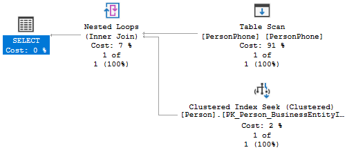

# SQL Server 查询语句优化入门

之所以限定于“查询语句”是因为 SQL Server 中的内存使用，查询编译，死锁等都有优化空间，本文不涉及。

之所以限定于“入门”是因为我算不上 SQL Server 专家，只不过在最近做性能优化时积累了一些经验，虽然不深但足以应付我们日常需要解决的一些 SQL 语句方面的性能问题，因此分享出来供大家参考。自私点说哪怕长时间用不上这技能，生疏之后靠回顾自己的文章也能很快的捡回来。

“入门”的另一层意思是我会侧重于原理讲解。我发现无论是前端性能优化还是 SQL 性能优化都没法和所见即所得的编码相提并论，可能是因为工具提供的信息有限，也有可能是因为性能的瓶颈是祖传代码屎山，大部分时候你需要随机应变。有时候你可以通过抽丝剥茧找到病根，有时候你只能大刀阔斧的重写代码才能稍稍缓解。无论什么方法，都需要你对它背后工具原理有所了解才行。**我力求即使你只会简单的 SELECT, UPDATE, DELETE 也能够看懂这篇文章**

本文涵盖两部分内容：**索引（Index）**和**执行计划（Execution Plan）**。虽然索引能够解决我们90%以上的性能问题，但我们还要知道在何时何地添加索引，于是就要通过阅读执行计划找到这方面的提示。两部分内容虽然在章节上独立，但是依然会交叉引用。

为了说明问题文章会用到官方提供的范例数据库 [AdventureWorks](https://docs.microsoft.com/en-us/sql/samples/adventureworks-install-configure?view=sql-server-ver15&tabs=ssms) 和其中的 Person.Person、Person.PersonPhone、Person.EmailAddress 三张表。三张表中都存有 BusinessEntityID 字段，我们可以通过 BusinessEntityID 字段将同一个人的信息都关联在一起。

## 索引

### 小心 Scan

简略的把数据库比作一本书不为过。想象一下如果你需要在一本没有目录的书中查找一行文字你唯一能做的只能逐页查找。数据库也是这么工作的，对于一个没有任何索引的表，它只能通过**扫描（scan）**整张表的数据来找到匹配的数据

例如我把 PersonPhone 表中的所有索引都删除之后查找某一个具体的电话号码：

```sql
  SELECT *
  FROM Person.PersonPhone
  WHERE PhoneNumber = '156-555-0199';
```

执行计划给我们展示的过程如下：



鉴于下一节我们才谈到执行计划，目前你姑且可以把执行计划当作 SQL 语句的执行过程。上图中的 `Table Scan` 就是在告诉我们它扫描了整张表。并且在整个执行过程中，这一步操作占用了最多的资源: `Cost: 100%`。这里的 cost 只是一个抽象单位，它不代表 CPU 亦或是 I/O 单个维度的消耗，而是各类资源统计之后的结果。

其实上面过程中的 100% 并不能说明 scan 这一种类型的操作是效率低下的，因为这里只涉及到了单个表的查询操作，即使是对带索引的表进行这种简单的查询，你看到的也是 `Cost: 100%`。比如我对带有 `[PK_Person_BusinessEntityID]`索引的 Person 表进行查询：

```sql
  SELECT *
  FROM Person.Person
  WHERE BusinessEntityID = 10;
```

得到的执行过程如下：



非 scan 类型的 `Clustered Index Seek`（我稍后会解释） 操作的消耗同样是 100% 。

但如果我们对 PersonPhone 和 Person 表进行联合查询，查询效率就立分高下了：

```sql
  SELECT *
  FROM Person.PersonPhone AS PersonPhone
  JOIN Person.Person AS Person ON PersonPhone.BusinessEntityID = Person.BusinessEntityID
  WHERE PhoneNumber = '156-555-0199';
```



scan 在所有操作中消耗占比达到 91%

所以 scan 是我们可以识别到的一个优化点，当你发现一个表缺少索引，或者说在执行计划中看到有 scan 操作时，尝试通过添加索引来修复性能问题。

### Logical Reads 很关键

通常 SQL Server 在查询数据时会优先从内存中的缓存（buffer cache）中查找，如果没有找到才会继续前往磁盘中查找，前者我们称之为 logical read，后者称之为 physical read，鉴于从内存读写的效率比磁盘高，我们当然希望尽可能避免任何的 physical read。

而 logical read 具体读写的是什么呢？是 page，page 是数据库中数据组织的最小单位。所以 logical read 数量也理应越小越好。默认情况下你不会看到 logical read 这项指标的输出。


