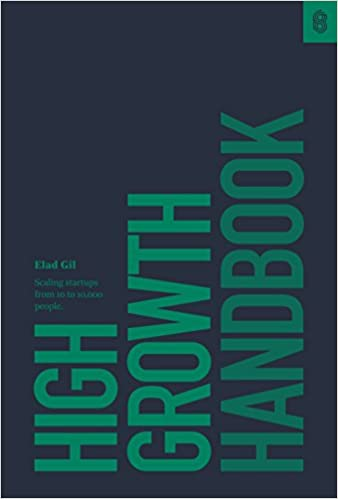

在 25 岁之前我对于世界上有些事物存在的意义是理解不了的，比如

- 时间管理
- 冥想
- 推拿按摩

当年我以为这辈子永远也用不上它们，然而现在的我这些全都需要。

## 不成问题的问题

这就是今天我想聊的，有一类知识我曾经不屑一顾，然而现在我觉得他们很重要。

长时间在互联网公司工作的工作经历，将我塑造成以结果为导向和用简单粗暴的方式思考问题。比如能够工作的代码是唯一真理，以及快比好更重要。

这种思维方式至今依然会让我在 Thoughtworks 工作时产生一种割裂感。一方面咨询行业的工作模式会指导你用更完备的方式解决问题，优先考虑最佳实践；但另一方面，我会对缜密产生怀疑，当解决方案僵持不下时，我心里会不自觉的喃喃，talk is cheap, show me the code.

这种思维方式能解决代码，但是解决不了这两年我遇到带领团队时遇到的问题。

说到这里我要暂停一下，你是否认为团队问题真的是一个问题？

在我看来在大部分内公司并不成立。你见过多少 leader 是待团队成员如春风般温暖的？你见过多少 leader 会关心你在项目里能得到些什么的？付诸权威和抱大腿是我最常见的灵丹妙药，但我不认为这两者可以冠名「解决办法」，他们利用的不过是动物的本能而已。不解决它们马照跑，舞照跳，我把它们称之为不成问题的问题。如果你同样认为它们不成问题，那不必继续阅读，之后的内容对你意义不大。

即使你想从一些人身上学习如何处理它们，我不认为现实里有什么榜样能够值得学习的。绝大部分人对待 leader 的态度和去看脱口秀开放麦的态度是一样的：就这？我也行。

我错误的以为带领团队不需要额外的知识，靠模仿和惯性就够了。

怎么办？

## 解决问题

解决问题的思路很简单

- 如果我没有这方面的知识，那我就去学习这方面的知识
- 如果身边没有这方面的渠道，那就优先去寻找渠道
- 如果声音太多，那么不妨都听听，直到找到你听起来有道理的为止。

你要相信答案一定存在，因为你肯定不是第一个遇到相同问题的人。

在如此往复之后我想有些经验是能够和大家分享的。

首先我不推荐彼得德鲁克或者卡耐基，在我看来它们与心灵鸡汤无异。我不能说书中的普世价值是错的，但解决不了现实里的问题。比如如何重新凝聚一个人心涣散的团队，如何解决交付压力和对技术卓越的追求之间的平衡问题。

当然也可能我的格局没有打开，那些书本不是为了解决这些小事而著的。

在我所有接触到的材料里，有一类书籍是我特别推荐的，就是来自第一线管理者的经验，比如 [Stripe](https://press.stripe.com/) 出版的 [《An Elegant Puzzle》](https://press.stripe.com/an-elegant-puzzle) 和 [《High Growth Handbooka》](https://press.stripe.com/high-growth-handbook)。

它们依然不是万能的，但是鉴于书中叙事主角都是科技公司里的 manager of engineers 或者 manager of manager 一类的角色，那些发生在你身上的，
大概率曾经以不同的面貌也在他们的工作里出现过好几次。过去和将来的问题，多半都能在这类书里找到答案。

### 哈佛商业评论

[「哈佛商业评论」（Harvard Business Review）](https://hbr.org/)是我最近从中受益非浅最多的阅读材料

杂志的标题起的其实很吓人，毕竟我们大部分人并不来自哈佛，也看不懂商业逻辑。但杂志里的相当一部内容谈的是职场人的林林总总，你总能在它的文章分类下找到你感兴趣的标签。如果它能起名为「职场那些事」会更亲切一些。

它内容很有意思的一面是，既不是悬空的普世价值，也不是来自第一线员工的职场经验，而是来自于科学研究，长期实验的结果。

这不是我推荐它的主要原因，我推荐它的主要原因有两点，1. 我在它提供的内容里确实能找到我急亟需解决问题的答案，2. 它提供的一些建议或者方案能够让我感同身受

关于前者，并非所有人都有共鸣。本文开头所说的「不成问题的问题」就是一类。但即使你不需要和团队打交道，也可能有其他问题有待解决，比如说时间管理，比如说你感觉到 burn out，比如需要排解压力；又例如你是刚入职场的小白只是想提升沟通技巧，锻炼某种思维，也能从中找到答案。

它们可否一定就是对的呢，你无法知道，你无法知道任何课本或者人给你的建议是否真的有效，但不妨 take a leap of faith 尝试一下。

至于后者——我们需要回到这个系列前两篇文章的上下文中。在相当长的一段时间内我都对应该如何领导团队有很多疑惑，关于这些疑惑的回应只是若隐若现的出现在我脑海中，不知对错与否。哈佛商业评论有一类标签就叫做[「leadership 」](https://hbr.org/topic/leadership)，你可以按照受欢迎程度在其归类下找到很多经久不衰的文章，而这些文章通常也具有很高的价值。我会发现这些文章的内容会与你的想法不谋而合，或者会进一步激发你的正向思考。

## 结束语

我还是想提醒你，你是否真的需要解决各种「不成问题的问题」。在新自由主义世界下的每个人似乎都变得无所不能，为了无所不能，我们都在心甘情愿的剥削自己。

