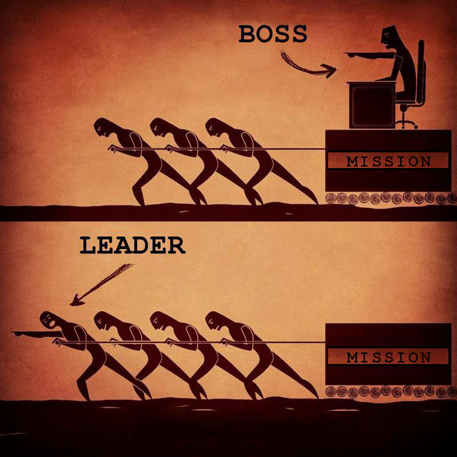

相比于技术路线而言，管理技巧难以被量化。更严重的问题在于，对于 leader 自己而言似乎也没有动力去给领导力做进一步提升，因为一方面大部分公司对于对于团队以及 leader 的绩效考核，永远是以业务指标为导向的（在 Thoughtworks 并不是）；另一方在公司框架的束缚和工作节奏的惯性带动下，团队工作表现也不太可能出现大的波动，似乎只要不犯错就是万事大吉。退一步说，没有胡萝卜仅仅用大棒来鞭策团队也是可以接受的，只要向上管理得当，没有人会关心你的管理工作是如何执行的。

如果不犯错是 leader 的及格线的话，我们还能为管理技巧加多少分？

## Leader 向左， manager 向右

长时间以来，我们一直被鼓励要成为 leader 而非 manager， 关于两者差异最经典的解释是：manager 游离于团队之外发号司令，leader 身先士卒

然而这样一句话远远不够，它没有来龙去脉：我们为什么要身先士卒而不是发号司令，两种行为产生的效应又有何不同，以及才能达到预期 leader 带来的效应。我不如再直接一些，抛开各种各样的理论，leader 究竟应该做些什么

在 [《Lean Software Development: An Agile Toolkit》](https://www.amazon.com/Lean-Software-Development-Agile-Toolkit/dp/0321150783) 一书中，作者给出了以下有关 manager 和 leader 之间的差异

|Managers (Cope with Complexity)|	Leaders (Cope with Change)|
|-------------------------------|---------------------------|
|Plan and Budget|	Set Direction|
|Organize and Staff|Align People|
|Track and Control|Enable Motivation|

但不同角色之间并非是完全割裂的，例如 leader 也要关注交付计划的执行状况，manager 最好也能和团队成员对齐愿景。

带着这些问题，我在《哈佛商业评论》[Leadership 标签](https://hbr.org/topic/leadership)下的很多文章里搜寻答案。我认为最完整的回答[《What Leaders Really Do》](https://hbr.org/2001/12/what-leaders-really-do)中已经说的很清楚了：

Management is about coping with complexity; it brings order and predictability to a situation. But that’s no longer enough—to succeed, companies must be able to adapt to change. **Leadership, then, is about learning how to cope with rapid change.**

- Management involves planning and budgeting. **Leadership involves setting direction.**
- Management involves organizing and staffing. **Leadership involves aligning people.**
- Management provides control and solves problems. **Leadership provides motivation.**

Management and leadership both involve deciding what needs to be done, creating networks of people to accomplish the agenda, and ensuring that the work actually gets done.

其中的很多观点在它其他很多篇的内容中也有重复，比如在[《Becoming a More Humane Leader》](https://hbr.org/2021/11/becoming-a-more-humane-leader)中：

management is about managing others, about exercising executive control over people. **Leadership, on the other hand, is about seeing and hearing others, setting a direction, and then letting go of controlling what happens next.**

在[《The Leader as Coach》](https://hbr.org/2019/11/the-leader-as-coach)中

companies are moving away from traditional command-and-control practices and toward something very different: a model in which managers give support and guidance rather than instructions…**The role of the manager, in short, is becoming that of a coach.**

不难发现 leader 总是与 vision、people、direction 这些词汇关联在一起。答案也就呼之欲出了：
leader纵然有管理的特质，但是他无法一意孤行，你必须要不断的和团队在方向上达成一致，并肩前行。

## 帮助团队成长的理由

在上一篇文章中我已经否定了让团队成员放飞自我的工作方式，这类工作方式在《打造 Facebook》或者《奈飞文化手册》书中看似美好的一个隐形前提是，公司愿意肯花费巨资去寻找最优秀的人。而我相信大部分公司的现状是，想找到一个靠谱能出活的人都难上加难。

我曾经的一位 leader 送给过我一本他颇为受用的图书[《一分钟经理人》](http://product.dangdang.com/23761954.html)，书中作者一语点破了这种现状：

>作为经理人，你实际上有三种选择。第一，你雇佣成功者，这些人很难找，而且开价很高；或者，第二，找不到成功者，你还可以雇佣有成功潜力的人，通过系统的训练把他们培养为成功者；要是前两种选择你都不满……那你只剩最后一种选择了——祈求老天保佑

看上去我们并无选择是不是？只有培养他们。

当然这里有一个前提是，公司认可人才带来的价值的，并且有意愿去招募好的人才。大部分公司并不会买这个帐，因为他们用平庸的人打造出的平庸产品就能够占领足够的市场获取丰厚利润了。

另一个自私的理由是，尽可能的去培养与你旗鼓相当的人，还可能是对 TL 自己的解脱。

我曾经纠结了相当长时间的一个问题是：我应不应该为团队成员分担更多的代码？毕竟我能写的更快更好。但在和某位前司大佬促膝长谈之后，他用下列理由明确告诉我不要这么做：
1. 我之所以能写的更快和更好，恰恰是因为我已经驾轻就熟了，付出再多的时间对我个人来说不会有更多的收益
2. 然而同样的工作对于尚未接触这块知识点的同学来完成带来的收获可能说受益匪浅，所以交由他们完成更加适合
3. 应当从执行者的视角转向管理者的视角转变，解决预见性的问题，解决非常规问题。

在另一本书[《The Coaching Habit: Say Less, Ask More & Change the Way You Lead Forever》](https://www.amazon.com/Coaching-Habit-Less-Change-Forever/dp/0978440749)中开篇就提出了类似的观点：通过养成培养（coach） 他人的习惯，你能够轻松打破工作场合中关于你自己的三类恶性循环：
- 对于你个人的过度依赖：当你成为全组人员的依赖之后，你的工作量会剧增，同时也成为系统中的瓶颈，其他人自然也就失去了工作的热情和动力。
- 忙到停不下来：无论你掌握了多么高超的高效工作技巧，你解决的问题越多，有待你解决的问题也就越多，在你被各类不同优先级的工作缠身之后，你便会失去工作的重心。
- 与最重要的事情脱节：我们的目标不应该仅仅是完成工作，更是要带来影响力和赋予工作意义。培养这件事能够帮助他人走出舒适区，向卓越迈进

跳过私人理由，即使从团队健康发展的角度上说，团队内也不应该有 hero 的存在，或者你听过更常见的说法是“摇滚明星程序员”（Rockstar Programmer）。这类人群在团队中无所不能，专攻疑难杂症，救项目于水火之中，但很快你就会开始发现他会成为瓶颈（single point of failure），越来越多的环节缺少他会开展不下去。这种对他的依赖同样也会反噬他自己，他的负担会变得越来越重，导致他最终燃烧殆尽（burn out）。

最后，如果你是痴迷于“掌控感”，那我可以很明确的告诉你 membership 和 ownship 对于员工也同样重要，他们工作中的幸福感也来源于掌控感。

## 营造氛围

去帮助我的团队除了给他们带来成长以外，还有一项任务可能是你想不到的：为他们营造无压力的氛围。

我最近在东东枪老师的播客“宇宙牌电饭锅”一期有关上班的节目里，听到一则让我非常有共鸣的观点，大意是工作会给人带来一种无力感。无力感不是有意谁强加给谁的，可能是从上到下，从外到内传导的结果

我想表达的是作为 leader，你不仅有能力将 suffering 在你这一层就阻断掉，还有义务这么做。道理非常简单：suffering 的环境只可能给工作环境带来负面效应。对于团队内产生的问题，拍桌、呵斥、咒骂都无济于事。 如果你相信新自由主义自我管理的那一套的话，在[《第五项修炼》](http://product.dangdang.com/25216820.html)或者[《Question Behind the Question》](https://www.amazon.com/QBQ-Question-Behind-Practicing-Accountability/dp/0399152334)书中永远在告诫你，永远从自己找问题，永远去想如何解决问题。

我说服不了自己如果团队成员能够少关心繁琐的事情，少参与一些政治斗争，哪怕花很少的成本就能让他们工作的开心一点，那为什么不呢？

[知乎上一个沉重问题](https://www.zhihu.com/question/346895765/answer/838575128)下的答案更深刻的解释了这个道理，这一小节其实引用他的话就足够了：

>不是说因为经理在 suffering 就能合理化手下的人在 suffering。做经理的人知道这是 suffering 的工作，他们可以选择不做经理。好的经理往往都要有一定自我牺牲的意识，帮手下把屎挡掉。一个好的经理就是应该尽力把 suffering 的事情终结在自己这个层级，不要再往下扩散，只是有时候这不现实，往下扩散无法避免。

撕开公司柔情脉脉的面纱，对团队以及 leader 的评价始终是要建立在结果为导向上的。人毫无疑问是对交付来说最基本和最有效的保障。“以人为本”喊了那么多年听到我们耳朵都起茧了，但不得不承认它依然是有效的。

在[上一篇文章](https://www.v2think.com/tech-leader-mistake)的最后我留下了一个问题

皮克斯公司在《玩具总动员》大获成功之后，他们安排《玩具总动员》一片的创意团队专心致力于《虫虫危机》的制作，而只派遣了两名（导演经验为零的）资深动画师来掌舵《玩具总动员2》。

而等到一年之后再来审视《玩具总动员2》的进展时，却发现整部动画惨不忍睹。于是他们不得不做出换掉导演团队的艰难决定。

但冒险也是皮克斯不可以扔掉的一个特质，这就意味着他们必须把钥匙交到那些不太符合传统导演标准的新人手中。那么如何避免上上面的情况再次出现？

他们开始有意识的培养新人：

>为那些我们认为具备导演潜质的人才提供培训和历练的机会。我们不再奢望新人会通过潜移默化自然而然地吸收资深导演们的智慧，而是设置了一套正规的培训课程……此后，每位资深导演每周都要和自己所培训的新人进行交流，对新人的电影构思给予激励并提出建议。

