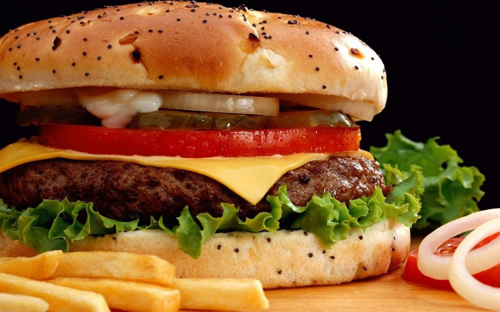

# Food

Chinese has Eight Great Traditions food which origin from different regions of China:
Anhui, Cantonese(Yue), Fujian, Hunan, Jiangsu, Shandong, Sichuan, and Zhejiang. Each kind of food tradition has its own cuisine(way of cooking/cooking style). What a pity is my hometown's food is not on the list but they are delicious as well and worth to taste. Each kind of food need specify cuisine method, like Boiling, frying, or make them together, more than one processour. and braising are the most common way. Also different tradition style depend on special region related food ingredients(material).

Now let's talk about western food. About few weeks ago, there is a popular documentary TV serial called **A bit of China**. They(Production unit/crew ) travel across China, using almost eight hours/episodes to show what I just told the traditional food. At the same time, there are some amuse version like **A bit of England** and **A bit of American**

We both know this is not true but just some kind of joke. I this truly reflect people's impression about western food: lack of variety, high calories, not so healthy.

Compare with Chinese food, we can summarize western food have features like: 

1. simple cook way
2. Largely protein intake (beef and milk)
3. because of advanced food industry(food study), western food collection seems more Nutrition

# Relationships

- Chinsese seems more introversion. Chinese always have small number of close, lifelong friends who feel deeply obligated to give each other whatever help might seem reuqired. 

- With acquaintances we always avoid direct confrontation, open criticism, and controversial topics.  Concern maintaining harmony and with "face."(reputation)

- More faith in personal relationships than in written rules and procedures(even the laws) for structuring interactions. We good at/tend solve problems in relationships

- Western people are more open nad good at making friends. More friendly to strangers. They have large collection of "friends" and acquaintances which changes over time and involves only limited mutual obligations. 

- On the contrary, willing to confront directly, criticize, discuss controversial topics, press personal opinions about what they consider the truths or the fact.  Little concern with "face."

- Written rules presumably apply to everyone and are assumed to produce fair, reasonable procedures and decisions.

