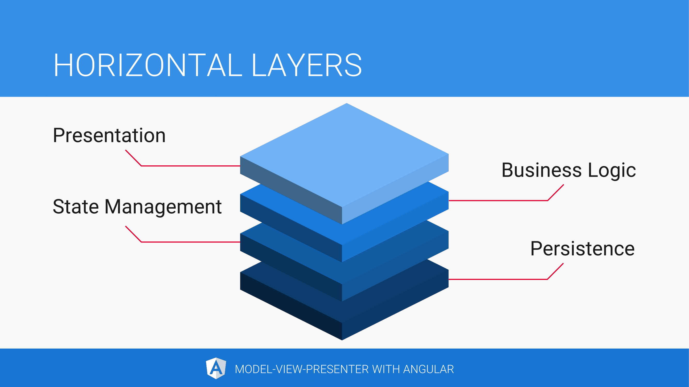

# Angular 与 MVP 模式

随着应用程序的日趋庞大，它变得更难维护。复杂性也随着可复用模块的价值增长。我们都知道我们应该在它面临失败风险前做些什么

设计模块能够拯救它！

## 复杂应用

一个复杂应该至少拥有以下其中一个特征

- 组件树中的多个组件展示同一份应用状态
- 拥有多个更新应用状态的来源：
  - 多个用户同时交互
  - 后端实时推送状态更新给浏览器
  - 后台定时任务
  - 近距离传感器或者其它设备传感器
- 频繁的更新应用状态
- 大量的组件
- 代码量大的组件，回想一下之前的[大泥球](http://www.laputan.org/mud/)般的 AngularJS controller
- 组件内部的高度复杂循环——高度集中的逻辑分支和异步控制流

与此同时，我们希望应用是具有可维护的，可测试的，可拓展的和具有良好性能的

复杂的应用不一定拥有所有这些有价值的特征。我们也不能在完成高级功能的情况下避免这些所有的特征，但是我们可以设计应用来最大化它的有价值的特征

## 分离关注点

我们可以将*分离关注点（separation of concerns）*作为应用的分层方案。我们按照系统的关注点组织逻辑以便于每次只聚焦于单一功能。在最顶层，分离关注点是一个架构原则。在日常开发中，它都应该改被铭记于心

我们可以同时将我们的应用横向，纵向的分片。当纵向分片时，我们按照*功能*把软件工件分组；当横向分片时，我们按照软件*层次*分组。子啊我们的应用中，我们可以将软件工件划分为这些横向层次，或者是系统关注点

| Horizontal layer | Examples                                                     |
| ---------------- | ------------------------------------------------------------ |
| Business logic   | Application-specific logic, domain logic, validation rules   |
| Persistence      | WebStorage, IndexedDB, WebSQL, HTTP, WebSocket, GraphQL, Firebase, Meteor |
| Messaging        | WebRTC, WebSocket, Push API, Server-Sent Events              |
| I/O              | Web Bluetooth, WebUSB, NFC, camera, microphone, proximity sensor, ambient light sensor |
| Presentation     | DOM manipulation, event listeners, formatting                |
| User interaction | UI behaviour, form validation                                |
| State management | Application state management, application-specific events    |

同样的规则也可以应用于我们的 Angular 组件。它们应该只关心*表现*层和*用户交互*层。结果就是我们将系统的里的动态部分解耦

当然，我们添加额外的抽象层的过程需要非常多的约束，但是最终结果的有价值的特性会弥补这一切。请记住我们只是创建了一开始就应该在那里的抽象

## MVP（Model-View-Presenter）模式

MVP 是一类实现应用界面的软件架构设计模式。我们用它使得类，函数，和难以测试的模块（软件工件）的复杂逻辑减到最小。特别是我们会避免像 Angular 组件这种界面类型的软件工件的变得复杂。

就像它衍生自的 MVC 模式一样，MVP 将领域模型（domain model）和表现（presentation）进行分离。表现层通过观察者模式（Observer Pattern）对领域的变化做出响应，这些在由 Erich Gamma, Richard Helm, Ralph Johnson, and John Vlissides (又称为 “The Gang of Four”) 编写的经典图书 “[Design Patterns: Elements of Reusable Object-Oriented Software](https://www.amazon.com/Design-Patterns-Elements-Reusable-Object-Oriented/dp/0201633612)” 中具有描述

在*观察者模式*（Observer Pattern）*中，一个*对象（subject）*维护了一个当状态改变时需要通知的*观察者（observers）*列表。这听起来熟悉吗？你已经猜到了，RxJS 就是基于观察者模式

*视图*（view）*除了在表单的数据绑定和组件组合中并不包含任何的逻辑或者行为。当用户交互发生时它把控制权委托给 presenter

presenter 会批处理状态的修改，所以当用户填写表单时最终呈现的时一个巨大的修改而不是许多零碎的修改，比如每一个表单会更新应用的状态而不是每一个字段。这使得撤销或者重做状态的改变变得容易。presenter 通过命令更新状态。多亏了 [Observer Synchronization](https://www.martinfowler.com/eaaDev/MediatedSynchronization.html) 状态的改变才得以反馈到视图上

### Angular 变种

受到原始 MVP 模式的启发以及经过一系列的变化，我们创建了适用于 Angular 平台的软件工件，它的关键界面单位就是*组件（component）*