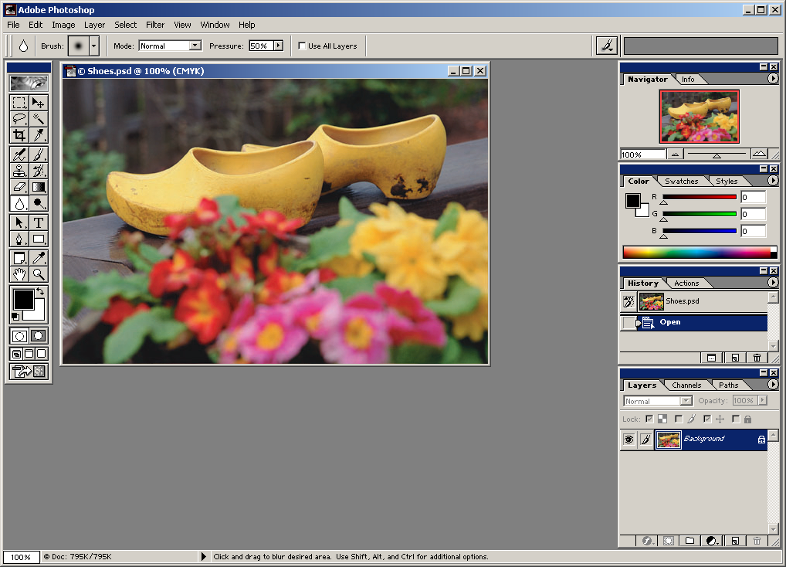

# MVC 的铠甲和软肋

在这个系列里面，我会谈到前端架构的进化；它们解决了什么样的问题以及又是如何面临新的无法解决的问题的；最后这些架构背后常见的组件和模式。 

我知道你们都太熟悉 Flux，Redux 和 Vuex 了，所以我不会对它们着墨太多甚至说刻意避免它们。相反，我会谈论到你们不熟悉和没有听说过的 Backbone.js，Mobx，NgRx 和 Akita 等等。我不会深入这些框架的使用细节，而是在必要时介绍它们框架内的概念和设计思路。最后你会发现其实所有框架背后其实都在用同一种方案解决问题，你也有能力创建自己的框架了。

如果你是第一次接触这个系列，建议从第一篇文章阅读起

---

## 单页面应用的主要矛盾

我在刚入这行的时候加入的是一家创业公司，它们的产品是 iPad 上给儿童阅读的电子互动图书。而我的工作职责就是负责一款在线单页面应用编辑工具的前端部分，以供公司内的编辑同事制作这些电子图书。编辑同事可以在这个工具内导入素材，比如音频、视频、或者图片。然后摆放这些素材的位置，给它们设置动画效果等等。它类似于一个可以制作动画的 Photoshop，或者平面版本的 Unity3D 编辑器。当然用这两个比喻实在是太抬举它了，但是我想你们大概能想象出它的功能和样子。

我们就从这个应用开始

它的界面类似于 Photohop 的工作区



如上图所示，每当你选中一个素材，右侧的不同属性栏中就会呈现这个素材不同维度的状态，例如它的尺寸，色彩状况，操作历史，图层状态等等。我们不如先把不同的视图区域标注一下：


那么对于“每选择一个素材是就展示它的相关这个属性”这个需求，我想当然的第一版（伪）代码是这么写的：

```javascript
canvasView.onSelectElement(image => {
    const {size: { width, height }, color, history, layer } = getComputedStyle(image);
    
    infoView.updateHeight(height);
    infoView.updateWidth(width);
    
    colorView.updateColor(color);
    historyView.updateHistory(history);
    layerView.updateHistory(layer)
})
```

如果只有这一个需求不会有大问题，现在我们提出另一个需求：当删除选中的元素时把各个属性栏的数值清空：

```javascript
canvasView.onDeleteSelectedElement(image => {
    infoView.updateHeight(0);
    infoView.updateWidth(0);
    
    colorView.updateColor(null)
    historyView.updateHistory(null)
    layerView.updateHistory(null)
})
```

以及我们可以从 history 中选择回滚到某个版本：

```javascript
historyView.rollbackTo((historyInfo) => {
   	const {size: { width, height }, color, history, layer } = historyInfo;
    
    infoView.updateHeight(height);
    infoView.updateWidth(width);
    
    colorView.updateColor(color);
    historyView.updateHistory(history);
    layerView.updateHistory(layer)
})
```

我的第一版代码真的是这么写的，想必此时你也应该感受到我的痛苦了：**我必须手动的更新每一个视图状态信息**

