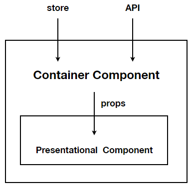
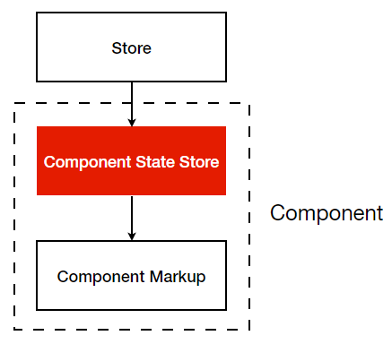
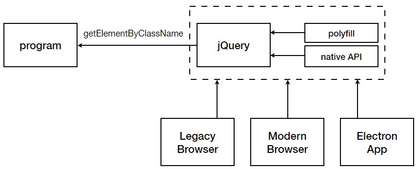

# MVC 启示录：模块的职责，作用域和通信

在上一篇中，我提出了一个应用中常见的问题：如何在多个视图中共享同一份数据，并且保证它的改动能够同步到不同的视图中去？

针对这个问题我给出了两类解决方案：一类是用户行为驱动的意识流编码，比如当我选择将素材回滚到某个历史版本时，我想当然的手动去更新每一个视图：

```javascript
historyView.rollbackTo((historyInfo) => {
   	const {size: { width, height }, color, history, layer } = historyInfo;
    
    infoView.updateHeight(height);
    infoView.updateWidth(width);
    
    colorView.updateColor(color);
    historyView.updateHistory(history);
    layerView.updateHistory(layer)
})
```

另一类是 MVC 解决方案，以 Backbone 为例，它通过广播事件来通知各个视图的更新发生了

```javacript
const HISTORY_ROOLBACK_EVENT = 'rollback';

// InfoView.js:
initialize: function () {
    this.listenTo(historyModel, HISTORY_ROOLBACK_EVENT, this.updateSizeInfo);
},

// ColorView.js:
initialize: function () {
    this.listenTo(historyModel, HISTORY_ROOLBACK_EVENT, this.updateColorInfo);
}
```

很明显第二种解决方案会更好，从维护代码的体验上说，我们不用去主动的维护视图间的调用关系。每当有视图添加或者被删除时，不需要找到它的每一个消费方把这层调用关系做对应的修改。

但不知道你们有没有考虑过为什么第二类方案会给我们带来这样的便利，或者说第一类会让人觉得糟糕；我们是否能够从中得到一些启示来帮助我们今后的代码也变得同样的利于维护？在这一篇的内容里我们详解这些编程中的原则和模式。这将为我们之后的内容奠定基础

## 分离关注点

“分离关注点”，即 Separate Of Concern，以下简称 SOC。

我们的前后端代码库是分离的，前后端团队是分离的，component 和 store 是分离的，component 之间也是分离的。分离是可维护性的出发点，有助于我们理解系统，有助于我们专注局部。 有的是框架使然，有的实践使然。再强调一遍，SOC 解决的不是帮助我们解决功能性问题，而是非功能性需求，“意大利面”和“大泥球”代码当然能工作，但是维护的成本极高

但是在约束之下呢，如果脱离了框架，回归到依靠人工编写的代码时，我们的代码依然是良好分离的吗？思考下面的这些问题有助于你理解“分离”这件事：

- 在早期的前端项目中提倡样式与脚本的分离，现在则是提倡以脚本和样式为整体单位的组件分离？为什么会出现这样的变化？
- “状态”和“组件”是什么样的关系？它们应该被分离吗？比如分开存放在 store 和 component 中
- 重复的代码务必需要被移除吗？

不知道你有没有读过原版 [Uncle Bob Martin](https://twitter.com/unclebobmartin?lang=en) 的 [Clean Architecture](https://www.amazon.com/Clean-Architecture-Craftsmans-Software-Structure/dp/0134494164)，我个人在阅读过程中印象最深的一个词组是 “axis of change”。也就是说分离关注点并不是无脑的一刀切，需要从变化的频率（rate）和变化的原因（reason）去考虑。在实际过程中你可以能还需要考虑更多的 “axis”，也就是更多的维度，比如 scope，团队。

但无论如何，我个人的经验是，“分离”问题大体上需要回答这几个问题

- 我们应该按照什么样的规则分离关注点？——**职责**
- 关注点的“可见度”（在系统内能做的，能访问的数据）有多少——**作用域**
- 不同关注点之间如何协作？——**通信**

其它的问题同样需要解决，但是在我看来这三个问题是最重要的

## 单一职责（Single Responsibility Principle）

我们再来重新审视一下最初的“意识流”代码：

```javascript
historyView.rollbackTo((historyInfo) => {
   	const {size: { width, height }, color, history, layer } = historyInfo;
    colorView.updateColor(color);
    historyView.updateHistory(history);
    layerView.updateHistory(layer)
})
```

这是一份存在于视图层的代码，但它同时再做好几件事情：

- 响应用户的请求
- 更新其它视图（的业务数据）
- 重新获取业务数据

喔，它同时把 MVC 的事情都做了，但这一定都不酷。**如果一段代码职责越多，改变任何其中一个功能对其它功能产生影响的可能性也就越大**。这种影响可能不仅仅限于这个模块，还会牵扯到整个应用。这样的代码是脆弱的。

在 Clean Architecture 中，单一职责意味着 **”A CLASS SHOULD HAVE ONLY ONE REASON TO CHANGE“**。如果你发现当你修改任何功能都要修改同一份代码的时候，就要小心了。

如果你有 React 经验的话，相信你一定知道 Smart Component 和 Dumb Component 的概念（或者又称为 Container Component 和 Presentational Component），前者负责存储状态，加载数据；后者只负责渲染。这种模式就是很好的职责划分的例子。



值得注意的是，职责和实现并不是绝对统一的。我们通常使用专业的状态管理框架比如 Redux 或者 Mobx 进行状体管理，但在 Container Component 的场景里一个本用于可视化的组件的成了临时的状态管理工具并且它也做的非常不错。事实上目前 React 自身提供的功能已经能实现绝大部分的状态管理功能，比如通过 `useReducer`，通过 `ContenxtAPI` 等等。

我想强调的是：**正确的设计程序、对模块进行职责划分比强行去套入框架重要**。上面的段落里我列举了一个状态从框架 “降级”到组件中的正面例子。类似的，你可以想象一个把组件状态“升级”到全局 store 的反面例子。之所以称之为反面，是因为有些类型的组件状态，比如表现层状态，比如是否高亮，是否折叠，并不适合加入到全局状态中。它们通常是局部的，带有生命周期的，更适合伴随着组件产生和消亡。

如果你现在已经感到疑惑的话，我再提出一个之后我们会谈到的模式：组件的状态既不存在于组件内部中，也不存在于全局 store 中，而是存在于独立第三类状态文件中，这种模式对组件内的状态再一次进行了分离（（下图箭头的反向代表数据的传递顺序，并非模块的依赖顺序））



## ”作用域“

之所以加上引号是因为可能用英文描述更加达意，比如 scope、boundary、knowledge。总之我们需要回答的问题是，当不同的关注点被分离成独立的模块后，它的知识边界在哪里？它们能够知道些什么，不应该知道些什么

我猜你的 React 项目一定有类似于 util.js 或者是 helper.js 一类的工具类库，它们通常负责做一些类似于转化日期格式，生成 uuid 一类的边角料工作。我们都同意这类代码完全可以和项目无关的，甚至把文件复制到另一个 Angular 项目中它们依然可以生效，它们对项目里的 store 是用什么解决方案管理的，甚至有没有 store 都完全不知情。

但如果我们把边界再缩小再模糊一些呢，store 应不应该知道 component 的存在？component 应不应该知道 store 的存在？如果继续把边界缩小一些呢，父组件是否应该知道子组件的存在？子组件是否应该知道父组件的存在？你也许会说现有的机制里面 store 不必知道 component 的存在，React 框架父组件也必须知道子组件的存在。但假设给你一个机会，能够让你有无上的权力重写所有的这些框架，重置它们的机制，不用担心有任何的副作用，你是会依然遵循现有的方案还是有不一样的想法？

或许换一个场景能够帮助你理解这个问题，假设你需要编写了一段在空调遥控器液晶屏显示实时时间的程序，将来还需要把它移植到电视遥控器甚至风扇遥控器上，为了避免移植过程中反复的重写代码，你肯定会最大程度的减少直接与硬件接口的调用，或者说至少把它们隔离出来独立统一管理。因为硬件是千奇百怪的，是会更新换代的，然而你的程序代码在完成之后基本不会在发生变化了。**如果你的核心代码对外界的信息了如指掌，那么外部的丝毫变化都会影响到代码的重写和重新编译。相反我们需要把变更的成本降到最小**。

这和我们上面说的 axis of change 依然是保持一致的——把不同变化原因的代码隔离开。

你也可以把这个当作最大程度的一种解耦

我们使用的外观模式、jQuery 殊途同归，只不过它们是站在消费者角度屏蔽系统的复杂性来看这个问题。以 jQuery 为例，浏览器和核心业务代码的关系就类似与我上面提到的硬件与代码的关系。我们不关心浏览器是否真的支持 `getElementByClassName`，我们仰仗的是`$()`函数支持我们传递 classname 来选择元素。即使浏览器从版本6升级到了版本60，关于这部分代码也不用做任何改变。甚至放到 Electron 应用中也没有问题



**所以 store 和组件没有任何关系，它们都不应该知道对方的存在**。换句话说，一个应用的 store 可以仅仅用一个 windows 全局变量就实现是不是；redux 也可以服务于 Node.js CLI 应用是不是。它们天生并没有必然的逻辑。

说白了这种理想的“不相往来”关系的最高境界是，如果有一天 React 不再开源了而是需要收费了，又或者有更好的视图层框架出现了，你可以在不改动任何一行 store 代码的前提下把 React 替换掉。更加理想的状态的是，因为应用是需要继续工作的，所以它的业务逻辑依然是有效的，而这些业务逻辑恰恰存在于 store 中，不用发生任何的修改。反之你也可以在不改变 component 的情况下换掉 store 的实现。

最后 store 和 component 是通过各种的 connect 或者 selector 连接起来的。


假设你使用的 React 渲染视图层，只需要保证传递给 props 的属性值不变即可。如果其它的框架不支持 props，facade 或者是 proxy

store 和 component 只是关于作用域其中的一个例子。在设计架构中的其它模块时，你都需要考虑模块的知识边界在哪里。例如当一个模块被其它模块引用的越多，它就越难以被替换；当一个模块引用的模块越多，他背负的职责也就越多，就更容易变得难以维护。

最后我照例提出一个承上启下的问题： 如果你有注意前一篇中举例的 Backbone.js 和 AngularJS 的话，你会发现两者的 model 层对 view 是一无所知的。但 view 是清楚 model 的存在的（在 AngularJS 中通过 controller 将数据转发给了模板，而 Backbone.js 中则是对 model 的直接引用）。**于是我们看到了一种模块间依赖的方向性，即 A 依赖于 B，但 B 不会依赖于 A。这样的方向有什么讲究？会给我们的应用带来什么样的影响？在后几篇中会继续谈到**

## 通信


