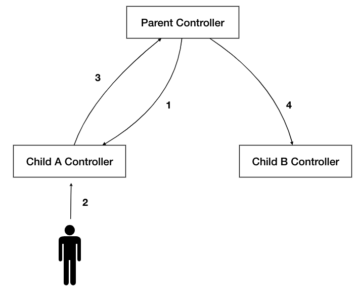

# MVC 没有解决的和 Flux 解决的

## MVC 的不足

在前几篇中，我演示了一个前端 Backbone.js MVC 框架用于解决实际问题的例子。但 MVC 依然存在几个问题

- 不可预测：当一个事件发生之后，你并不知道会有谁响应这个事件，是单个对象还是多个对象会响应这个事件
- 级联修改：当一个事件发生之后，A 组件在接收到事件之后在响应的过程中，还可能发出其他的事件触发后续的修改，你并不知道这个事件会在何处结束，会造成什么样的结果。这也和上一条「不可预测」相对应
- 响应顺序：如果存在多个对象响应同一个事件的话，有时候对响应的顺序是有要求的，某些变更不可以出现在其他的变更之前
- 有条件响应：对于传播方而言，并非希望所有的时间都一视同仁的广播出去；对于消费方而言，也并不希望一视同仁的响应所有的事件

你可能会认为事件机制存在的问题是否只存在于 Backbone.js 中，那 AngularJS 这个 MVC 框架会不会好一些呢？

首先 AngularJS 框架中也支持全局的事件机制，比如 `$broadcast`,`$emit` 等等。这样的事件机制支持变化从 `$rootScope` 向各个 contoller 的 `$scope` 广播全局的变化。如果你对 scope 这个概念不熟悉的话，可以把它理解为模块内部的作用域。

AngularJS 更重大的缺陷在于它的双向绑定机制，或者说是双向数据流 (bidirection data flow) 。也就是说 A 可以把变量传递给 B，当 B 修改这个变量之后，A 中对应的变量值也会发生修改。咋听之下似乎是非常方便的机制，例如在表单这个场景中会非常实用，但是它存在一些隐患。我们以下图中的这个场景为例：

1. Parent Controller 把某个变量以双向绑定的机制传递给 Child A Controller 

2. 此时用户在界面上对这个变量值进行了修改

3. 因为双向绑定的缘故这个值同步到了 Parent Controller 中

4. 同时 Child B Contoller 和 Parent Controller 也通过双向绑定把值同步到了 Child B 中，此时 Child B 中的值也发生了修改

也就是说，当你修改 Child A 中的一个值时，你会影响到 Child B 中的值。这样的副作用是危险的，除非你对整个系统里用到这个值的地方了如指掌，否则你极有可能影响到你不愿意被你影响到的地方。

如果 Child A 和 Child B 属于不同的开发人员进行开发, 那么 Child B 的开发人员在排查这个问题是会非常困难，因为站在他的视角上而言，他只知道这个值来自于 Parent Controller，但是这个值又被哪些地方消费了，哪些地方修改了他并不知道。在框架机制内不支持这样的追溯。此时你只能保佑关于这个变量有一个 setter 方法，又或者通过 IDE 的查找功能在代码里全局搜索用到这个变量的地方

批评不等于否定。事件机制依然是我们许多问题里可选的解决方案之一；Backbone.js 和 AngularJS 放在现在看也依然是优秀的解决框架，但不是最优解而已。

我个人认为问题在于当下我们解决的问题和过去比发生了许多的变化，随着浏览器能力不断增强，前端需要解决的问题也变得越来越复杂，团队规模也逐渐扩大。如果以 React 步入公众视野的 2014 为节点的话。2014 年以前我们的开发主要集中在类似于 widget / plugin 级别的功能上；而在 2014 年之后应用级别的功能慢慢变得普及起来。

如果你对比 2014 年以后和之后流行或者崛起的那些框架，你就会感受到其中的微妙之处：

- 2014 年前：jQuery, Bootstrap, RequireJS, Kissy, Handlebars
- 2014 年后：Redux, Ngrx, Mobx, Akita, Ngxs

前者倾向于碎片化，各司其职的辅助性的功能；后者倾向于应用级别的数据管理

事件机制和双向绑定更适用于小规模的范围内，随着应用级别不断扩大，副作用的带来负面效用会变得越来越明显。

## Flux

