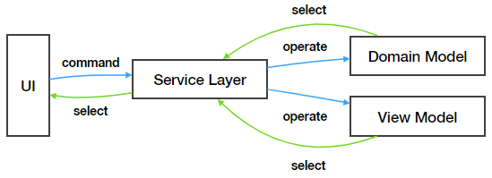

# 整洁（Clean Architecture）架构是归宿

## 整洁架构

如果你对整洁架构（Clean Architecture）有所了解的话，回想一下我们前几篇中描述的内容，你会发现整洁架构对前端，对 MVP 来说也是同样适用的。

关于什么是整洁架构完全可以通过阅读 Uncle Bob 原版图书中文版《整洁架构之道》来了解，或者可以通过阅读他的一个简短版本博客 [The Clean Architecture](https://blog.cleancoder.com/uncle-bob/2012/08/13/the-clean-architecture.html)  一探端倪。但我还是推荐阅读图书，图书全面而且浅显易懂，没有和某一门编程语言强行绑定，即使你没有后端背景也能流畅的通读下来。在这里我摘取一些契合于我们前端架构的知识点以作说明。

这篇文章里更多的是告诉你 what（结论），而不是 why（为什么需要这么做）。因为 why 这件事需要更多的上下文来解释，这也是我为什么推荐你阅读原书的另一个原因。

为了便于说明，我也把上次的 MVP 流程也放在这里

### 依赖关系

我们可以将我们的应用大致划分为三类模块：UI、Service Layer (Presenter)，Business Model。这么划分不仅是直觉上告诉我们应该怎么做，更重要的是这三大类的模块的变化频率是不同的，这也是我前文中说的 axis of change.

变化频率最高的是 UI。这里的变化频率不仅仅指的是我们实际上修改代码的次数，还包括它可以”被替换的程度"。什么意思呢？想象一下目前你正在编写的任何前端应用，关于视图的渲染可能使用的是 React, Angular, 甚至还可能只是 Node.js 的命令行而已。但无论视图层的框架是什么，这个应用的核心功能是不会变的，如果它是一个计算器，不同视图框架编写的不同之处无非在于，用户是通过 React 的输入框、 Angular 输入框还是电脑终端输入需要计算的数值。

变化频率次高的是 Service Layer，也就是用户用例，最后才是 Business Model。Service Layer 通常起的是编排作用，你也可以简单理解为流程控制，它通过调用各个 Business Model 来完成用户的一次交互，相信你完全可以理解流程的更改是比较频繁的。而至于 Business Model，则是不会轻易更改的，或者说修改起来是非常慎重的。想象税务系统或者移民系统中的每一个业务领域，每一个规则都和法律法规相关联，有的和公司的政策和盈利模式相关联，是不能随意修改的。

还是想强调我描述的其实是一种相对情况，你在实际过程中可能你的 Service Layer 和 Business Model 会有相同的修改频率。有时候这种情况是正常的，但有时候是则是危险的信号。

