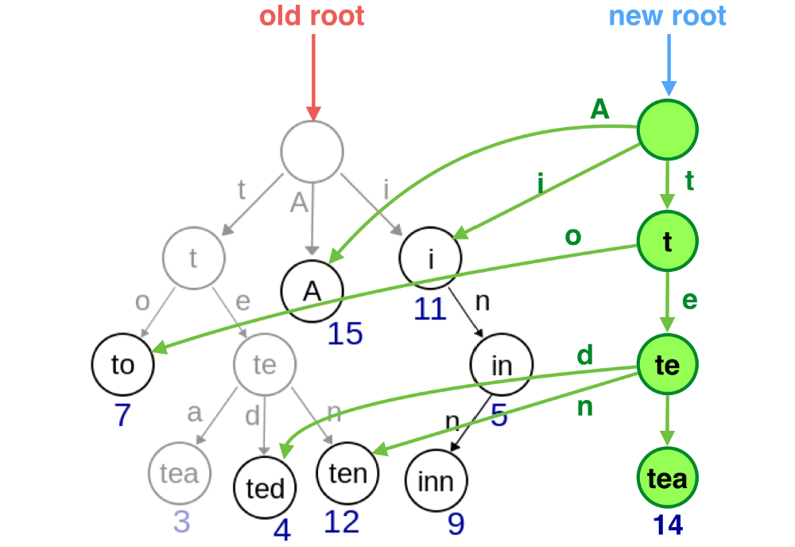

# React + Redux 性能优化（二）工具篇： Immutablejs

建议在阅读完上一篇[React + Redux 性能优化（一）：理论篇](http://qingbob.com/redux-performance-01-basic/)之后再开始本文的旅程，本文的很多概念和结论，都在上篇做了详细的讲解

这会是一篇长文，我们首先会讨论使用 Immutable Data 的正当性；然后从功能上和性能上研究使用 Immutablejs 的技术的必要性

我猜你更关心的是是否值得使用 Immutablejs，这里先放上结论：推荐使用；但不一定必须使用。如果推荐指数最低一分最高十分的话，那么打六分。

## 关于 Pure

无论是在 react 还是 redux 中，pure 都是非常重要的概念。理解什么是 pure 有助于我们理解我们为什么需要 Immutablejs

首先我们要介绍什么是Pure function （纯函数）, [来自维基百科：](https://en.wikipedia.org/wiki/Pure_function)：

> 在程序设计中，若一个函数符合以下要求，则它可能被认为是纯函数：
>  * 此函数在相同的输入值时，需产生相同的输出。函数的输出和输入值以外的其他隐藏信息或状态无关，也和由I/O设备产生的外部输出无关。
>  * 该函数不能有语义上可观察的函数副作用，诸如“触发事件”，使输出设备输出，或更改输出值以外物件的内容等。

简单来说纯函数的两个特征：1) 对于相同的输入总有相同的输出；2) 函数不依赖外部变量，也不会对外部产生影响（这种影响称之为“副作用（side effects）”）

### Reducer

redux 中**[规定](https://redux.js.org/basics/reducers) reducer 就是纯函数**。它接收前一个 state 状态和 action 作为参数，返回下一个状态:

```
(previousState, action) => newState
```
保证 reducer 的“纯粹（pure）”非常重要，你永远不能在 reducer 中做以下三件事：
* 修改参数 
* 执行任何具有副作用的操作，比如调用 API
* 调用任何不纯粹的函数，比如`Math.random()`或者`Date.now()`

所以你会看到在 reducer 里返回状态是通过`Object.assign({}, state)`实现的（注意不要写成`Object.assign(state)`这样就修改了原状态）。而至于调用 API 等异步或者具有“副作用”的操作，则可以借助于`redux-thunk`或者`redux-saga`。

### Pure Component

在上一篇中我们谈到过 Pure Component，准确说那是狭义上的`React.PureComponent`。广义上的 Pure Compnoent 指的是 Stateless Component，也就是无状态组件，也被称为 Dumb Component、 Presentational Component。从代码上它的特征是 1) 不维护自己的状态，2) 只有`render`函数:

```javascript
const HelloUser = ({userName}) => {
  return <div>{`Hello ${userName}`}</div>
}
```

显而易见的是，这种形式的“纯组件”和“纯函数”有异曲同工之妙，即对于相同的属性传入，组件总是输出唯一的结果。

当然这样形式的组件也丧失了一部分的能力，例如不再拥有生命周期函数。

## 性能

上篇中我们得出的一个很重要的结论是，只要组件的状态（`props`或者`state`）发生了改变，那么组件就会执行`render`函数进行重新渲染。除非你重写`shouldComponentUpdate`周期函数通过返回`false`来阻止这件事的发生；又或者直接让组件直接继承`PureComponent`。

而继承`PureComponent`的原理也很简单，它只不过代替你实现了`shouldComponentUpdate`函数：在函数内对现在和过去的`props`/`state`进行“浅对比”（shallow comparision，即仅仅是比较对象的引用而不是比较对象每个属性的值），如果发现对象前后没有改变则不执行`render`函数对组件进行重新渲染

其实这样一套相似逻辑在 Redux 中也多次存在，在 redux 中也会对数据进行“浅对比”

首先是在`react-redux`中

我们通常会使用`react-redux`中的`connect`函数将程序状态注入进组件中，例如:

```javascript
import {conenct} from 'react-redux'

function mapStateToProps(state) {
  return {
    todos: state.todos,
    visibleTodos: getVisibleTodos(state),
  }
}

export default connect(mapStateToProps, mapDispatchToProps)(App)
```
代码中组件`App`是被 `react-redux` 封装的组件，`react-redux`会假设`App`是一个`Pure Component`，即对于唯一的`props`和`state`有唯一的渲染结果。
所以`react-redux`首先会对根状态（即上述代码中`mapStateToProps`的第一个形参`state`）创建索引，进行浅对比，如果对比结果一致则不对组件进行重新渲染，否则继续调用`mapStateToProps`函数；同时继续对`mapStateToProps`返回的`props`对象里的每一个属性的值（即上述代码中的`state.todos`值和`getVisibleTodos(state)`值，而不是返回的`props`整个对象）创建索引。和`shouldComponentUpdate`类似，只有当浅对比失败，即索引发生更改时才会重新对封装的组件进行渲染

就上面的代码例子来说，只要`state.todos`和`getVisibleTodos(state)`的值不发生更改，那么`App`组件就永远不会再一次进行渲染。但是请注意下面的陷阱模式：

```javascript
function mapStateToProps(state) {
  return {
    data: {
      todos: state.todos,
      visibleTodos: getVisibleTodos(state),
    }
  }
}
```
即使`state.todos`和`getVisibleTodos(state)`同样不再发生变化，但是因为每次`mapStateToProps`返回结果`{ data: {...} }`中的`data`都创建新的（字面量）对象，导致浅对比总是失败，`App`依然会再次渲染

其次是在 `combineReducers` 中。

我们都知道 Redux Store 鼓励我们把状态对象划分为不同的碎片（slice）或者领域（domain，也可以理解为业务），并且为这些不同的领域分别编写 reducer 函数用于管理它们的状态，最后使用官方提供的`combineReducers`函数将这些领域以及它们的 reducer 函数关联起来，拼装成一个整体的`state`

举个例子

```javascript
combineReducers({ todos: myTodosReducer, counter: myCounterReducer })
```

上述代码中，程序的状态是由`{ todos, counter }`两个领域模型组成，同时`myTodosReducer`与`myCounterReducer`分别为各自领域的 reducer 函数

`combineReducers`会遍历每一“对”领域（key是领域名称、value是领域 reducer 函数），对于每一次遍历：
* 它会创建一个对当前碎片数据的引用
* 调用 reducer 函数计算碎片数据新的状态，并且返回
* 为 reducer 函数返回的新的碎片数据创建新的引用，将新的引用和当前数据引用进行浅对比，如果对比失败了（同时意味着两次引用不一致，意味着 reducer 返回的是一个新的对象），那么将标识位`hasChanged`设置为`true`

在经过一轮（这里的一轮指的是把每一个领域都遍历了一遍）遍历之后，`combineReducer`就得到了一个新的状态对象，通过`hasChanged`标识位我们就能判断出整体状态是否发生了更改，如果为`true`，新的状态就会被返回给下游，如果是`false`，旧的当前状态就会被返回给下游。这里的下游指的是`react-redux`以及更下游的界面组件。

我们已经知道了`react-redux`会对根状态进行浅对比，如果引用发生了改变，才重新渲染组件。**所以当状态需要发生更改时，务必让相应的 reducer 函数始终返回新的对象！修改原有对象的属性值然后返回不会触发组件的重新渲染！**

所以我们常看到的 reducer 函数写法是最终通过 `Object.assign` 复制原状态对象并且返回一个新的对象：

```javascript
function myCounterReducer(state = { count: 0 }, action) {
  switch (action.type) {
    case "add":
      return Object.assign({}, state, { count: state.count + 1 });
    default:
      return state;
  }
}
```
错误的做法是仅仅修改原对象：

```javascript
function myCounterReducer(state = { count: 0 }, action) {
  switch (action.type) {
    case "add":
      state.count++
      return state
    default:
      return state;
  }
}
```
有趣的事情是如果你此时在`state.count++`之后打印 `state` 的结果，你会发现`state.count`确实在每次`add`之后都有自增，但是组件却始终不会渲染出来

## Immutable Data 和 Immutablejs

结合以上两个知识点，无论是从 reducer 的定义上，还是从 redux 的工作机制上，我们都走上了同一条`Object.assign`的模式，即不修改原状态，只返回新状态。可见 state 天生就是不可被更改的（Immutable）

但是使用`Object.assign`的方法却不能算优雅，甚至有 hack 的嫌疑，毕竟`Object.assign`的本意是用来复制一个对象的属性到另一个对象的。于是我们在这里引入 Immutablejs，它为我们实现了几类“不可更改”的数据结构，比如`Map`，`List`，我们举几个使用的例子。

比如我们需要创建一个空对象，这里使用 Immutablejs 中的 `Map`数据结构：

```javascript
import {Map} from 'immutable'
const person = Map()
```

好像没有什么特别的。接下来我们想给这个`person`实例添加`age`属性，这里需要使用`Map`自带的`set`方法：

```javascript
const personWithAge = person.set('age', 20)
```

接下来我们把`person`和`personWithAge`打印出来：

```javascript
console.log(person.toJS())
console.log(personWithAge.toJS())
```

注意这里不能直接打印`person`，否则你会得到一个封装之后的数据结构；而是要先调用`toJS`方法，将`Map`数据结构转化为普通的原生对象。
此时你得到的结果是：

```javascript
console.log(person.toJS()) // {}
console.log(personWithAge.toJS()) // { age: 20 }
```

看出问题了吗？我们想更改`person`的属性，但`person`的属性却没有更改，而`set`方法返回的结果`personWithAge`却是我们想得到的。

也就是说，在 Immutabejs 的数据结构中，当你想更改某个对象属性时，你得到的永远是一个新的对象，而原对象永远也不会发生更改。这与我们`Object.assign`的使用场景是契合的。那么当我们需要修改`state`而`state`是 Immutablejs 数据结构时，修改并且返回即可：

```javascript
function myCounterReducer(state = { count: 0 }, action) {
  switch (action.type) {
    case "add":
      return state.set('count', state.get('count') + 1);
    default:
      return state;
  }
}
```

这只是 Immutablejs 的核心功能。基于它自己的封装的数据结构，它还给我们提供了其他好用的功能，比如`.getIn`方法或者`.setIn`方法，又或者可以约束数据结构的`Record`类型。Immutablejs 的使用技巧可以另说

### Immutablejs 实现内幕

提到 Immutablejs，不得不提用于实现它的数据结构，这常常是被认为它性能高于原生对象的论据之一。这一小节的部分直接翻译自[Immutable.js, persistent data structures and structural sharing](https://medium.com/@dtinth/immutable-js-persistent-data-structures-and-structural-sharing-6d163fbd73d2)，做了简化和删减

假设你有这样的一个 Javascript 结构对象：

```javascript
const data = {
  to: 7,
  tea: 3,
  ted: 4,
  ten: 12,
  A: 15,
  i: 11,
  in: 5,
  inn: 9
}
```
可以想象它在 Javscript 内存里的存储结构是这样的：


但我们还可以根据 key 使用到的字母作为索引，组织成字典查找树的结构：


在这种数据结构中，无论你想访问对象任意属性的值，从根节点出发都能够访问到

当你想修改值时，只需要创建一棵新的字典查找树，并且最大限度的利用已有节点即可

假设此时你想修改 `tea` 属性的值为`14`，首先需要找到访问到`tea`节点的关键路径:


然后将这些节点复制出来，构建一棵一摸一样结构的树，只不过新树的其他的节点均是对原树的引用：



最后将新构建的树的根节点返回

这就是 Immutablejs 中 Map 的基本实现原理，这也当然只是 Immutablejs 的黑科技之一

### 实战测试

这样的数据结构能够带来多大性能上的提升？我们实际测试一下：

假设我们有十万个`todos`数据，用原生的 Javascript 对象进行存储：

```javascript
const todos = {
  '1': { title: `Task 1`, completed: false };
  '2': { title: `Task 2`, completed: false };
  '3': { title: `Task 3`, completed: false };
  //...
  '100000': { title: `Task 1`, completed: false };
}
```

或者使用函数生成十万个`todos`:

```javascript
function generateTodos() {
  let count = 100000;
  const todos = {};
  while (count) {
    todos[count.toString()] = { title: `Task ${count}`, completed: false };
    count--;
  }
  return todos;
}
```
接下来我们准备一个 reducer 用于根据 id 切换单个 todo 的 `completed` 状态：

```javascript
function toggleTodo(todos, id) {
  return Object.assign({}, todos, {
    [id]: Object.assign({}, todos[id], {
      completed: !todos[id].completed
    })
  });
}
```

接下里我们测试一下修改单个`todo`所耗费的时间是多少：

```javascript
const startTime = performance.now();
const nextState = toggleTodo(todos, String(100000 / 2));
console.log(performance.now() - startTime);
```

在我的PC（配置 1700x ，32GB，  Chrome 64.0.3282.186）上执行的时间是 33ms

接下来我们把`toggleTodo`换成 Immutablejs 版本（当然数据也要是 Immutablejs 中的`Map`数据类型，Immutablejs 提供了方法`fromJS`能够很方便的将原生 Javacript 数据类型转化为 Immutablejs 数据类型）再试试看：

```javascript
function toggleTodo(todos, id) {
  return todos.set(id, !todos.getIn([id, "completed"]));
}
const startTime = performance.now();
const nextState = toggleTodo(state, String(100000 / 2));
console.log(performance.now() - startTime);
```
执行时间不超过 1ms，快了 30 倍！

但是你有没有看出这个测试的问题：
* 虽然两者之间相差了30倍，但是最慢也就是 33ms 而已，用户是感觉不到的。如果这也算是瓶颈的话，这个瓶颈不会造成太大的问题
* 1ms vs 33ms 的成绩是在十万个 todo 的情况下测试出来的，但在实际的过程中，很少的场景会用到这么大的数据量。那如果在一千条数据下原生表现的情况如何呢？原生方法同样不会超过 1ms
* 我们只观察到了 Immutablejs 在更改属性时高效，却忘了在原生数据转化为 Immutablejs 时（`fromJS`）或者从 Immutablejs 转化为原生对象时（`toJS`）也是需要代价的。如果你在`fromJS`的前后记录时间，你会发现时间大约是 300ms。你无法避免转化，因为第三方组件或者老旧代码很有可能不支持 Immutablejs 

所以综上，使用 Immutablejs 会带来性能上的提升，但性能并不会非常明显，同时还会有兼容性问题

我还有其他的一些关于性能的的测试放在 [github](https://github.com/hh54188/immutablejs-benchmark) 上，测试过程中也有一些很好玩的发现，就不一一赘述了。有兴趣的朋友可以拿去跑一跑，因为是一次性的以后不会再维护了，所以代码写得比较烂，请见谅

### 说一说使用 Immutablejs 可能带来的问题

* 学习成本。不仅仅是你个人的学习成本，整个团队都需要学习如何使用它。最可怕的是在大家都不熟悉但是又不得不使用它的情况下， 很容易的就会引入一些错误实践。这会给代码埋下隐患
* 兼容性问题，绝大部分第三方代码都不支持这种数据结构，你也无法改造当前项目的每一个组件去适应它，所以务必要进行数据格式间的兼容和转化。如果只是在单个组件中使用 Immutablejs 还好，如果你想贯穿于整个应用使用，从 reducer 的 initialState 就开始使用它，那么可能会有更多的问题等着你处理，比如常用的`react-router-redux`就不支持 Immutablejs，你需要的不仅仅是`fromJS`和`toJS`，还需要额外的代码去支持它。

## 最后

其实关于 Immutablejs 还有很多的话题可以聊，比如最佳实践注意事项什么的。鉴于篇幅有限就先聊到这里。有机会再继续


## 参考文章

* [Immutable Data](https://redux.js.org/faq/immutable-data)
* [React.PureComponent](https://reactjs.org/docs/react-api.html#reactpurecomponent)
* [Immutable.js, persistent data structures and structural sharing](https://medium.com/@dtinth/immutable-js-persistent-data-structures-and-structural-sharing-6d163fbd73d2)
* [Pure function](https://en.wikipedia.org/wiki/Pure_function)
* [Reducers](https://redux.js.org/basics/reducers)
* [A deep dive into Clojure's data structures - EuroClojure 2015](https://www.slideshare.net/mohitthatte/a-deep-dive-into-clojures-data-structures-euroclojure-2015)