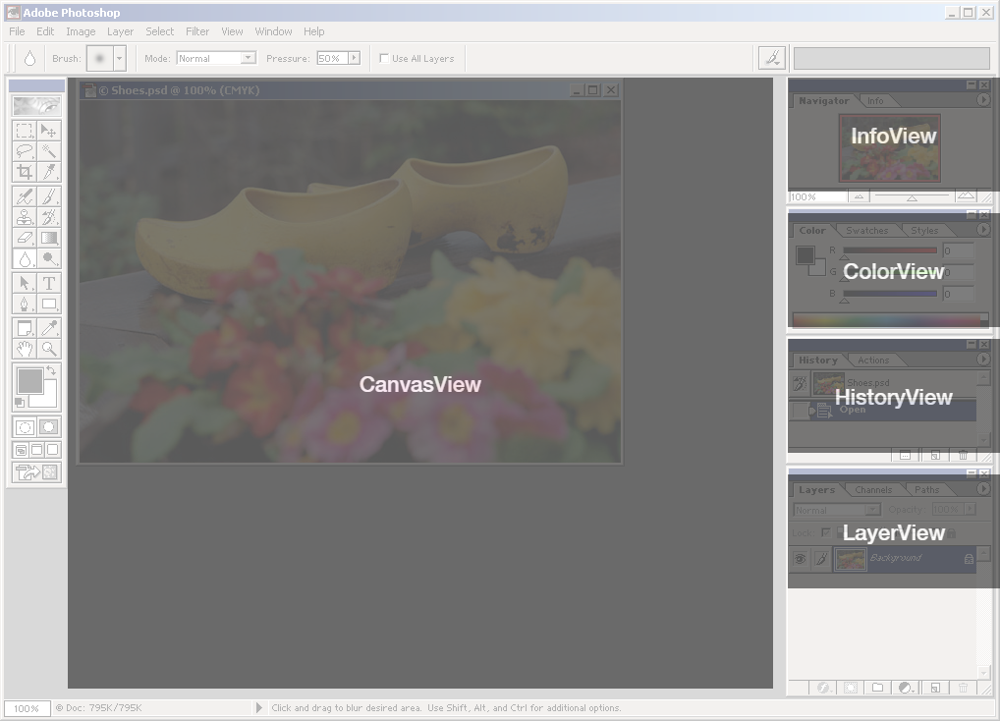
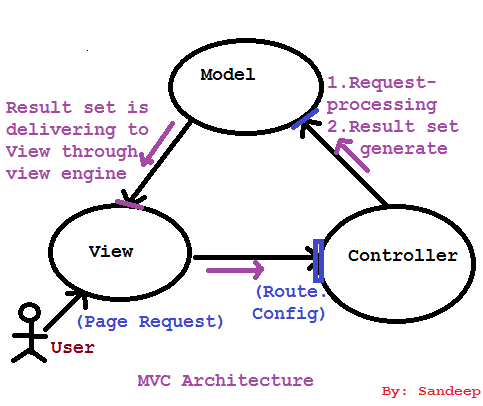
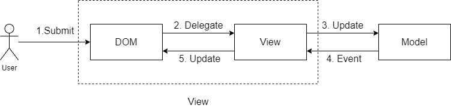

我把 MVC 框架作为我们理解架构的切入点。虽然它现在已经式弱了，但在我看来它非常重要并且起到了承上启下的作用：作为经典的解决方案第一次系统的把应用的从复杂的混沌中解救了出来。从这套方法论中我们能学习到很多至今能受用的思路，同时我们也能了解到它的不足。

如果从篇幅上看我确实 MVC 里停留较长的时间，但实际上我是深入某个具体的框架，而是需要借助它来阐述我们需要解决的问题，引入更多的概念。这些东西在之后的讨论中都会使用到。

## 我的第一个单页面应用

我在刚入这行的时候加入的是一家创业公司，它们的产品是 iPad 上给儿童阅读的电子互动图书。而我的工作职责就是负责一款在线单页面应用编辑工具的前端部分，以供公司内的编辑同事制作这些电子图书。编辑同事可以在这个工具内导入素材，比如音频、视频、或者图片。然后摆放这些素材的位置，给它们设置动画效果等等。它类似于一个可以制作动画的 Photoshop，或者平面版本的 Unity3D 编辑器。当然用这两个比喻实在是太抬举它了，但是我想你们大概能想象出它的功能和样子。

我们就从这个应用开始

它的界面类似于 Photohop 的工作区


如上图所示，每当你选中一个素材，右侧的不同属性栏中就会呈现这个素材不同维度的状态，例如它的尺寸，色彩状况，操作历史，图层状态等等。我们不如先把不同的视图区域标注一下：



那么对于“每选择一个素材是就展示它的相关这个属性”这个需求，我想当然的第一版（伪）代码是这么写的：

```javascript
canvasView.onSelectElement(image => {
    const {size: { width, height }, color, history, layer } = getComputedStyle(image);
    
    infoView.updateHeight(height);
    infoView.updateWidth(width);
    
    colorView.updateColor(color);
    historyView.updateHistory(history);
    layerView.updateHistory(layer)
})
```

如果只有这一个需求不会有大问题，现在我们提出另一个需求：当删除选中的元素时把各个属性栏的数值清空：

```javascript
canvasView.onDeleteSelectedElement(image => {
    infoView.updateHeight(0);
    infoView.updateWidth(0);
    
    colorView.updateColor(null)
    historyView.updateHistory(null)
    layerView.updateHistory(null)
})
```

以及我们可以从 history 中选择回滚到某个版本：

```javascript
historyView.rollbackTo((historyInfo) => {
   	const {size: { width, height }, color, history, layer } = historyInfo;
    
    infoView.updateHeight(height);
    infoView.updateWidth(width);
    
    colorView.updateColor(color);
    historyView.updateHistory(history);
    layerView.updateHistory(layer)
})
```

我的第一版代码真的是这么写的，想必此时你也应该感受到我的痛苦了：**我必须手动的更新每一个视图状态信息**。这会导致更严重的后果：

- 如果需要额外的添加一个视图，比如用户展示文件信息的 FileView。那么在上面三段代码中我都要手动添加一行类似的用户更新 FileView 信息的代码。但实际代码中不可能只存在三段代码，所以我有可能会遗漏这样的修改

- 如果我需要页面不止有一个 InfoView 怎么办？例如 InfoView01 用于展示公制单位，InfoView02 用于展示英制单位。也就是说如果页面上有多出需要展示同一份信息的时候，我的代码需要复制 N 遍：

  ```javascript
  infoView01.updateHeight(height);
  infoView01.updateWidth(width);
  
  infoView02.updateHeight(height);
  infoView02.updateWidth(width);
  ```

你可以想象一下五个 view 之间的调用关系，如果每一个视图都会和其它四个视图直接沟通的话，它们之间的关系会变的如下图所示。再多加入一个 view 将会是一个灾难


## 抽象问题

如果把上面的问题抽象一下的话其实非常简单：把同一份数据**便捷**的**同步**展示在**多个消费者**中。

- **便捷**

就功能而言，上面的代码已经实现了，只不过维护起来非常的困难。所以我们解决的问题还是回到这个系列第一篇所说的，解决非功能需求。针对上面的例子，我们希望添加 View 的成本降到最低。“便捷”这个词或许不太恰当，但我也找不到更好的词，它能形容的是我们开发者能够把维护代码的成本降到最低。

- **同步**

同步不仅仅是同步的“读取”数据，还包括“回写”。假设一份数据被三个视图所用，如果其中一个视图对数据发生了修改，那么修改应该应该也同时反馈到另外两个视图上。

在上面的代码中我没有明确的一个问题，关于这份数据我们应该存一份，还是存在 N 个视图中都保存一份副本。这个我们会在之后讨论

- **多个消费者**

数据的消费方不一定是视图，还有可能是 selector。它不一定被展示，还有可能被用于计算。


## MVC 来拯救

MVC 在不同的上下文中的架构都不一样。从最早的 Smalltalk 里的 MVC，到 .NET 的 MVC，再到 JavaScript 中的 MVC 框架都不尽相同。但我们通常谈论 MVC 是泛指的是服务端架构中的 MVC。以 .NET 的 MVC 为例，我们可以在 [ASP.NET MVC 文档](https://docs.microsoft.com/en-us/aspnet/mvc/overview/older-versions-1/overview/understanding-models-views-and-controllers-cs) 中找到关于 MVC 中三个角色的定义。简单来说一个服务端 MVC 的应用流程如下：用户通过 URL 访问应用，controller 负责响应用户的请求，获取数据模型；model 封装了业务逻辑，并负责数据进行更改；最后数据渲染在页面模板上之后将页面返回给用户



例如 Node.js 的 MVC 框架 [kraken.js](http://krakenjs.com/) 的 controller 语法如下：

```javascript
'use strict';

var IndexModel = require('../models/index');

module.exports = function (router) {
    var model = new IndexModel();

    router.get('/', function (req, res) {
        res.render('index', model);
    });
};
```

相信你也发现了 MVC 其实是更适用于多页面应用，所以它与前端这种单页面应用场景并非天生契合。前端的 MVC 架构与后端有很大的不同。

但即使是在后端的 MVC 架构中，我们看到了一种思路，就是**职责分离**。在我们上面的代码中，所谓的 handler，比如 `canvasView.onSelectElement` 几乎包办了所有的事情：负责响应用户的请求，负责更新数据，还负责更新视图。职责分离究竟给我们带来了什么，我们会在后面讨论

### Backbone.js

Backbone 解决的方法很简单：通过事件——当数据状态发生改变需要被同步时，它不是依次去调用消费方的接口，而是向外广播一个事件。任何需要消费这份数据的地方只需要监听数据的相关事件即可。

我们以一个[开源](https://github.com/tastejs/todomvc)的[在线 todo 应用](http://todomvc.com/examples/backbone/)为例:


它关于处理添加 todo 的代码是这样的，首先[绑定输入框的事件处理函数](https://github.com/tastejs/todomvc/blob/41ba86db92336c11e56d425c5151b7ec2932be9a/examples/backbone/js/views/app-view.js#L21)

```javascript
events: {
    'keypress .new-todo': 'createOnEnter',
},
    
createOnEnter: function (e) {
    if (e.which === ENTER_KEY && this.$input.val().trim()) {
        app.todos.create(this.newAttributes());
        this.$input.val('');
    }
},
```

当用户敲击回车之后往数据模型中添加一条数据，注意这里只是修改数据，并不负责更新视图。

接着在 app 组件内[监听数据模型的“添加”事件](https://github.com/tastejs/todomvc/blob/41ba86db92336c11e56d425c5151b7ec2932be9a/examples/backbone/js/views/app-view.js#L37)，并且添加回调函数`addOne`

```javascript
initialize: function () {
    this.listenTo(app.todos, 'add', this.addOne);
},
```

而 `addOne` 的函数实现[是这样的](https://github.com/tastejs/todomvc/blob/41ba86db92336c11e56d425c5151b7ec2932be9a/examples/backbone/js/views/app-view.js#L78)：

```javascript
// Add a single todo item to the list by creating a view for it, and
// appending its element to the `<ul>`.
addOne: function (todo) {
    var view = new app.TodoView({ model: todo });
    this.$list.append(view.render().el);
},
```

这里才是真正更新视图的地方。

上面代码的流程图如下：



在有的架构中 DOM 和 View 是分开被定义，有的还有称为 template 的概念。但我们可以再进行一层抽象，相对于 Model 而言，也可以把它们都视为 View，

看似代码变得冗余了，一份代码被拆分成了三份。但实际上我们不用再为添加额外的视图后，忘记添加某个调用而感到苦恼了。当添加多个视图之后


### AngularJS

AngularJS 指的是 Angular 1.x 的版本，Angular 2.x 之后通常会直接称之为 Angular，这两个版本的架构和设计思路不同

AngularJS 不是通过事件来解决这个问题，而是通过全局变量和依赖注入解决

首先定义一个全局变量用于[存储 todos 以及相关的操作方法](https://github.com/tastejs/todomvc/blob/41ba86db92336c11e56d425c5151b7ec2932be9a/examples/angularjs/js/services/todoStorage.js#L90)：

```javascript
angular.module('todomvc')
.factory('localStorage', function ($q) {
		'use strict';

		var STORAGE_ID = 'todos-angularjs';

		var store = {
			todos: [],
			get: function () {
			},
			insert: function (todo) {
            }
        }
        return store
}
```

这个 store 会被注入到其它的 controller。比如在 `todoCtrl.js ` 中，我们可以直接访问 store 对它进行修改，来实现[添加 todo 的功能](https://github.com/tastejs/todomvc/blob/41ba86db92336c11e56d425c5151b7ec2932be9a/examples/angularjs/js/controllers/todoCtrl.js#L31):

```javascript
angular.module('todomvc')
	.controller('TodoCtrl', function TodoCtrl($scope, $routeParams, $filter, store) {
		var todos = $scope.todos = store.todos;
    	// ...
		$scope.addTodo = function () {
			var newTodo = {
				title: $scope.newTodo.trim(),
				completed: false
			};

			if (!newTodo.title) {
				return;
			}

			$scope.saving = true;
			store.insert(newTodo)
				.then(function success() {
					$scope.newTodo = '';
				})
				.finally(function () {
					$scope.saving = false;
				});
		};
}

```

那么在页面上，我们首先完成对[添加事件的绑定](https://github.com/tastejs/todomvc/blob/41ba86db92336c11e56d425c5151b7ec2932be9a/examples/angularjs/index.html#L17)，给输入框的 submit 事件绑定上面的  `addTodo` 处理函数

```html
<form class="todo-form" ng-submit="addTodo()">
    <input class="new-todo" placeholder="What needs to be done?" ng-model="newTodo" ng-disabled="saving" autofocus>
</form>
```

又同时再将（通过双向绑定的方式） [todo 列表渲染出来](https://github.com/tastejs/todomvc/blob/41ba86db92336c11e56d425c5151b7ec2932be9a/examples/angularjs/index.html#L37):

```html
<ul class="todo-list">
    <li ng-repeat="todo in todos | filter:statusFilter track by $index" >
	</li>
</ul>
```

那么如果有其他的视图想使用这份 todo 的话，只需要在这个视图对应的 controller 里访问全局的 store 即可

```javascript
angular.module('todomvc')
	.controller('TodoCtrl', function TodoCtrl($scope, $routeParams, $filter, store) {
		var todos = $scope.todos = store.todos;
```

流程图如下图所示


## 总结

我们暂时告一段落。在这一篇里我引入了一个经典的 SPA 中需要解决的问题，并且介绍了两个 MVC 框架解决这个问题的不同方式。关于这个问题，关于这两个解决方案更进一步的思考会在下一篇里继续

需要注意的，在上述的内容中我只是触及了两个 MVC 框架的冰山一角，千万不要把它们当作框架的全部。例如以 Backbone.js 为例。整个框架结构应该是如下所示的：


而我们只是触及了上图中右下角的部分而已。如果你想要完全的了解它们还需要更彻底的学习

最后我想留给你们的问题是：到现在看来 MVC 是一个不错的解决方案，为什么现在我们不再使用它们了。它们是否会给我们的项目埋下隐患？