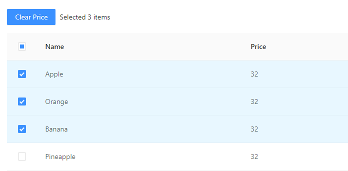
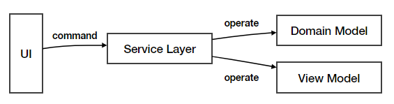
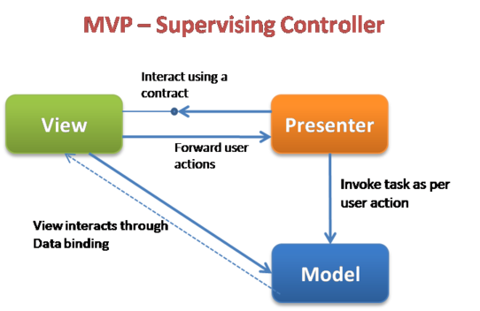

在 Flux 架构中，有两个问题依然没有被提到，一个是表现层模型，另一个是测试

我们从表现层逻辑说起

表现层模型即  Presenter Model 或者称之为 View Model。这是一些与业务无关紧要，但是与可视化展示息息相关的数据。简单的例如某个可折叠的控件是否处于折叠状态，复杂的可以是某个字段的校验规则，校验的出错信息，或者是图表的展现类型（饼图还是柱状图）等等。

想象一下在 Flux + React 的框架下这些数据应该存放在哪里？我想包括曾经的我在内的大多数人都会把它放在组件中，这是想当然的事情：既然它们属于表现层状态，那么就应该放在表现层的组件中；而不放在 Redux 中的另一个原因是，Redux 并非是所有功能的标配，把所有数据都往 Redux 中集成会让整个 store 显得臃肿，维护起来反而不利。

但在实际应用中这些数据并没有那么纯粹，甚至可以说大多数时候表现层模型和业务模型是息息相关，比如用户允许在下面的表格中选中某些商品，然后选择将它们的价格清零：



简易的伪代码可能是这样的：

```javascript
// 每行的选中函数
function onRowSeleted(rowId) {
  selectedRows.push(rowId)
}

// 左上角提交按钮的回调函数
function onSubmit() {
  // Step 1: Clear selected data's price:
  selectedRows.forEach(rowId => data[rowId].price = 0);
  
  // Step 2: Sync to local store:
  syncToLocalStoreAction(data);

  // Step 3: Sync to remote backend:
  syncToBackendRequest(data);

  // Step 4: Clear view model:
  selectedRows = [];
}
```

有几个问题我要需要考虑：

- 如果上面的这段代码书写在某个 React 组件中，如果某天我们需要切换为另一个 UI 框架时，这部分代码我们可能需要原封不动的照抄一遍，但你可以看到，上述代码并没有使用到 React 技术特定的接口或者语法。理论上来说时可以无缝移植的
- 即使需求不是迁移框架，而是需要上述逻辑在同一个应用的不同组件中重用，例如上面截图是清除水果的价格，另一个页面需要清除 3C 产品的商品价格， 抄一遍似乎也有一些多余。这样就可能产生“散弹式修改”的代码坏味道
- 最后一个问题是测试，对于相同的逻辑，我们可不希望当逻辑复用时需要编写的测试也要加倍。

再次提醒以上考虑的出发点是我们在第一章讨论的非功能需求，即可维护性和测试。如果你不在乎非功能需求，那么接下来的内容对你的意义并不大。

## 服务层

从上面的三点叙述中，我们不难得出我们需要进一步解决的问题：

1. 即表现层逻辑、业务逻辑、与视图三者其实并非强相关的，尤其是表现层逻辑可以与视图使用的具体技术栈无关。
2. **表现层逻辑需要和视图进行分离**，以便于复用。

同时注意上面 `onSubmit` 回调函数中的内容，它其实描述的是一些列流程，在这个提交操作中，我首先需要做什么、其次需要做什么以及最后需要做什么。这样的流程是用户使用的其中一个场景，也算是其中一个用例。这些用户用例本质上是和表现层的技术无关的，无论是使用 React 还是 Vue 都需要将它们实现。所以我们可以把它们作为独立的模块与视图隔离并且封装起来。借用后端的概念，我们可以把这类模块、这种规则的分层称之为**Service Layer**，后文中使用**服务层**称呼它。




封装用户用例只是服务层的实现，再往上抽象点看，它定义的其实是应用的边界。因为无论操作指令来自于用户界面，或者想象它终有一天被移植到命令行界面，操作指令来自于命令行输入，所有可行的操作以及需要对这些操作做出的响应都不过封装于该层。**该层决定了应用能做什么不能做什么**。直接搬用 Martin Fowler [对于服务层的完整定义](https://martinfowler.com/eaaCatalog/serviceLayer.html)如下：

> *Defines an application's boundary with a layer of services that establishes a set of available operations and coordinates the application's response in each operation.*


但不难看出服务层其实也只是“中介”而已，在服务层的实现里它依然需要调用其它的模块来实现功能，最需要互动的就是各种领域模型。这个方面的相关的问题我们待会再谈

在后端开发中，服务层不会关心视图，视图的操作通常以 API 的形式到达的这里，所以并不存在表现层逻辑的问题。但是涉及在界面的开发中我们必须要解决这个问题，我们都同意表现层逻辑需要和视图的实现分离，那么分离之后放哪呢？目前看来服务层是一个不错的选择，因为 1) 表现层逻辑确实和用例相关；2) 服务层也确实是和视图分离的。服务层和视图的合作方式也非常简单，通常是把事件委托给服务层处理而已。React 示例代码如下：

```javascript
function TodoComponent() {
  	const serviceLayer = new ServiceLayer();
    
    function onComplete(todo) {
    	serviceLayer.completeTodo(todo);
    } 
    
    function onDelete(todo) {
        serviceLayer.deleteTodo(todo);
    }
    
    return (/.../)
}
```

就像上面说的，服务层其实是一个舶来品。服务层在后端上下文中需要解决的问题与前端并不重叠。但主动权掌握在我们手中，我们可以丰富服务层的职责，让它为我们提供更好的服务——比如 selector。

selector 的作用并不是仅仅把组件所需要的属性选择出来而已。它是组件与领域模型之间的缓。因为组件并不知道自己会被用在何处，所以它不需要也不应该关心在它所属的应用内 store 包含的是什么样的业务模型。如果让组件直接拥有关于 store 的知识反会产生耦合。这个问题可能在 React 中会有所缓解，因为有 `mapStateToProps` 和 `reselector` 作为天然的屏障。但是在 Angular 中，因为依赖注入的关系很容易产生这一的问题。比如直接和 store 打交道的例子：

 ```javascript
@Component({
  selector: 'List',
  templateUrl: './list.component.html',
  styleUrls: ['./list.component.scss']
})
export class ListComponent implements OnInit {
  constructor(private todoStore: TodoStore) {
  }
  
  ngOnInit() {
    this.data = this.todoStore.todos.filter(t => !!t.active);
  }
}
 ```

在上面这段代码中，`ListComponent` 是通用的表现层组件，但是确直接对具体的 `TodoStore` 进行引用，造成了和具体业务的强耦合，降低了组件复用性。可以修改为对 `ServiceLayer`的引用

```javascript
@Component({
  selector: 'List',
  templateUrl: './list.component.html',
  styleUrls: ['./list.component.scss']
})
export class ListComponent implements OnInit {
  constructor(private serviceLayer: ServiceLayer) {
  }
    
  ngOnInit() {
    this.data = this.serviceLayer.getData();
  }    
}
```

这样一来`ListComponet` 的职责会更加明确更加通用，当开发人员需要仅仅对视觉功能进行修改时可以降低业务逻辑造成的干扰。又或者当开发人员需要修改获取数据的逻辑时仅仅修改 `serviceLayer.getData`方法即可，这也呼应了我们之前所说的单一职责。


同时补全 UI 与服务层的获取数据的流程，我们便得到了最终上图的结果。注意，上图中**数据流依然是单向**的。也就是说上图中的架构设计在 React 或者是 Redux 中是适用的。

截止到现在“服务层”似乎已经有些偏离它原始的涵义，我更愿意亲切的称之为 Presenter，MVP（Model View Presenter） 中的 Presenter

## MVP

MVP 的实现有两类，一类称为 Passive View，另一类称为 Supervising Controller

* Passive View: 顾名思义如 passive（被动）所示，在这个模式中 View 是不包含任何逻辑的，它是被动的被调用方。View 和 Model 完全被Presenter 隔开，Presenter 充当中介的角色分别与两者沟通。Presenter 可以监听的 Model 层上的一些事件。当数据发生修改时，事件就会被触发，接着 Presenter 再通过 View 上暴露的方法对 View 进行数据更新。

  

* Supervising Controller: Presenter 会负责响应用户的 UI 操作，但与 Passive View 最大的不同在于 View 会直接与 Model 打交道，并且与 Model 进行数据绑定。在有的实现中 Presenter 的职责还包括就是将 Model 数据传递给 View

  

相对于 MVC，MVP 在桌面端和 web 端的概念更统一一些。

所以很显然，Supervising Controller 模式与我们上面描述的服务层模式，乃至 Redux 都更加契合。总结下来，前端领域 View、Presenter、Model 的分别职责如下：

|           | Responsibility                                               | Data           |
| --------- | ------------------------------------------------------------ | -------------- |
| View      | 1. Render; 2. Delegate;                                      | n/a            |
| Presenter | 1. flow control; 2. user gesture response; 3. state selector/converter | Presenter Data |
| Model     | Business Logic                                               | Domain Data    |

至于如何实现，我认为目前的所有框架都支持这一套架构的实现，只不过 Redux 类型的框架可能相对 Object 类型的框架实现起来会别扭一些。

这样的分配会影响到我们下一个谈论的话题，测试。

## 测试


不知道大家是否熟悉上图中的测试金字塔，简单来说我们可以根据测试所涉及的范围来将测试类型划分为这些等级，最底层的是粒度最小的单元测试，最顶层的端到端的应用级测试。我在Google搜索测试金字塔的时候不同图片会有少许差异，但总的来说和我上面的描述大致相似。

就我个人的经验而言，在编写测试时不可能覆盖所有这些类型的测试，这当中有交付压力与人力成本的考虑。

我们再次回到最终版本的这个图：


在经过重新对代码进行组织之后，现在我们需要回答这个问题，应该对哪些代码进行测试？

* UI：我最不建议对纯 UI 代码进行测试，这里所说的纯 UI 指的是类似于 React 中的 Dump Component. 因为UI 测试的效率是非常底下的，相对于纯粹代码性的测试，不仅 UI 测试的启动和运行都略逊一筹，编写起来也费劲，通常你需要查找出不同的元素，然后模拟的用户的操作，最后再对页面元素做验证。

  建议 UI 测试只在非用不可的情况下编写，比如你设计了一个极其复杂的组件，例如 [handsontable](https://handsontable.com/), 它纯粹是表现层的，组件对用户操作的反馈是其中非常重要的功能，那么此时对 UI 的测试才是有价值的。

* Service Layer / Presenter：这里是我最推荐编写测试的地方。首先这里的测试对象通常面向的是代码，因为服务层通常由 store 或者是类进行封装；其次这部分的逻辑非常重要，它包含的是所有的用户用例，用户用例即“用户能干什么”的终极体现。如果这部分都没法保证的话，那么我们的应该基本上没有任何用处。

  在对用户用例进行测试的同时，其实也间接的在对业务模型进行测试。因为你最终需要验证用户的一顿操作之后业务的数据是否如期望所示，例如是否按期望进行了删除、是否发生了修改

当然凡事没有绝对，如果你的应用内有非常重要的功能，例如工具类中的一个非常重要的算法，严格的业务模型，那么也可以单独对这些功能做单元测试。

关于测试，我推荐阅读 Kent 的关于前端测试的一系列的文章：[The Testing Garden of Kent C. Dodds](https://kentcdodds.com/testing/)，我个人是是非常赞同他主张的一些列测试策略，例如：

- Test use cases, not code.
- Write tests. Not too many. Mostly integration.