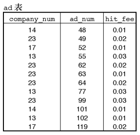
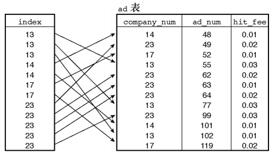
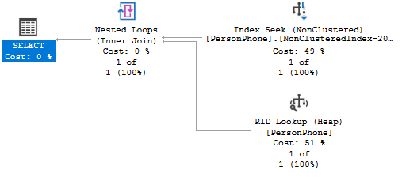

之所以限定于“查询语句”是因为 SQL Server 中的内存使用，查询编译，死锁等都有优化空间，本文不涉及。

之所以限定于“入门”是因为我算不上 SQL Server 专家，只不过在最近做性能优化时积累了一些经验，虽然不深但足以应付我们日常需要解决的一些 SQL 语句方面的性能问题，因此分享出来供大家参考。自私点说哪怕长时间用不上这技能，生疏之后靠回顾自己的文章也能很快的捡回来。

“入门”的另一层意思是我会侧重于原理讲解。我发现无论是前端性能优化还是 SQL 性能优化都没法和所见即所得的编码相提并论，可能是因为工具提供的信息有限，也有可能是因为性能的瓶颈是祖传代码屎山，大部分时候你需要随机应变。有时候你可以通过抽丝剥茧找到病根，有时候你只能大刀阔斧的重写代码才能稍稍缓解。无论什么方法，都需要你对它背后工具原理有所了解才行。**我力求即使你只会简单的 SELECT, UPDATE, DELETE 也能够看懂这篇文章**

本文涵盖两部分内容：**索引（Index）**和**执行计划（Execution Plan）**。虽然索引能够解决我们90%以上的性能问题，但我们还要知道在何时何地添加索引，于是就要通过阅读执行计划找到这方面的提示。

为了说明问题文章会用到官方提供的范例数据库 [AdventureWorks](https://docs.microsoft.com/en-us/sql/samples/adventureworks-install-configure?view=sql-server-ver15&tabs=ssms) 和其中的 Person.Person、Person.PersonPhone、Person.EmailAddress 三张表。三张表中都存有 BusinessEntityID 字段，我们可以通过 BusinessEntityID 字段将同一个人的信息都关联在一起。

## 小心 Scan

简略的把数据库比作一本书不为过。想象一下如果你需要在一本没有目录的书中查找一行文字你唯一能做的只能逐页查找。数据库也是这么工作的，对于一个没有任何索引的表，它只能通过**扫描（scan）**整张表的数据来找到匹配的数据

例如我把 PersonPhone 表中的所有索引都删除之后查找某一个具体的电话号码：

```sql
  SELECT *
  FROM Person.PersonPhone
  WHERE PhoneNumber = '156-555-0199';
```

执行计划给我们展示的过程如下：


鉴于后面我们才谈到执行计划，目前你姑且可以把执行计划当作 SQL 语句的执行过程。上图中的 `Table Scan` 就是在告诉我们它扫描了整张表。并且在整个执行过程中，这一步操作占用了最多的资源: `Cost: 100%`。这里的 cost 只是一个抽象单位，它不代表 CPU 亦或是 I/O 单个维度的消耗，而是各类资源统计之后的结果。

其实上面过程中的 100% 并不能说明 scan 这一种类型的操作是效率低下的，因为这里只涉及到了单个表的查询操作，即使是对带索引的表进行这种简单的查询，你看到的也是 `Cost: 100%`。比如我对带有 `[PK_Person_BusinessEntityID]`索引的 Person 表进行查询：

```sql
  SELECT *
  FROM Person.Person
  WHERE BusinessEntityID = 10;
```

得到的执行过程如下：


非 scan 类型的 `Clustered Index Seek`（我稍后会解释，在这里你可以把它理解为优于 scan 的一类操作就好） 操作的消耗同样是 100% 。

但如果我们对 PersonPhone 和 Person 表进行联合查询，查询效率就立分高下了：

```sql
  SELECT *
  FROM Person.PersonPhone AS PersonPhone
  JOIN Person.Person AS Person ON PersonPhone.BusinessEntityID = Person.BusinessEntityID
  WHERE PhoneNumber = '156-555-0199';
```


scan 在所有操作中消耗占比达到 91%

所以 scan 是我们可以识别到的一个优化点，当你发现一个表缺少索引，或者说在执行计划中看到有 scan 操作时，尝试通过添加索引来修复性能问题。

## 关键的 Logical Reads

通常 SQL Server 在查询数据时会优先从内存中的缓存（buffer cache）中查找，如果没有找到才会继续前往磁盘中查找，前者我们称之为 logical read，后者称之为 physical read，鉴于从内存读写的效率比磁盘高，我们当然希望尽可能避免任何的 physical read。

而 logical read 具体读写的是什么呢？是 page，page 是数据库中数据组织的最小单位，我们只需要了解到这个深度即可，至于 page 是如何被组织的，page 的数据结构如何不重要。所以 logical read 数量也理应越小越好。默认情况下你不会看到 logical read 这项指标的输出，可以使用 `SET STATISTICS IO ON` 将这项监控打开，例如对于查询一个没有索引的 PersonPhone 表，我们的查询语句如下：

```sql
SET STATISTICS IO ON
GO

  SELECT *
  FROM Person.PersonPhone
  WHERE PhoneNumber = '156-555-0199';

SET STATISTICS IO OFF
GO
```

得到的有关 logical read 信息如下：

> (1 row affected)
> Table 'PersonPhone'. Scan count 1, **logical reads 158**, physical reads 0, read-ahead reads 0, lob logical reads 0, lob physical reads 0, lob read-ahead reads 0.

一旦我给 PersonPhone 加上了以 PhoneNumber 为 key 的 Clustered Index 之后（如果你对 index 没有任何了解，在这里可以仅仅把它理解为一种优化手段），上面语句的执行结果则变为：

>(1 row affected)
>Table 'PersonPhone'. Scan count 1, **logical reads 2**, physical reads 0, read-ahead reads 0, lob logical reads 0, lob physical reads 0, lob read-ahead reads 0.

logical reads 过高，可能（并不是一定）在暗示一些问题：

* 缺少索引导致多行被扫描
* 数值越高可能意味着给磁盘带来的压力也过高
* 即使是查询操作也可能会给数据上锁（根据事物隔离级别（isolation level）的不同），过长的查询会方案后续的读写操作，造成连锁反应。

之所以选择 logical read 的另一个好处是，作为衡量性能的指标之一，它的波动没有例如 `duration`或者`CPU time` 那么大

但 logical read 的参考价值没有执行计划高，一方面因为它是单向的，也就是说你能够通过 SQL 语句得出得出 logical reads 数值但却无法反向通过数值读出问题，从这点上看执行计划更适合我们排查问题；另一方面它并不是总能准确反馈问题，如果你把上面查询中的 where 语句去掉，你会发现添加 index 前后的 logical reads 并没有太大变化。

无论如何，logical reads 可以作为我们的参考指标之一。

## 索引（Index）

### Clustered Index & Nonclustered Index

终于能进入正题 index 了。Index 的工作原理很简单，如果我们把数据库比作一本书的话，那么索引就是这本书的目录，它能帮助你快速定位数据。



在上面这张表中，如果我们想要找到某个公司的行，那么需要检查表的每一行，看看它是否与那个期望值相匹配。 这是一个全表扫描操作，其效率很低，如果表很大，而且仅有少数几个行与搜索条件相匹配， 那么整个扫描过程的效率将会超级低。

我们可以给这个表添加一个索引：



该索引包含 ad 表里每个行的一个项，而且这些索引项按 company_num 值排了序。现在，不用 为了查找匹配项，一行一行地搜索整个表了，我们可以使用这个索引。假设，我们要找出公 司编号为 13 的所有行。我们开始扫描索引，便会找到 3 个属于该公司的值。然后，我们会到 达公司编号为 14 的索引值，该值比我们正查找的值要大一点。由于索引值已是有序的，因此 当我们读到那条包含 14 的索引行时，我们便知道再也无法找到更多与 13 匹配的内容了，于 是可以退出查找过程。由此可见，一种使用索引提高效率的做法是，我们可以得知匹配行在 什么位置结束，从而跳过其余部分；另一种使用索引提高效率的做法是，利用定位算法，不 用从索引开始位置进行线性扫描，即可直接找到第一个匹配项（例如，二分搜索比扫描要快 很多）。这样，我们便可以快速地定位到第一个匹配值，从而节省大量的搜索时间。

但是在 SQL Server 中，index 被划分为了几类。**Clustered Index 是最常被用的：表中的数据会按照 clustered index 进行物理排序**。因为只可能有一种物理顺序的关系，所以一张表只允许有一个 clustered index.当你在表中添加 primary key 约束时，数据库会为你自动以 primary key 创建一个 clustered index。

我们可以给 PersonPhone 添加一列以 PhoneNumber 为 key 的 index ，然后再次执行上面查询 PhoneNumber 的语句

```sql
  SELECT *
  FROM Person.PersonPhone
  WHERE PhoneNumber = '156-555-0199';
```

你可以看到了执行计划变成了下图所示的 **Clustered Index Seek**


**Seek 的效率是最高的，我们应该尽可能的让查询语句执行 seek 操作**，它不再像 scan 一样逐行扫描，而类似于书的目录一样直达目的地将所需要的数据取出。

但 clustered index seek 不会在任何情况下都生效，比如在上面 PhoneNumber 索引的情况下按照 BusinessEntityID 条件查询：

```sql
  SELECT *
  FROM Person.PersonPhone
  WHERE BusinessEntityID = 4511
```

你会发现执行计划是 Clustered Index Scan


index scan 意味着数据库通过索引获取所有行后再进行扫描。如果你对比 index scan 和 table scan，两者的 logical reads 差不多。

配置 nonclustered index 和 clustered index 相比并无不同，在使用的时候你也会在执行计划中看到 Non-Clustered Index Seek。明显的不同之处在于不会对原表的顺序产生影响。虽然看似相同，但实际上它们背后有千丝万缕的联系，搞清楚这些联系有助于我们判断在什么时候应该恰当的添加哪一种 index。

### Index 运作原理

想象一下有一组 27 行的单列数据，因为 page 大小有限的缘故，它们被分为了 9 个 page


你为它们添加的 Clustered Index 之后，索引的数据结构如下所示


当你想找值 5 时，搜索会从顶部节点开始，因为5在1到10之间，搜索过程会继续到左侧分支的下一个节点上，又因为5落在4到7之间，搜索会走到下一层以4开头的节点上。最后从叶子节点上找到5

事实上我们忽略了一些细节，clustered index 的结构如下：


从图中不难看出，每一层节点都是双向列表，叶子节点上存储的是表的真实数据。

但 nonclustered index 的存储结构稍有不同，叶子节点由索引信息（index page）而非数据信息（data page） 组成。**nonclustered index 需要借由 row locator 定位到对应的数据行（你可以理解为指针），对于 heap table（没有 clustered index 的表） 而言，row locator 指向的是每行数据的 RID (row identifier)；对于非 heap table，row locator 指向的是 clustered index**。

篇幅有限，基于以上知识点我们就能总结一下何时应该使用什么样的 index:

* 在创建 nonclustered index 之前你应该优先创建 clustered index
* 如果你查询的数据总是需要按照某一列排序，可以为那一列添加 clustered index
* 不要给会被频繁更新的列添加 clustered index，这会导致所有与此相关的 noneclusterd index 的 row locator 也被频繁更新，这可能会引起死锁问题。
* 相反你可以给频繁更新的列添加 nonclustered index,因为它只会影响到当前的 nonclustered index
* nonclusterd index 不适合数据量巨大的查询，因为它们可能会带来额外的 lookup 操作，此时你应该将这个索引变成一个 covering index。

### Covering Index

清除 PersonPhone 下所有的索引后将 PhoneNumber 添加为 nonclustered index，再执行最初的查询语句：

```sql
  SELECT *
  FROM Person.PersonPhone
  WHERE PhoneNumber = '156-555-0199';
```

你会得到如下的执行计划：



除了 Index Seek 之外，右下方的 lookup 操作占比是最多的。触发 lookup 的原因非常简单：当数据库决定使用 nonclustered index 进行查询，而需要查询的列信息又不在 nonclustered index 中（既不是作为 index 的 key 也不再 includes 列表中）时，就会触发 lookup 操作。**lookup 的意思是它会根据 index 所关联的 row locator （非 heap table 用 clustered index，heap table 用 RID） 找到对应的 row data，再从中读取中想查询的列数据**。整个过程除了除了有消耗在 index page 上的 logical read 上以外，还有额外花费在 data page 上的 logical read 操作。可想而知如果数据库在查询过程中使用了 clustered index 那么它永远也不需要 lookup，因为 clustered index 的叶子节点就是 data page

**如果查询所需要的所有列信息 index 都能提供，那么意味着访问 data page 的操作可以省略，这种类型的 index 就能称之为 covering index**。

我们可以将除了 index key 以外的却又要查询信息的列放入 includes 列表中，这也就能解决上面 lookup 的问题：


## 总结

本来还想写 join 效率的问题（对比 hash join / nested loop / merge join），但想了一下数据库使用什么样的 join 是超出我们控制范围之外的。事实上数据库是否真的会使用我们的 index 也是我们控制之外的，执行计划是由它内部的 optimizer 计算出来的，残酷点说每一次执行计划都可能随着资源、数据、索引状态的不同而不同。但好歹索引的可控性高一些。绝大部分的性能问题都能通过 index 解决

你可能会喜欢

- [性能指标的信仰危机](https://www.v2think.com/performance-metric-crisis)
- [React + Redux 性能优化（一）：理论篇](https://www.v2think.com/redux-performance-01-basic)
- [React + Redux 性能优化（二）工具篇： Immutablejs](https://www.v2think.com/redux-performance-02-immutablejs)
- [Mobx 与 Redux 的性能对比](https://www.v2think.com/mobx-redux-performance)
- [用 100 行代码提升 10 倍的性能](https://www.v2think.com/trie)
- [仪表盘场景前端优化经验谈](https://www.v2think.com/dashboard-optimize)
- [让我们再聊聊浏览器资源加载优化](https://www.v2think.com/let-us-talk-about-resource-load)
- [Javascript高性能动画与页面渲染](https://www.v2think.com/javascript-high-performance-animation-and-page-rendering)