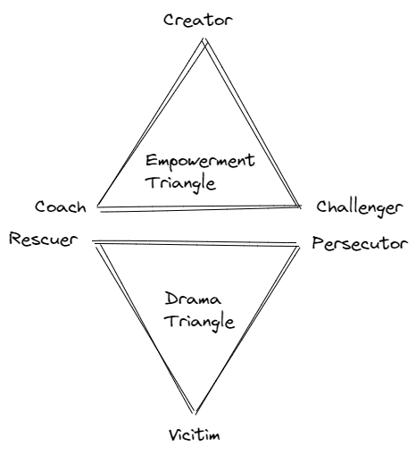

## 一

在成为 Tech Leader 之后，有一件事困恼我相当长一段时间：我应该多大程度上干涉团队成员的工作？

某些公司的 leader 可能会有两条路径供选择：技术或管理。但是在 ThoughtWorks，你既需要运营团队，也要对团队内产出的技术方案负责。看上去我理所应当在更多方面有所把控，也意味着有更多正当理由插手团队成员的手头工作。

然而无论从管理还是从执行的视角看，这类过多干涉团队成员工作的 micromanagement 都不认为是好的实践。站在管理者的角度上看，在颇具规模的团队内精准把控每个人的工作是不现实的，你有限的精力应该放在更有价值的事情上，delegate、leverage 而非 control 才是应该追求的效果，让团队做到自组织，让每个成员做的自我管理才是终极目标。早在《人月神话》一书中，作者就引用 IBM 负责人 Earl Wheeler 的观点来支持权力的下放：The key thrust [of recent years] was delegating power down. It was like magic! Improved quality, productivity, morale. 

对于执行者而言，被控制的感受同样糟糕——彻底沦落为上级的工具人，工作的掌控感完全丧失。我的亲身经历是，在独断专行的 leader 面前，我的决策永远值得被怀疑。《驱动力》书中谈到的驱动力3.0 三大要素之一就是自主权，只有团队成员同时能在工作内容、工作时间、工作方法上自我决定，积极性才能被激发出来，主动以更好的方式完成工作。没有自主权的工作不会有挑战，更谈不上成长和参与感，要知道这三点对知识工作者来说是多么重要。

“哈佛商业评论”（Harvard Business Review）[leadership 标签下](https://hbr.org/topic/leadership-and-managing-people)受欢迎前十的内容中，有一篇关于领导风格与团队氛围关系之间的文章经久不衰，名为[《Leadership That Gets Results》](https://hbr.org/2000/03/leadership-that-gets-results)。文章将领导类型划分为六类：

- 独裁（Coercive）——“我说什么，你做什么”
- 依靠威信（Authoritative）——“相信我，我们齐头并进”
- 具有亲和力（Affiliative）——“工作嘛，最重要的是开心”
- 民主的（Democratic）——“你是怎么想的？”
- 勇往直前（Pacesetting）——“如果我能做到，就别说你做不到”
- 辅佐类型（Coaching）——“试试看吧”

同时文章使用“工作氛围”作为衡量不同领导类型下领导力的标准。“工作氛围（Climate）”由六个关键因素组成是: 灵活性（Flexibility）、责任感（Responsibility）、标准（Standards）、回馈（Rewards）、透明度（Clarity）、投入（Commitment）。

文章引用的研究结果表明，独裁型和勇往直前型的领导对于工作氛围伤害最大。以独裁型为例，在这种总是自顶向下的行事风格下，人们无法感受到尊重，大多数人连想法都没有机会说出口，所以组织的灵活性首先受挫；其次责任感受到伤害，因为他们不再有义务背负绩效，因为任务皆从上指派而来；最后工作氛围内的反馈系统也受到打击，要知道高效员工通常会被金钱以外的事物激励——比如工作圆满完成的满足感，而在此类氛围下团队成员会认为他们的完成的工作无足轻重，因为感受不到工作成果对于全局的影响。

除此两者以外的其他类型的领导风格都能给氛围带来积极作用，而威信型的领导最能给氛围带来正面效应，因为此类风格的领导能够鼓动人们将他们的日常工作与组织愿景相融合。在这种领导的团队中的成员非常明确知道什么才是最重要的以及为什么重要。

在文章的最后作者指出，并非某单一类型能够做到赢家通吃，独裁型也并非一无是处，最有效的领导方式最好能够根据实际情况灵活切换风格才好。

## 二

在过去一年中，因为笃信自主权的重要性，所以在一些任务上我会完全放手交给团队中的人员去处理，其中有一些不乏颇具难度。这么做的原因还有另一个，那就是有难度的事情在我看来是绝佳的成长机会。

但其中有一些任务，失败的是相当惨烈的。如果说我们都认同上两节的结论，那问题出在哪里？

这里我们优先关注底限，即如何避免失败；而至于上限如何把事情做好，下篇再聊。

在和某位前司大佬促膝长谈之后，发现原来他对这个问题早有答案，他给我的建议是，应该及时对风险进行把控。此时猛然才发现自己犯了一个低级的错误：**考虑到执行人的经验以及任务难度，在已经提前预判到了风险的情况下，我竟然没有任何作为；以及，对于理想状态的追求让我忽略了对现实的关注。**

风险管理和自主权并不矛盾，两者并非是此消彼长的的存在。你可以从一开始交由他掌舵，但还请不要等到 deadline 才询问是否抵达终点，有可能他此时还在楼下对面街角对着爆胎一筹莫展，而此时你已已无力回天。

但在处理自主权的风险上，不必生搬硬套传统风险管理的方法论

通常我们会将问题根据发生概率和影响划分为四个类别。对于 avoid 类型问题，一类做法将它扼杀在摇篮中。对应在自主权的场景中，最好的办法其实是不要让没有经验的人去执行。我们不妨接受团队的学习成本，并且通过其他办法降低风险等级：要么减少发生概率，要么降低它的破坏力。比如你需要保持对工作进展的关注；或者我们为他争取足够的工作时间，提高任务的容错率；或者让更资深的同事参与项目。这样能够让 avoid 象限的问题往其他象限转移

上面的方法不是万能的。进行风险控制的前提是你识别出了风险，但不排除你对风险的判断出现了偏差。因为你也会同样犯和团队成员一样缺少识别问题的嗅觉。对于这些场景，我并无更高明的建议，只是觉得接纳就好。你之所以没有对它留意，我相信部分原因也是因为它的破坏力有限无需给予更多的关注，或者它们带来的损失是再承受范围之内的。

有时候 leader 的拯救者心态并非可能是无意识产生的。各个冲突方会无形地陷入 drama triangle 模型中，在 drama triangle 中有三类角色：

- 受害者（Vicitim）：认为自己对生活毫无掌控能力，对生活不抱有任何希望
- 迫害者（Persecutor）：认为错在他人，是别人导致了自己现在的惨状
- 拯救者（Rescuer）：乐于从困境中解救他人

在冲突中我们不自觉的会在不同的角色中切换，比如 leader 可能会说出这样一番话：我已经够焦头烂额的了（受害者），你导致的这次事故还让我们的交付进度雪上加霜（迫害者），还是我来帮你把这部分代码写完吧（拯救者）

不同的人会有自己的陷入角色的默认偏好。然而如果 leader 恒定的陷入拯救者的角色而团队成员又频频把自己当作受害者的话，着难免陷入一个恶性循环：

- 拯救者反复扮演救世主终于把自己精力消耗殆尽
- 受害者产生了习得性无助心理，丧失了前行的动力

所以 leader 应该尽可能从拯救者角色抽离出来。有一种办法是使用 empowerment triangle 来对抗 drama trangle:

在 empowerment triangle 中，Vicitim 应该向 Creator 的角色做转换，主动承担起责任去解决问题；而 Rescuer 应该向 Coach 的角色进行转换，去协助 Creator 自主的解决问题

答案虽然有了，但是执行起来的难点在于这需要不同角色的领悟和配合，和沟通一样，单方面付出再多的努力如果没有对方的配合最后的成果也为 0

## 三

有没有可能正如 Netflix 或者 Google 这类用顶级待遇招聘顶级员工的公司所宣传的，在某些团队中可以彻底放权也无需担心风险——听上恰恰就是《奈飞文化手册》中教科书般的情节。中文版中其中的一段让我记忆犹新：

> 招人就要招那些高素质和高度自律的人。人招来之后不用太花心思去管理他们，只要给他们足够的发挥空间，他们自然会创造出一个又一个让你惊讶的成果来。

我对此表示怀疑。

在皮克斯公司自传性质的《创新公司：皮克斯的启示》一书中，作者给出了一个与我有相似遭遇的例子：《玩具总动员》大获成功之后，皮克斯开始着手同时制作《玩具总动员2》和《虫虫危机》，在想当然的认为《玩具总动员2》不会在像制作第一集那样的艰巨之后，他们安排《玩具总动员》一片的创意团队专心致力于《虫虫危机》的制作，而只派遣了两名（导演经验为零的）资深动画师来掌舵《玩具总动员2》。

而等到一年之后再来审视《玩具总动员2》的进展时，却发现整部动画惨不忍睹。于是他们不得不做出换掉导演团队的艰难决定。并把修改剧本的工作交由一只由富有经验人员组成的“智囊团”进行处理。

但冒险也是皮克斯不可以扔掉的一个特质，这就意味着他们必须把钥匙交到那些不太符合传统导演标准的新人手中。那么如何避免上上面的情况再次出现？这是我再下一篇中再谈

你可能会喜欢

- [开源社区的暗面](https://www.v2think.com/darkside-of-the-opensource)
- [帮助团队成长是唯一的出路](https://www.v2think.com/what-is-leadership)
- [去年做 Tech Leader 犯过最大的错](https://www.v2think.com/tech-leader-mistake)
- [技术写作的困境](https://www.v2think.com/stuck-in-technical-writing)
- [拥抱原则与面对现实](https://www.v2think.com/principles-and-facts)
- [代码与质量的思考与随笔](https://www.v2think.com/think-about-good-code)
- [从对 Vue 中 mixin 的批评，到对模块间依赖关系的探讨](https://www.v2think.com/vue-mixin-module-dependency)