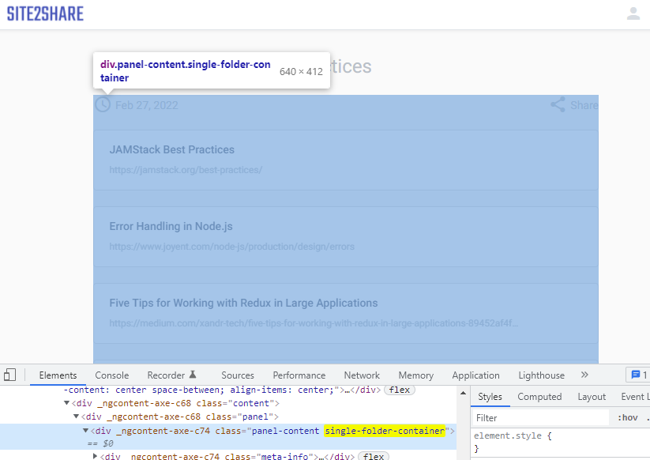
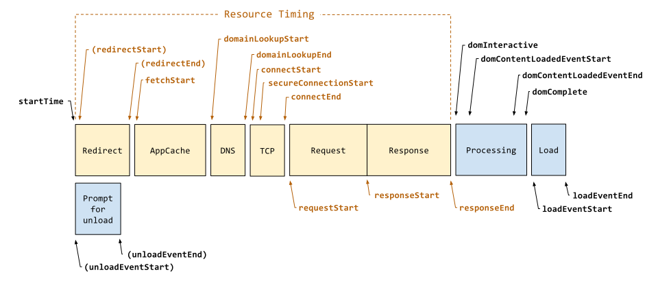
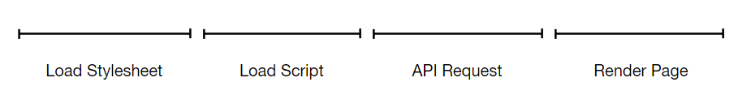
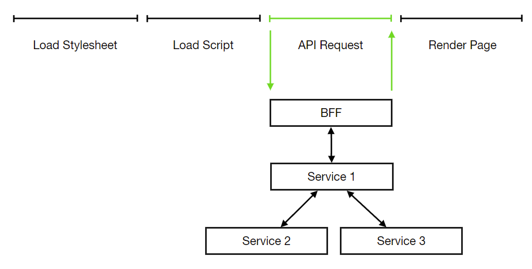

APM 全称是 Application Performance Monitor，即性能监控

这篇文章有三个前提：

- 从产品形态上看这肯定不是一个能够媲美阿里产品的竞品，所以抱歉我碰瓷了。你可以把这里的阿里换成任何一个你在 google 用 APM 搜索到的工具。但是文章最后会我会用阿里的工具对同一网站进行性能测试，看看我们两者的悬殊究竟子啊哪里。很有意思的是，虽然我自己的写的这个工具相比阿里云的监测工具无比简陋，但它依然达到了我的目的帮助我发现了问题在哪。从这个意义上说，这确实是一种胜利
- 工具起点和终点是 [site2share](https://www.site2share.com/login)，这是一个我自己给自己写的一个工具网站，我需要知道上线后用户对它的性能感受究竟如何，所以工具因它而造，在完成对它进行性能测试的使命之后也即寿终正寝。
- 这篇文章其实是对我去年写的[《性能指标的信仰危机》](https://www.v2think.com/performance-metric-crisis)一文的回应。在那篇文章中基本都是在阐述这个工具背后的道理和设计，没有一行真实代码的落地。
	
我还记的很多年前网络上盛传的一道经典前端面试题，大意是请解释从浏览器地址栏敲入 url 之后到看到页面的过程中发生了什么。这类问题的迷人之处在于它给了你一记响亮的大嘴巴子却又让你心服口服——原来我们对眼皮下的诸多事物都熟视无睹，以及漫不经意问题背后存在着这么大的学问题。

在这篇文章里我要回答的问题也简单明了：我怎么知道我网站性能有多慢以及慢在哪？这个问题是网站上线之初我需要首先搞清楚的。

## 有待解决的问题

### 确定指标

在大问题下有两个子问题是优先需要搞清楚，
- 我要用什么指标来衡量快慢？
- 我怎么排查慢的瓶颈在哪里？

这两个子问题在我去年的[《性能指标的信仰危机》](https://www.v2think.com/performance-metric-crisis)一文中已经做出了详细说明，因为篇幅的关系，这里只陈述结论，并且两个问题的答案有千丝万缕的联系，必须放在一起聊才行

简单来说，诸如 onload 或者 DOMContentLoaded 这类技术指标是远远不够的，甚至 First Contentful Paint 距离用户的实际感知依然有距离（在后面我也会证明这件事）。 好的指标应该尽可能的向用户靠拢，甚至是与业务深度定制的。所以我建议将页面上用于承载核心内容DOM元素的出现时机作为性能的核心指标。这个时机之所以关键，因为它等同于网站此时此刻才能被称之为可用。

以网站的详情页为例，关键元素便是 `.single-folder-container`




但着并不意味着一个指标就足够了，因为如果我们发现这个指标数值不够理想，我们无法准确定位问题在哪里。所以好的数据带来的效应应该是双向的：即它既能准确反映当前产品运行状态（从产品到数据），同时通过观察数据我们也应该能得知产品存在何类问题（从数据到产品）

在这个前提下，我们需要从“有潜力”的性能瓶颈中挖掘指标。想当然影响网站加载性能的因素有：
- 资源加载（脚本，样式等外部资源）的快慢
- 接口响应时间

那继续记录这两者的加载时间如何？

要回答这个问题，我们又要继续反问自己了，这两类信息足够我们推测出问题出在哪里吗？相比单一指标而言答案是肯定的，但依然还有细化的空间。以资源加载为例，参考 [Resource Timing](https://developer.mozilla.org/en-US/docs/Web/API/Resource_Timing_API/Using_the_Resource_Timing_API) 如下图所示资源加载也分为多个阶段：



我们甚至可以诊断到究竟是在 DNS 解析还是 TCP 连接阶段出现了问题。然而我们不应该事无巨细的收集一切指标，有几个因素需要考虑：
- 问题暴露之后是不是真的有必要解决？我有没有能力解决？比如上百毫秒的 DNS 解析时间可能是业界的好几倍，但它是否真的是我整个站点的瓶颈？采用已有的CDN解决方案是不是会比我煞费苦心的提升几百秒的时间性价比更高？
- 我的个人经验告诉我，采集指标用的代码是有维护成本的，通常这类代码的维护成本会比业务代码成本高，成本和代码的侵入性成正比。成本高昂之处在于它被破坏之后难以被察觉；单元测试和回归测试更加困难

回到确定指标的问题上，我们必须直面的一个现状是我们无法一次性知道我们需要什么样的数据，这很正常，确定指标就是一个是假设、验证、再假设、再验证的收敛过程。尝试总比停滞能够让我们接近正确答案。我们不妨开始收集上面提到的三类指标

- 关键元素的出现时机
- 资源加载时间
- 接口时间


### 接口问题 

前端工程师一定会落入的陷阱是只用前端的视角看待问题，而忽略了最重要的接口性能。对大部分人来说页面加载可能只是线性的：



但实际上在 API Request 环节上，我们应该用微服务的视角来看待问题。一个请求从发出请求到得到响应，会经由不同的微服务用以获取数据，如果能对请求历经的每一道链路予以追踪。这有益于我们在线上环境中定位问题以及衡量单个微服务的效率。这就是 [Distributed Tracing](https://opentracing.io/docs/overview/what-is-tracing/), 目前这项技术已经相当成熟了，[jaegertracing](https://www.jaegertracing.io/)，[Zipkin](https://zipkin.io/) 都是 distributed tracing 解决方案



然而如果你对后端拆分[服务层](https://martinfowler.com/eaaCatalog/serviceLayer.html)有所了解的话，如果想诊断单个微服务的性能在哪，我们还可以继续下钻到单个微服务中，去对比调用不同服务层方法时的性能（服务层对前端同样适用，详细的介绍可以参考我前年翻译的这篇文章[《Angular 架构模式与最佳实践》](https://www.v2think.com/arch-enjoy_angular-architecture-best-practices-zh-cn)）

我想表达的已经非常明显了，想要完整挖掘应用的性能瓶颈，我们应该同时对上下游进行考察，割裂视角得到的结果是有失偏颇的

## 解决方案

### 收集日志

如果你有采集日志的经验，你应该知道日志的采集和输出是两码事。尤其是对于后端程序而言。日志既可以记录在本地文件中，也可以直接输出在控制台上，而到了线上环境则需要记录在专业的日志服务里。

比如 NodeJS 的开源日志类库 [winston](https://github.com/winstonjs/winston)，它支持集成多种 transport，一种 transport 即为一种用于存储日志的存储方式。它还支持编写自定义的 transport，目前[开源社区的的 transport](https://github.com/winstonjs/winston/blob/master/docs/transports.md#additional-transports)可选项几乎支持市面上所有主流的日志服务。在 .NET CORE 中的 [logging providers](https://docs.microsoft.com/en-us/dotnet/core/extensions/logging-providers) 也是相同的概念

但这种“主动”收集日志的方式并非是最佳实践，关于构建网络应用的方法论[The Twelve-Factor App](https://12factor.net/zh_cn/)曾[提出](https://12factor.net/zh_cn/logs)，应用本身不应该考虑日志的存储，而只是保证日志以 stdout 的形式输出，由环境来负责对日志的收集与加工。这项提议是合理的，因为应用程序本不应该知道也无法知道它将要部署的云环境，而不同环境处理日志的方式并不相同

出于 fail fast 的考虑我在开发 site2share 后端时并没有遵循这一理念，在需要进行日志采集时，我直接调用具体平台的采集方法。目前我的日志全部记录在 Azure Application Insights 上，所以在记录时我需要调用 Application Insights 客户端方法：AppInsightsClient.trackTrace(message)

只不过在实现层面借助 winston 代码可以变得更优雅，我们可以创建一个 logger 来达到同时兼容多个日志输出渠道的效果

```javascript
const logger = winston.createLogger({
  transports: [
     new AppInsightsTransport(),
     new winston.transports.Console()
  ]
});
```

因为我们测试的是前端性能，且性能数据产生在消费端浏览器的网页上。所以我们依赖的是每个用户在访问之后由植入在页面的脚本主动上传数据

### Application Insights

我选择 Azure Application Insights 用于存储和查询日志， 选择的其中一个原因是网站从前端（[Azure Static Web App](https://azure.microsoft.com/en-us/services/app-service/static/)）到后端（[Azure Service App](https://azure.microsoft.com/en-us/services/app-service/)）甚至是 [DevOps](https://azure.microsoft.com/en-us/services/devops/) 我使用的都是 Azure服务，自然官方的 Application Insights 能更好的与这些服务整合；而另一个更重要的原因是，它能为我们解决 distributed tracing 的问题。

你需要在你的应用中植入 Application Insigths 的 SDK 才能进行日志收集，SDK支持前后端程序。它收集日志的方式有两种，主动收集和被动上报。以 JavaScript 语言的 Web 应用程序为例，在页面上植入 SDK 之后它会自动收集程序运行时的报错、发出的异步请求、console.log（以 monkey patch 的方式）、性能信息（通过 Performance API）；你也可以调用 SDK 提供的 trackMetric、trackEvent 等主动上报自定义的指标和事件信息。性能采集时我们同时利用了这两种手段

我们通常将指标、日志等信息称为 telemetry (data / item)，通常这些数据会存储在不同的表中并且和其他数据淹没在一起。如何将两者关联起来呢？ Application Insights 将 telemetry 相互关联起来的解决方案很简单：为每一则数据提供一个唯一的上下文标识 operation_Id。以用户访问一次页面为例，那么这次访问产生的数据里的 operation_Id 都叫做 xyz，那么在 Application Insights 平台上，我们便可以通过 xyz 将关联的数据（以Kusto语法）查询出来

```kusto
(requests | union dependencies | union pageViews)
| where operation_Id == "xyz"
```

我们不仅可以将前端与前端的数据关联起来，还可以将前端与后端的数据做关联，这便是我们做 distributed tracing 的法宝。对于微服务应用而言，Application Insights 甚至可以为我们生成 Application Map，可视化服务间的调用过程和耗时情况。

在过完这一小节的技术细节之后，我们可以可视化的看看我们需要哪些数据以及它们又是如何关联的

### 资源加载指标
 
多亏了 Performance API，在现代浏览器中收集指标变得异常简单。无需主动触发，浏览器在每次页面加载时就已经按照时间线将性能指标信息封装在 PerformanceEntry 对象中，事后我们只需将需要的数据筛选出来即可，比如我们关心的脚本：

```javascript
window.performance.getEntries().filter(({initiatorType, entryType}) => initiatorType === 'script' && entryType === 'resource')
```

根据上一小节的结论，我们也不会事无巨细的记录资源加载每一个环节的数据，在这里我重点采集资源加载的持续时间和资源加载的开始时间，这两者我们从 PerformanceEntry 上都能获取到，分别是 duration 和 fetchStart。因为目前在我看来前置加载以及缩短加载时间都是提升性能的有效手段。如果事后这两项数值无法看出任何异常再考虑收集更多的指标

### 上报元素出现时间

确认元素出现时刻最简单粗暴的方式就是通过 setInterval 顶起轮询元素是否出现，但在现代浏览器中我们可以使用 MutationObserver API 来监控元素的所有变化，于是问题可以换一种问法：body 标签下什么时候出现 .single-folder-container 元素，关键代码大致如下

```javascript
const observer = new MutationObserver(mutations => {
        if (document.querySelector('.single-folder-container')) {
          observer.disconnect();
          return;
        }
    });
    observer.observe(document.querySelector('body'), {
      subtree: true,
      childList: true
    });
```

这里出现了一个问题：这段代码极为关键却又难以被测试。

第一个问题是例如在 Jest 环境中并不存在原生的 MutationObserver 对象，如果你只是为了通过测试而单纯 mock MutationObserver 对象测试的意义便荡然无存了；

其次即使在 Headless Chrome 这类支持 MutationObserver 的环境中进行测试，你如果知道它上报给你的元素出现时间是正确的？因为你自己也不知道准确的时机是什么（也就是你测试李的 expect），10秒一定是不正确的，但是 2.2秒呢？

### 额外性能指标

理论上来说上面两者便是所有我们预期想收集的指标。但还是有两个额外指标是我想收集的：First Paint 和 First Contentful Paint，简单来说它们记录的是浏览器在绘制页面的一些关键时机。这两项指标也可以从 Performance API 里获得

```javascript
window.performance.getEntries().filter(entry => entry.entryType === 'paint')
```

Paint Timing 会比单纯的技术指标更接近用户体验，但是与实际用户看到元素出现实际相比如何，我们拭目以待

### 后端时间

我猜想可能存在的性能瓶颈有两处：1）Redis 查询 2） MySQL 查询。

Redis 主要用于 session 的存储，加之后端由 Node.js + ExpressJS 搭建，对于 session 读取性能监控不易。所以我优先优先考察 MySQL 查询性能，比如统计`findByFolderId`方法的读取性能：

```javascript
const findFolderIdStartTime = +new Date();
await FolderService.findByFolderId(parseInt(req.params!.id))
appInsightsClient.trackMetric({
	name: "APM:GET_SINGLE_FOLDER:FIND_BY_ID", 
	value: +new Date - findFolderIdStartTime
});
```

## 总结

最后，为了便于在日志平台上找到对应的指标，以及对指定类型的指标做统计，我们需要对上述指标进行命名，以下就是命名规则，

- 后端数据库查询单条数据时间—— APM:GET_SINGLE_FOLDER:FIND_BY_ID
- 浏览器中 first-paint 指标 ——browser:first-paint
- 浏览器中 first-contentful-paint 指标——browser:first-contentful-paint
- 前端中异步请求数据——resource:xmlhttprequest:
- 浏览器请求脚本资源数据——resource:script:
- 浏览器请求样式文件数据——resource:link:
- 详情页关键元素可见时间——folder-detail:visible
- 个人首页关键元素可见时间——dashboard:visible

上一篇即将告一段落。我已经阐述了这个性能收集方案的思路，也基本实现了我们的性能采集脚本。有了这些代码，我们基本上可以完整采集单次的性能数据了

在下一篇中我们要解决这样几个问题
- 在网站几乎没有人访问的情况下，如何得到足够的样本量来衡量性能（如何使用 Azure Serverless 和 Azure Logic App 来解决）
- 从最后产生的二十万条数据中如何发现问题
- 对比阿里的监控服务 ARMS

你可能会喜欢

- [性能指标的信仰危机](https://www.v2think.com/performance-metric-crisis)
- [React + Redux 性能优化（一）：理论篇](https://www.v2think.com/redux-performance-01-basic)
- [React + Redux 性能优化（二）工具篇： Immutablejs](https://www.v2think.com/redux-performance-02-immutablejs)
- [Mobx 与 Redux 的性能对比](https://www.v2think.com/mobx-redux-performance)
- [用 100 行代码提升 10 倍的性能](https://www.v2think.com/trie)
- [仪表盘场景前端优化经验谈](https://www.v2think.com/dashboard-optimize)
- [让我们再聊聊浏览器资源加载优化](https://www.v2think.com/let-us-talk-about-resource-load)
- [Javascript高性能动画与页面渲染](https://www.v2think.com/javascript-high-performance-animation-and-page-rendering)