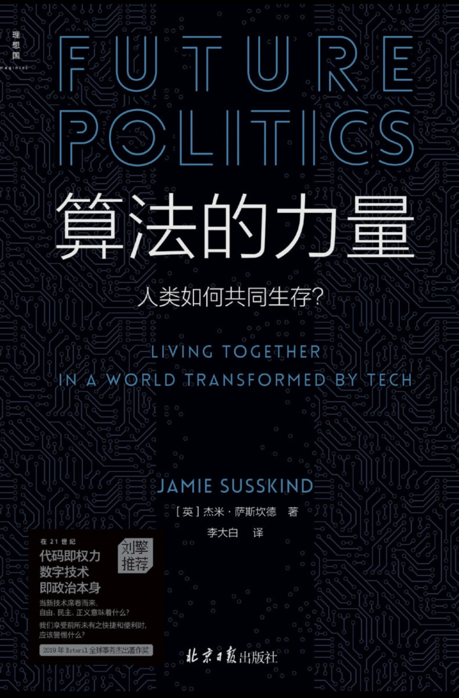
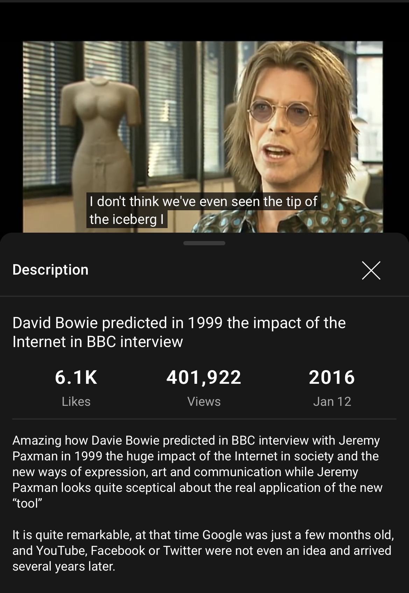
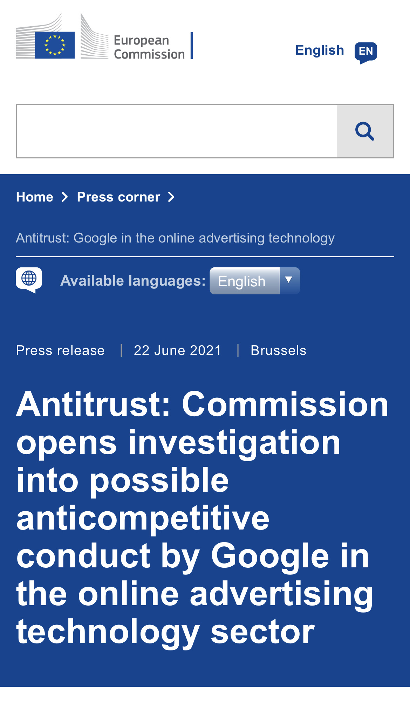
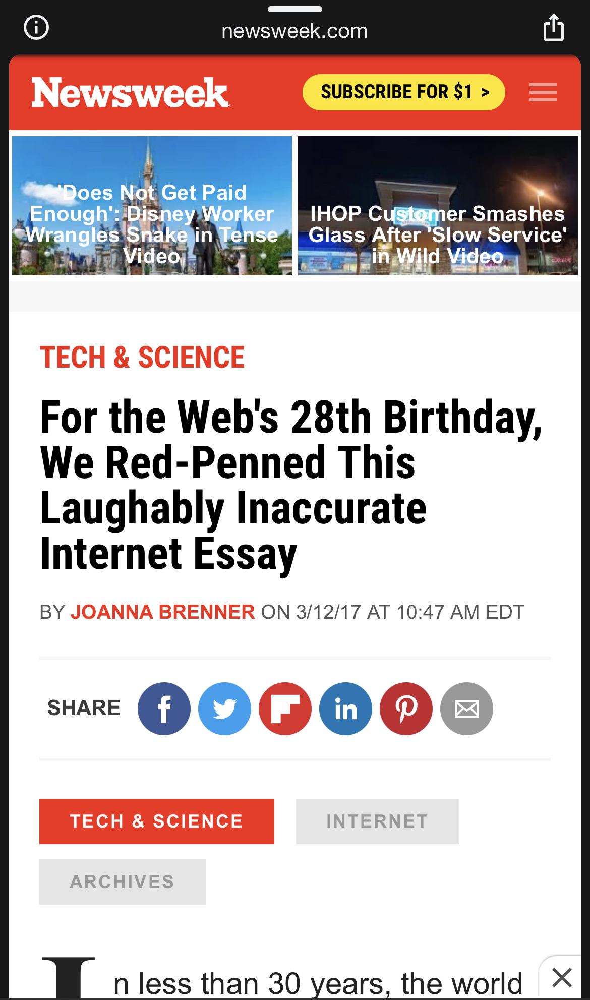

我一直在考虑如何让这个公众号「像话」的运转起来，也许把最近接触到有价值的媒体内容分享出来是值得尝试做的一件事，于是就有了这个系列。

你可以把这里理解为分享，或者是算法以外的声音，但绝不是书单。书单背后有一套傲慢逻辑：我们具有更高价值。然而如果我看到一位准妈妈站在书架前阅读着一本如何照顾新生儿的图书，那么此时此刻没有任何一本来自权威人士的推荐图书会比她手中的这本更加重要。

至于带货？不存在的，很多即将推荐的文字或者影像资源你在当下已经很难找到了

## 《算法的力量》

原版英文名称 Future Politics 在我看来中文更好的翻译应该是《未来政治学》，尤其从原版副标题 living together in world transformed by tech （译：与被科技改变的未来共生） 就不难看出，它想探讨的是人类应该如何以新的姿态来与科技共生的问题。不过从市场角度考虑，我也理解为什么标题直指算法。

在 1999 年 BBC 主持人 Jeremy Paxman 与大卫鲍伊探讨将来互联网带来的影响时提出了一个质疑：它不只是一个工具而已吗？（it's just the tool though isn't it）而大卫鲍伊的观点是：我认为我们连它的冰山一角还没有看到，我认为互联网给社会带来正面或者负面的影响的可能性是难以想象的（I don't think we have even seen the tip of the iceberg, I think the potential of what the internet going to do to society both good and bad is unimaginable ）

在 23 年之后的今天再回过头看那一次对话，大卫鲍伊显然更具前瞻性。互联网并非如传统工具般只在某些固定场合才会被派上用场，人类开始在它身上投入感情，它早已从虚拟世界中延伸出来并参与构成我们身边的实体，网络亦是现实。但问题是我们依然习惯将网络与现实生活隔离看待，并且在数字生活中不自觉的丧失了道德敏感性。

本书探讨的便是在此之上的问题，在后科技时代，传统政治观点与道德标准在数字生活中是否依然成立？无数的创新在短短几十年内如雨后春笋般出现，例如人类不再受自然的摆布而是可以成为生命的主宰，民众可以超越地理的限制在虚拟世界中发起轰轰烈烈的网络运动，它们在不断颠覆了人类几千年来积累的认知。在这里我们就列举书中的一个例子，来看看冲击带来了何种的连锁反应

我们不得不要承认的一件事是，最重要的科技公司正在变得像公共事业一样重要，它们的产品不亚于现实世界里的基础设施。但问题在于，在现实世界中，国家通常要求基础设施服务商为公共利益服务，而对于私人科技公司而言我们似乎没有权力要求它们这么做，它们天然的为利益相关者服务。在这里我们便嗅到了一丝不对劲：当私人公司和大众福祉关系越来越紧密，但大众福祉并非是利益的第一出发点。

如果你以关键词 eu（欧盟），antitrust（反垄断），再加上任意一家大型互联网公司的名称，例如 Amazon，Facebook 进行搜索，你得到的头条搜索结果无疑都是欧盟委员会对这些巨头的反垄断调查。

除了不可替代的服务以外，科技公司的强制力也隐约让我们不安。强制力既可以是显式的如社交平台通过算法来决定你的所见，也可以是隐式的如未经同意包括不动声色的收集你的行为信息。如果说国家法律是在考量集体利益下协商之后结果，那科技公司的决策则完全是单方面且不透明的。小到数据杀熟，大到对于诸如对选举、脱欧等现实政治生活施加的影响，我们很难分清楚我们的感官是否陷入了操作之中，如果是的， 我们有能力拒绝吗？当下我们很清楚的一点是，个人的意志在巨头眼中变得越来越不重要，我想看到什么或者不想看到什么不重要，平台想让你看到什么才重要。

这些无需人工介入也不带感情色彩的强制力执行之高效，原因之一便是它们根植在代码中，而代码又遍布于真实世界里。好处是，它弥补了规则从文书到执行的鸿沟。但别忘了上述「规则翻译为代码」的另一面即是「代码是规则」。代码的权力不仅于此，除了能够约束行为以外，还能够操纵你的感官以及对个体进行审查。但问题在于我们依然仅仅把代码当作工程问题交给程序员、交给市场、交给大数据解决。在自动驾驶汽车撞向儿童的惨烈车祸发生前，究竟是拯救一条年轻的生命还是车内多数人的生命更重要，你真的要把这个决定交给一群算法工程师来决定吗？

我是在唱衰互联网吗？不，我只是觉得这些是需要解决的问题。互联网无法被预测，如果你回过头去看二十年前甚至三十年前人们对互联网的评价是可笑和天真的。你可能无法想象在94年美国时代杂志（Time）试图解释为什么互联网没法成为主流的时候给出了这样的理由：它并非为商务而设计（It was not designed for doing commerce） ，以及新闻周刊（Newsweek）在95年一篇名为《THE INTERNET? BAH!》的报道中，把虚拟社区和线上购物认为是一场骗局。以至于他们在17年在线发布了一篇文章对此进行更正

## 《再见，乌托邦》

最近播客「大内密谈」邀请了二手玫瑰主唱梁龙粱伯伯做客节目（vol. 969/970 梁龙：二手的地方必有光芒），聊了聊他们当年的发迹史。从节目中你可以一窥当年中国内地摇滚圈的形态，以及了解到那个年代乐队是如何野蛮生长的。

这两期节目本是我想在这里推荐的，但回头一想，如果这才是我的出发点的话，那有一部纪录片更能让读者准确的感受到那个年代的点滴：盛世民导演的《再见，乌托邦》

这部纪录片以“做梦”乐队吉他手吴珂的消失为线索，对90年代不同身份的音乐人展开了采访和跟拍，让我们在着眼他们当下状态的同时聆听他们对那个年代摇滚音乐的解读。其中包括崔健以及当年赫赫有名的魔岩三杰：窦唯、何用、张楚。

如果你对那个年代的摇滚一无所知的话，可能这部纪录片对你来说会有些晦涩：为什么在纪录片里张培仁说在十多年以后才有胆量面对当年的伙伴？吴珂的身上究竟发生了什么？以及最重要的是，在轰轰烈烈的94年摇滚中国乐势力演唱会之后，为什么中国的内地摇滚乐反而走向没落了？

这部以摇滚为主题的纪录片丝毫不含有既定印象里的摇滚元素：巨星，反叛，激情，躁动。相反它的基调是失落和无奈。你看到的是一代人的失语，对于商业模式的反思，甚至关于中国这片土壤是否能够容纳摇滚音乐的质疑。在南方周末一篇关于这部纪录片的报道里写到，在跟随采访过何勇、张楚、陈劲等摇滚乐手之后，影片的录音师有点受不了：“他们怎么这么惨？真难受。”

之所以推荐这个纪录片并不是因为我想推崇些什么或者贬低些什么，因为过去总是自带滤镜的，从当下去评判过去永远不公平。导演盛志民最近在参与播客「别的电波」一期节目（Vol. 204 乐与路：选中的人与轰然倒塌的废墟）中说，他一点都不怀念九十年代，虽然那个年代是绚烂的并且带给了他快乐，但他并不觉得那个年代有多么牛逼。从那之后摇滚不仅没有死，还活的很好。

但我们可以去了解些什么理解些什么。

借用片中张培仁的话说，在90年后来到内地后他看到每一个乐队都没有好的器材，都没有外在市场甚至财富的吸引……但每个乐队都用生命，产生出强大的爆发力，而且风格各自不同。这是非常难能可贵的，甚至后来任何一只树村乐队都无法企及（关于树村的乐队可以参考另一部纪录片《后革命时代》，图为《后革命时代》里的二手玫瑰）

但同时随着台湾滚石唱片的介入，以及理想主义思潮的褪去，大家开始在创作上失去方向，看上去水到渠成的商业化似乎成了拔苗助长的罪魁祸首。直到今天我们看到的是窦唯和崔健依然远离主流的商业音乐而选择在自己的音乐道路上探索。

当你再有了这些上下文之后再回过头看当下的音乐，甚至相似的社会问题我相信你也许会有许多不一样的看法。

即使是纪录片我们也很难去保证它的客观性，但作为观众我们依然可以尽力摒弃我们的有色眼镜。这部纪录片依然只是一个索引，迫使我们去发现和思考太多的问题

