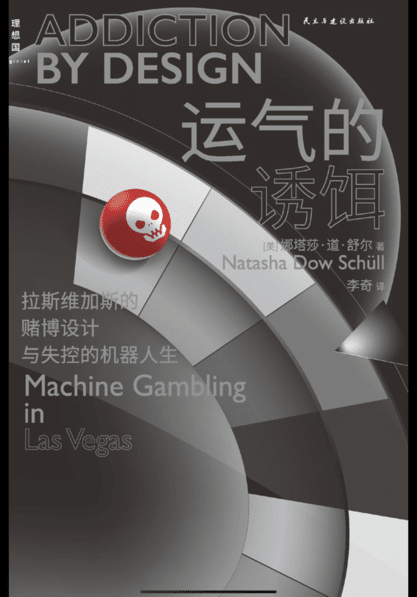
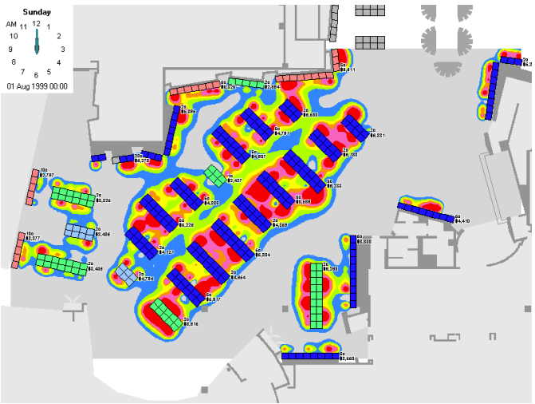
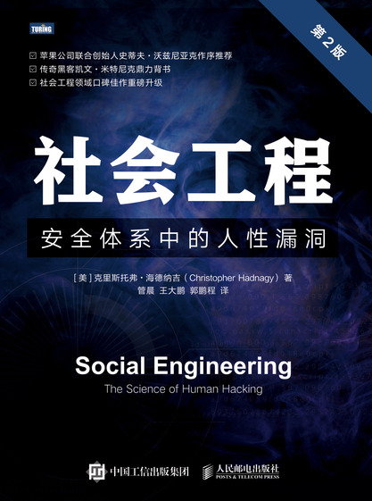
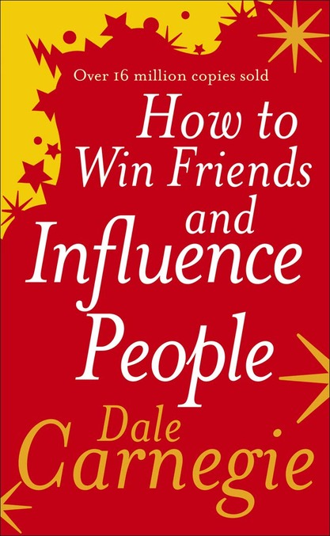

人们为什么赌博？大部分人也许会说是为了赢钱；黑客应该如何潜入公司机房进行破坏？你也许会认为悄无声息是首要条件。但今天推荐的两本书会打破你的这些认知——在这些工作展开的背后离不开对人性的洞察。

#人肉智能# 是一档不负责任的科技类图书推荐栏目

## 《运气的诱饵》

很多有关赌博骇人听闻的故事，相信在包括我在内的很多人听起来是难以置信的，即使就发生在身边。例如在我读大学时，有同学可以在开学第一天打麻将输掉一个学期生活费。

你可能还不知道，在澳大利亚的某些老虎机上甚至带有“自动玩”功能，玩家不需要亲自操纵每一局，只需要在系统内预设好投注选项之后观看机器自己玩自己即可——你可能会对此感动匪夷所思，但是联想到自动挂机在端游手游中早已经不是什么新鲜事物，你会不会稍稍有些释然？

所有这一切都是与我们的认知相悖的，我们认为人应该有能力为自己的行为负责，我们认为参与感应该是游戏的最大乐趣，我们认为掌控胜负应该是赌徒的最大动力——但如果你有机会读完这本书你就会了解到，赌徒需要打败的并不仅仅是他自己，他面对的是从建筑硬件到软件技术的合谋；甚至他可能想要的并非是赢。

如果我们把沉迷赌博当作一类顽疾的话，那么本书就是对它最好的病理分析。它从各个方面对赌博活动进行拆解，事无巨细的讲解它是如何一步步把赌徒们套牢的。例如为什么要把赌场布局设计的如迷宫一般，游玩过程中机器的声光电如何悄无声息的迎合你，以及玩家自己的心态是如何潜移默化成为帮凶的，你都可以在里面找到答案。

然而这里不是科技类图书推荐节目吗？线下的实体赌博和线上虚拟产品的关系在哪，为什么要推荐一本关于赌博的书？——因为在我看来互联网2C产品的构建方法论和赌场设计根本是一丘之貉，在很多方面，例如如何尽最大可能保留用户的注意力这件事情上，他们利用的都是人性相同的一面。

以我们熟悉的 Meta与 Google为例，表面上看他们是2C产品公司，从盈利结构上看它们是广告公司，可骨子里是数据驱动型公司。雅虎前 CEOMarissa Mayer在谷歌工作时期最为人津津乐道的一件事情便是“四十度灰测试”：她把蓝色划分为四十种不同灰度，然后把每一类随机展示给 2.5%的用户，进而从中找出能够带来最高点击率的蓝色灰度。它也是现在你在谷歌邮箱以及谷歌页面上看到的最终颜色，并且它最终给公司带来了2亿美元的收入。现在你可以在互联网上找到相当数量的有关 AB测试的论文都来自 Meta和 Facebook。赌场的机器设计早已不再依赖“专家”和“直觉”，从图标到音效都是经过无数次测试的结果。注意博彩公司并不是在追随互联网公司的步伐，早在 AB测试流行之前它们已经在采用该实践。

例如书中介绍到，赌场会对玩家价值进行建模，连锁型赌场基于人口统计学信息，将客人细分为90个群体。他们发现与客户价值相关性最强的是赌博频率、赌博类型和每转/每手的下注金额。“高速”玩家（按机器按钮手速极快的玩家）很容易受到诱导赌得更多，因而对公司格外有价值。玩家价值预测算法会设置一套日历和预算系统，用来预测一个玩家什么时候会赌博，会赌多少钱，并生成“行为调整报告”，向赌场建议何种诱惑对他们可能有效。玩家如果“逾期”未至，会收到邮件提醒，接下来就是电话跟进。

在拉斯维加斯你可以选择加入赌场的会员计划，这样你就不必随时携带现金，而是通过在机器上插入储值会员卡进行游玩。你以为只有使用会员卡的客户他们才有能力进行追踪吗？他们可以在玩家连会员卡都没有办理的情况下追踪他们。这一系统在赌博机上加装了与中央数据库连接的微型摄像头，并引入了生物识别系统，当玩家开始游戏但没有用会员卡时，摄像头就会“捕捉玩家的图像，并与其游戏过程一并保存”，创造一个“某甲”玩家档案。

最后我们要意识到一个问题，玩家可能并不一定想赢。准确来说，他们不想被赢打断。因为赌博本质上是一类心流活动，它具有和其他如编程或者写作之类的心流活动相同的特征：具有小目标、能给出实时反馈、满足参与者的控制感和挑战性等等。然而别忘了心流活动都具有潜在的成瘾性，它会诱惑人们借此去悬置消极的情感状态。

赌博机的设计者们的很多尝试，例如额外的奖励动画、小型电视、融入更多的娱乐感等等，最后都无功而返。甚至玩家对于填一张表格就能领取5美元的奖励也毫不在乎——因为玩家想要的是全然的沉浸感，想要进入一种节奏。在视觉和听觉上都不想被打断。如果你难以理解，回忆一下你在看剧时被迫观看广告的心情，是不是勾起了你想要去充值以确保心流不被打断的冲动？类似的，甚至游戏中过长的死亡动画也会被诟病（参见最近发售的游戏《木卫4协议》引起的争议）

## 《社会工程》

社会工程狭义上来说是一类攻击手段，它的突破目标不是硬件或者软件的二进制漏洞，而是实实在在的人。广义上说你也可以用它来搭讪女孩，从商家那里得到些小恩小惠一类的。这本书听上去带有专业色彩但阅读起来却并不枯燥，也没有负担，你大可以用一种猎奇的心态把它当作故事会来消磨时间。

以上都不是我推荐的理由，准确来说如果你不是对社会工程感兴趣，我也不推荐你阅读完整本书。但其中有几章有意思的章节非常值得阅读，相信不仅是对从事这个职业的人有效，甚至对所有人都是有益的。

如果你想要从既定的角色身上找到缺陷作为突破口，你势必要熟络你的目标：接近他，让他放下防备，最终让他相信你甚至敞开心扉——抛开目的看，这个过程本质上日常生活中的社交无异。尤其是当你刚刚加入到一个新环境时，你更需要和你的利益相关方熟悉起来以便展开工作。我们可以在本书的第五章（获得他人的好感）、第六章（对他人施加影响）学习到有关的技巧。例如在第六章，作者给出了建立融洽关系的八条原则（互惠、义务、让步、稀缺、权威等等）。

很有意思的是，在这里我们从一本有关社会工程书籍中学习到了社交技巧；而在另一份有关于社会工程资料汇总的[开源项目](https://github.com/v2-dev/awesome-social-engineering)里，则将另一本人际交往图书[《How to Win Friends and Influence People》](https://www.amazon.co.uk/d/Books/How-Win-Friends-Influence-People-Dale-Carnegie/0091906814)作为必读图书。这本书在亚马逊上收获了八万多条评价，有4.5星好评。

社会工程的另一面，也许就是“社交”工程，有时候恶魔与天使真的只在一念之间。

---

你可能会喜欢

- [人肉智能#001：代码即权力](https://www.v2think.com/recommend-future-politics)