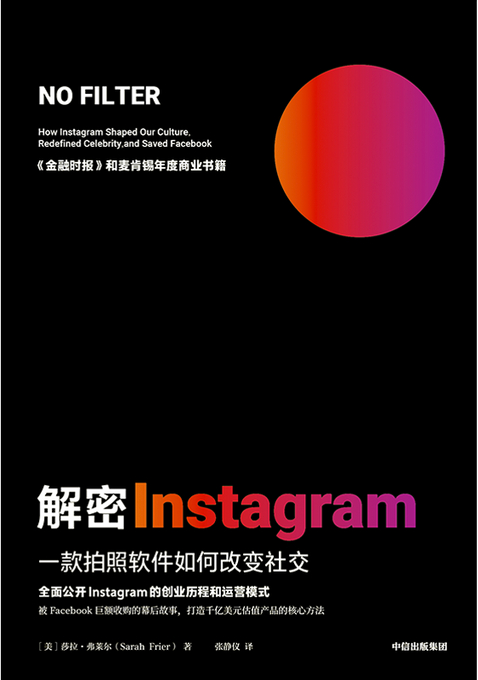
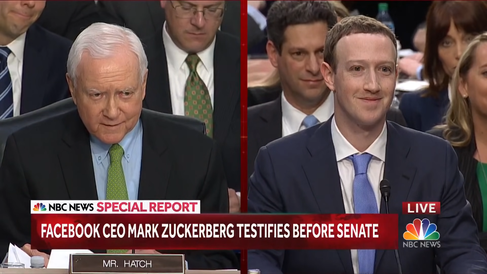

你可曾发现 Instagram 并不提供转发功能？又或者思考过你关注者的信息在 Instagram 上究竟是以何种顺序展现在你的主页上的？Instagram 也许距离我们遥远，但是社交网络从未在我们生活中缺席。理解 Instagram，也许就能理解当下的社交媒体网络，也更能理解我们自己。

#人肉智能# 是一档不负责任的科技类图书推荐栏目

这次我们依然推荐两本书：《解密 instagram：一款拍照软件如何改变社交》（以下简称《解密》）和《手机大脑》（以下简称《手机》）。不过这次我采取的形式将不同于往期，不再将两本图书独立分小节介绍，而是融合在同一段文字中。

《解密》的重心并不是对 Instagram 之所以如此成功的解析（这也无法做到，因为此类性质的图书难免有“事后诸葛亮”去神话它所讲述对象的嫌疑），虽然本书内容涵盖了它背后的商业逻辑，但在我看来它更多的是对这款应用发展史的梳理，从创始人如何开始构思软件，到 Instagram 被 Facebook 收购，最后再到创始人选择离开公司，本书也是时间线来组织内容的。

书中有很多有意思的内容值得被挖掘，比如 Instagram为什么拒绝了 Twitter 的收购而转投了 Facebook，它又是如何面对来自snapchat 到 What's app 的竞争的 ——但作为一个（有温度的人文关怀类）读书节目，我更想展现的是软件与人的关系——书中有不少的内容就涉及到了这方面的内容，例如在 Instagram 的设计理念中对用户的理解是如何的与 Facebook 不同，这些才是我想在这里分享的。同时因为我们离不开手机这个重要的媒介，第二本书《手机》也就自然的引入其中。

对于个体来说，社交网络已经成为每个人生活不可缺少的一部分，但我们从未尝试理解它服务我们背后的逻辑：例如你可曾发现 Instagram 与 Twitter 不同并不提供转发功能？又或者你关注者的信息在 Instagram 上究竟是以何种顺序展现在你的主页上的？Instagram 也许距离我们遥远，但是社交网络从未在我们生活中缺席，知乎、微博、甚至曾经的人人网不过是彼此的影子罢了。理解 Instagram，也许就能理解当下的社交媒体网络，也更能理解我们自己。

也许还有人并不清楚 Instagram 早已被 Facebook 收购，如果你也对此感到惊讶这并不怪你，因为两款软件气质如此之不同让人很难把它们联系在一起，这得力于 Instagram 长期坚持的独立运营，并由此带来的解决问题的不同思路（至少与 Facebook 相比）。

**Instagram 难得可贵的气质之一便是坚持以人为导向而非算法**

在《解密》一书记录期间，发现 Instagram 上明星用户的主流渠道之一是通过 Instagram 的官方账户的推荐，Instagram 拥有独立的社区建设团队去寻找在特定领域冉冉升起的明星。许多博主或者公司试图通过官方账号发布的帖子去破解选人流程，但没有什么好破解的，因为根本没有公式或者算法，与 Facebook 以数据为导向的决策不同，Instagram 的选择完全是由员工的个人品味决定的。

Instagram 也没有类似于知乎或者微博上的“热榜”页面，这些页面上会显示哪些点赞和评论超过平均水平的帖子。因为在官方看来，如果员工无法通过自己的审美加以干涉的话，应用就会变得容易操控，例如只要在用户登录应用频繁的理想时间段内发帖，自然就能够得到更多的关注。

Facebook 执行的则是另一套以数据驱动，他们从来不接触平台的超级用户，一切依靠算法进行分发。但是负面效应也显而易见，他们受到了纵容负面新闻泛滥，操控总统选举的指责

Facebook 的问题不在于它做了什么，而是什么都没有做。

在#人肉智能#的第一期里我推荐了一本有关于算法的图书：《算法的力量》。关于算法最沮丧的事情便是即使它保持中立的态度也是一种偏见。如果你在谷歌上搜索一个非洲裔美国人的名字，你很可能会看到一个提供犯罪背景调查的网站广告，如果你输入的不像是非洲裔美国人的名字网站则不会弹出。这是谷歌通过一个中性规则来决定的：如果输入搜索词X的人倾向于点击广告Y，那么广告Y就应该更加突出地显示给那些输入搜索X的人。这种操作并非由不公正的规则引起的，而是由人类自身本身的行为引起的，因为人们搜索和点击的模式就是种族主义的。

为什么人们热衷于耸人听闻的假新闻，则需要从另一本书《手机大脑》中寻找答案。

虽然手机对我们来说都是稀松平常的事物，但站在整个人类历史角度上看它们存在时间都十分短暂，狩猎采集的生活占据了人类历史 99.9% 的时间，我们大脑也是随着这一生活方式不断进化来的。然而近一万年以来，人类大脑基本没有发生变化，也就是说，尽管身处现代社会，我们的大脑却认为我们依然生活在非洲的热带草原时期

在那个时代，有一半的人会在十岁前死去，有 10% 到 15% 的人是被他人杀死的。所以在那个危险的环境生存下去，是那个时代人的第一要务。这也让我们更加关注那些涉及纷争和威胁的新闻，同时也意味着判断新闻的真假并不重要，因为“宁可错杀，也不放过”能够提升我们活下去的概率，这也能够解释为什么标题党文章总是能够吸引到不错的点击。

另一个被互联网产品“加以利用”的基因，便是人类对新鲜事物的追求。如果你有留意的话，无论是 Facebook 还是 Twitter，亦或者国内的知乎，他们越来越倾向于使用应用内的红点通知来吸引你的注意力，邮件，短信也会是不二选择。因为从进化的角度来说，对世界了解的越多，存活下来的概率也就越大，比如天气变化是如何对狮子行动轨迹产生影响的，大自然赋予了我们获取情报的本能。

回到 Instagram 上，Instagram 也同样引入的算法，但并非是以夺取用户时长为目的的那一种。

如果 Instagram 默认以生成时间为序把内容呈现在用户的界面上，这会让普通用户的参与感下降，因为专业用户（公众人物或者营销账号）会更频繁、在更有利的时间策略性的发布内容，而你关注的亲人可能一周才会进行一次分享。非专业用户的帖子得不到关注也就得不到评论和点赞，分享的积极性自然就下降。

Instagram 选择的算法是，不再将最新发布的帖子放在页面顶部，而是把家人和朋友的帖子放在公众账号的内容之前。这导致了虽然普通用户的帖子获得了更多的评论和点赞，但是导致网红和品牌账号的数据增长出现了下滑，要知道不少公司已经把 Instagram 增长纳入了商业 KPI 计划中——而 Instagram 给出的解决方案是：购买我们的广告吧

---

你可能会喜欢

- [人肉智能#002：为人性服务](https://www.v2think.com/recommend-addiction-by-design)
- [人肉智能#001：代码即权力](https://www.v2think.com/recommend-future-politics)