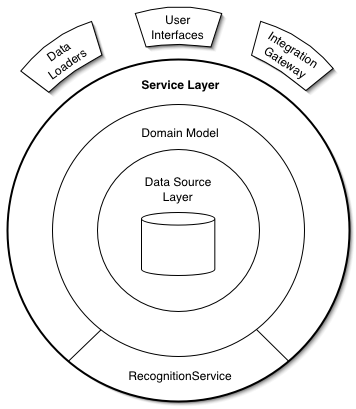
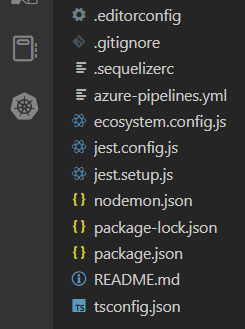

我们从一个最简单的需求开始，来探索我们应该从哪些方面思考模块设计，以及如何将不同的文件分类。之所以说“思考”，是因为我在这篇文章里更多的是提供一类解决问题的范式，而非统一的标准答案，能够为你提供一丁点的启发就好

实战系列来自个人开发以及运维 [site2share](https://www.site2share.com) 网站过程中的经验

需求很简单：当用户访问列表页面时，我们需要展示列表数据。为了便于接下来的演示，我们不如把这里的“数据”具象化，以 site2share 网站为例，列表即代表了每用户创建的文件夹下的内容，如下图所示


## Service 层很重要

在获取数据的过程中我们至少需要做这么几件事：

1.  获取列表数据
2.  获取列表文件夹元数据，如创建人、创建时间
3.  判断访问者是否有权限修改列表

我们可以想象这三类数据如果使用 SQL 进行存储的话，它们会属于不同的数据库表，所以在这次数据访问中我们至少要对三张表进行读操作。但是应该直接把三者的数据库读操作语句糅合在一个函数里吗？缺少封装问题不是最大的问题，这么做会导致代码的维护性会大大增加，因为可能有多个功能用例都需要“获取文件夹元数据”，这样一来同样的一组代码就难免会散落在代码库各个地方（可能是多行代码），如果有一天表结构发生了更改需要修改语句，你会面临[散弹式修改](https://refactoring.guru/smells/shotgun-surgery)的风险。

所以你至少应该以 service 视角将同类型操作封装起来。比如把所有和用户有关的操作都归类到 UserService.js 文件中



什么是 service？如上图所示，如果我们把最外层大圆圈定义为正在被开发的应用的话，那么 service 层处于应用的最外层边界上，与它接壤的是各种类型访问方式，例如网络请求可以访问这个应用，通过 CLI 也可以访问这个应用。无论访问方式是什么，外部永远无法跨越 service 层调用应用内部的接口。service 封装了常见的应用业务逻辑，你甚至可以理解为用户用例

在 service 层之下你还看到有 domain 层和 data source 层，在 NodeJS 中可以不追求一模一样的抽象，但 service 层是至少需要保证的。

注意 service 与 model 并非一一对应

例如我们有一个关于文件夹的服务层模块 FolderService.js，“Folder”意味着的是它服务于“Folder”，而非只能访问和 "Folder" 有关的数据。在模块内部可以有一个方法名为 GetFolderByUserId，这个时候它可能为了在结果中带上用户信息，而需要访问用户数据库。甚至它还需要请求应用外的数据，比如用户数据存储在 Auth0 的话

优先按照功能给文件分类

 除了 FolderService.js 以外，我们可能还有数据层访问模块 FolderModel.js，以及专门响应与文件有关请求的路由 FolderRouter.js。关于如何组织这些文件这里有两个思路

按照功能（与文件或者用户有关）将这些文件组织在一起（前者），和按照角色（与路由或者服务有关）将文件组织在一起（后者）

```
├── Folder
|   ├── FolerService.js
|   ├── FolderModel.js
├── User
|   ├── UserService.js
|   ├── UserModel.js
```

```
├── Services
|   ├── FolerService.js
|   └── UserService.js
├── Models
|   ├── FolderModel.js
|   └── UserModel.js
```

后者是我们最常见的组织文件方式，但实际上前者更有利于我们开发

日常开发工作都是围绕某个特定的功能展开的，例如需求“新增 API 用于前端获取访问量最多的前十文件夹 id“，在开发这个功能的过程中我们修改的路由、在 service 和 model 中新增的方法，都只和 Folder 有关，我们需要反复在有关文件之间切换并且做出修改。按照功能组织文件，便于我们聚焦我们开发的功能

这其实和前端开发中使用 [duck 文件分类法](https://github.com/erikras/ducks-modular-redux) 是类似。

甚至我建议你的测试文件也应该和功能放在一起（大部分项目的测试文件都会单独放在测试文件夹中）。当然是否应该这么做部分取决于你是如何制定你的测试策略的。在拥有 service 模块的前提下，我建议大部分精力应该对 service 进行测试，对 service 测试一方面间接测试了 service 以下的其他模块代码，另一方面也直接对用户用例进行了测试。测试还有一个颇为重要的功能是，它可以作为被测试模块的说明书，通过测试用例我们可以知道模块能做什么以及不能做什么

## 最小知识原则

项目中还有相当多的文件是无法与具体业务相关联的技术代码。例如我们通常会把常量，公共函数提取到单独的文件中。代码不是为了分类而被分类，所有的行为背后都是为提高代码维护性服务的。在我的经验看来代码分类的一个重要原则是确保程序员以最小的成本展开工作。

文件的命名和划分应该符合程序员的默契。例如我们看到 src 文件夹就应该知道它是用于存放源码文件的，如果你把源码文件命名为 src 的全称 source 会让不少人要理解好一会。

之所以说是默契，是因为这类规则并不是明文写在什么开发制度里的，而是当我们经历了10个代码库并且每个代码库都是这么做的时候，我们也就会认为这么做是对的，并且之后的编码工作把相同的规则传递下去。例如以下关键词常常被作为默契使用：

*   util/utility: 公共代码
*   libs：第三方类库
*   common：公共文件目录
*   constant: 常量
*   test/ut(united test)：测试相关
*   client/provider：第三方服务访问类
*   docs：文档相关
*   dist/build：打包目录
*   public/assets: 静态文件
*   \*.md：markdown 格式的文件通常为文档
*   \*.spec：带有 spec 字样的文件通常为测试文件
*   tool/scripts：与代码无关的工具文件，比如创建数据库的 shell 脚本

这些还只是文件命名上的潜规则。默契可以提升我们的开发效率，例如当你第一次接触某个代码库想看看它说明文档时，你想当然的会去搜寻 markdown 类型的文件；又或者你创建了一个函数觉得后期对其他团队成员也有帮助时，你下意识的会存储在 util.js 的文件中

“最小知识”的另一个方面是，当需要维护某个模块时，我们应该尽可能避免其他模块带来的干扰，这也是模块划分的本质意义。行数巨大的文件或者函数虽然是一个经典反例，但是在当下可能已经不常见。有一些其他类型的陷阱在这里分享出来。

package.json 就是一个例子，目前 jest, babel, nodemon 等等都允许将配置信息编写在 package.json 中，甚至一些开发工具还允许我们将 eslint 的配置也放置其内。但我不认为这是一个好的实践。例如当我们需要修改 jest 配置时，只专注于 jest.config.js 的修改能够让我们更快定位到文件和代码，以降低对其他配置破坏的可能性。

下面截图是 site2share 项目中所需要的各类配置文件，想象一下如果把它们所有内容都塞入 package.json 其中，诞生的超级配置文件是怎样一种灾难。



就像我在文章开头说的，所有的问题无法一概而论。例如对于多个团队共用一个代码库的 monorepo 类型项目来说，全局共享的单一常量文件注定是无法解决问题的。对于类似问题我无法一一作出解答，但是把你自己放到将来的项目中去，围绕可维护性去思考一定是正确的方向

---

你可能也会喜欢：

- [NodeJS 实战系列：DevOps 尚未解决的问题](https://www.v2think.com/devops-solution-in-nodejs)
- [NodeJS 实战系列：如何设计 try catch](https://www.v2think.com/nodejs-try-catch-best-practice)
- [做一个能对标阿里云的前端APM工具（下）](https://www.v2think.com/apm-tool-2)
- [做一个能对标阿里云的前端APM工具（上）](https://www.v2think.com/apm-tool-1)
- [小心 Serverless](https://www.v2think.com/careful-with-serverless)
- [SQL Server 查询语句优化入门](https://www.v2think.com/sql-server-optimize-tutorial)
- [利用Node.js+express框实现图片上传](https://www.v2think.com/nodejs-express-upload-image)
- [一篇来自前端同学对后端接口的吐槽](https://www.v2think.com/toast-about-backend-API)
- [关于Node.js后端架构的一点后知后觉](https://www.v2think.com/something-about-nodejs-architecture)
- [在Node.js中搭建缓存管理模块](https://www.v2think.com/built-cache-management-module-in-nodejs)'
