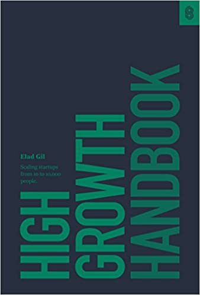

在寻找解决团队问题的过程中，我发现互联网可以提供的参考非常有限，在各大技术写作平台上大家更多的关心是技术，软技能很少被谈论。希望我的经验可以提供一些参考，有一些解决问题的思路和渠道可供参考。

在最后一段广告前，说的都是真心话

## 不成问题的问题

在 25 岁之前我对于世界上有些事物存在的意义是理解不了的，比如时间管理、冥想、推拿按摩。

当年我以为这辈子永远也用不上它们，然而现在的我这些全都需要。这就是今天我想聊的，有一类知识我曾经不屑一顾，然而现在我觉得他们很重要。

长时间在互联网公司工作的工作经历，将我塑造成以结果为导向和用简单粗暴的方式思考问题。比如能够工作的代码是唯一真理，以及快比好更重要。这种思维方式至今依然会让我在 Thoughtworks 工作时产生一种割裂感。一方面咨询行业的工作模式会指导你用更完备的方式解决问题，优先考虑最佳实践；但另一方面，我会对缜密产生怀疑，当争论僵持不下时，我心里会不自觉的喃喃：talk is cheap, show me the code.

这种思维方式能解决代码，但是解决不了带领团队时遇到的各种挑战。

说到这里我要暂停一下，你是否认为团队问题真的是一个问题？

在我看来在大部分内公司并不成立。如果你在 Thoughworks 之外的公司工作过，你见过多少 leader 是待团队成员如春风般温暖的？你见过多少 leader 会关心你在项目里能得到些什么的？付诸权威和抱大腿是我最常见的灵丹妙药，但我不认为这两者可以用“办法”去冠名，他们利用的不过是动物的本能而已。很多问题不去解决马照跑，舞照跳——我把它们称之为不成问题的问题。

但我希望去解决问题，因为如果只是确保有人能干完你布置下去的活的话，我其实更像个包工头而不是 Tech Lead——可设法从他人身上学习如何处理问题的技巧不切实际，一方面像之前说的现实里的榜样屈指可数，另一方面我曾经有和大部分人对待 leader 的一样态度：就这？我也行。遗憾的是互联网可以提供的参考也非常有限，在各大技术写作平台上大家更多的关心是技术，软技能很少被谈论。

我错误的以为带领团队不需要额外的知识，靠模仿和惯性就够了。

怎么办？

## 解决问题

解决问题的思路很简单：

如果我没有这方面的知识，那我就去学习这方面的知识
如果身边没有这方面的渠道，那就优先去寻找渠道
如果声音太多，那么不妨都听听，直到找到你听起来有道理的为止。

你要相信答案一定存在，因为你肯定不是第一个遇到相同问题的人。在如此往复之后我想有些经验是能够和大家分享的。

我不推荐彼得德鲁克或者卡耐基，在我看来它们与心灵鸡汤无异。不能说书中的普世价值是错的，但解决不了现实里的问题。比如如何重新凝聚一个人心涣散的团队，如何解决交付压力和对技术卓越的追求之间的平衡问题。当然也可能我的格局没有打开，那些书本不是为了解决这些小事而著的。

在我所有接触到的材料里，有一类书籍是我特别推荐的，就是来自第一线管理者的经验，比如 [Stripe](https://press.stripe.com/) 出版的 [An Elegant Puzzle](https://press.stripe.com/an-elegant-puzzle) 和 [High Growth Handbook](https://press.stripe.com/high-growth-handbook)。

前者的作者 Will Larson 曾经任职于多家大型科技公司，包括雅虎、优步、Stripe，目前是 Clam 公司 CTO。而后者的作者 Elad Gil 更是硅谷老兵，曾经在不同公司担任过投资者、顾问、运营主管等角色，书中内容来自于他与不同阶段、不同体量硅谷创业公司的管理者的对话实录。

它们依然不是万能的，但是鉴于书中叙事主角都是科技公司里的 manager of engineers 或者 manager of manager 一类的角色，那些发生在你身上的，
大概率曾经以不同的面貌也在他们的工作里出现过好几次。过去和将来的问题，多半都能在这类书里找到答案。

### 哈佛商业评论

[「哈佛商业评论」（Harvard Business Review）](https://hbr.org/)是我最近从中受益最多的阅读材料

网站的标题起的很吓人，毕竟我们大部分人离哈佛相距甚远，也看不懂商业逻辑。但杂志里的相当一部内容谈的是职场人的林林总总，你总能在它的文章分类下找到你感兴趣的标签。如果它能起名为“职场那些事”会更亲切一些。

网站内容很有意思的一面是，它既不是悬空的普世价值，也不是来自第一线员工的职场经验，而是源自科学研究、长期实验的结果。它们都不是我推荐它的主要原因，我推荐它的主要原因有两点，1. 我在它提供的内容里确实能找到我急亟需解决问题的答案，2. 它提供的一些建议或者方案能够让我感同身受

关于前者并非所有人都有共鸣。本文开头所说的“不成问题的问题”就是一类。但即使你不需要和团队打交道，也可能有其他问题有待解决，比如说时间管理，比如说你感觉到 burn out，比如需要排解压力；哪怕如你是刚入职场的小白只是想提升沟通技巧，锻炼某种思维，也能从中找到答案。它们可否一定就是对的呢，你无法知道，你无法知道任何课本或者人给你的建议是否真的有效，但不妨 take a leap of faith 尝试一下。

至于后者——我们需要回到这篇文章的上下文中。在相当长的一段时间内我都对应该如何领导团队有很多疑惑，关于这些疑惑的回应只是若隐若现的出现在我脑海中，不知对错与否。哈佛商业评论有一类标签就叫做[「leadership」](https://hbr.org/topic/leadership)，你可以按照受欢迎程度在该归类下找到很多经久不衰的文章，说不定你会发现这些文章的内容会与你的想法产生共鸣，或者会进一步激发你的正向思考。

我还是想提醒你，你是否真的需要解决各种「不成问题的问题」。在新自由主义世界下的每个人似乎都变得无所不能，为了无所不能，我们都在心甘情愿的剥削自己。

## 你可以少走弯路

你也许终有一天会成为 Tech Lead，但我们不希望你再走弯路。这本小册子便是为此而生的。在书的内容上我们不仅会强调原则，还会用实践予以丰富和补充，并且尽可能的平衡易懂和深度。我们不敢拍着胸脯去保证它覆盖到了 Tech Lead 工作的方方面面，但至少相当一部分的问题，书中经验是可以直接用来参考的。如果你感兴趣，可以通过扫描下方二维码或者[访问 Thoughtworks 洞见](https://insights.thoughtworks.cn/tech-lead/)进行下载。

---

你可能会喜欢

- [测试覆盖率治不好你的精神内耗](https://www.v2think.com/test-coverage-rethink)
- [昂贵的质量](https://www.v2think.com/expensive-software-quality)
- [理解流程](https://www.v2think.com/understanding-process)
- [帮助团队成长是唯一的出路](https://www.v2think.com/what-is-leadership)
- [开源社区的暗面](https://www.v2think.com/darkside-of-the-opensource)
- [去年做 Tech Leader 犯过最大的错](https://www.v2think.com/tech-leader-mistake)
- [技术写作的困境](https://www.v2think.com/stuck-in-technical-writing)
- [拥抱原则与面对现实](https://www.v2think.com/principles-and-facts)
- [代码与质量的思考与随笔](https://www.v2think.com/think-about-good-code)
- [从对 Vue 中 mixin 的批评，到对模块间依赖关系的探讨](https://www.v2think.com/vue-mixin-module-dependency)

