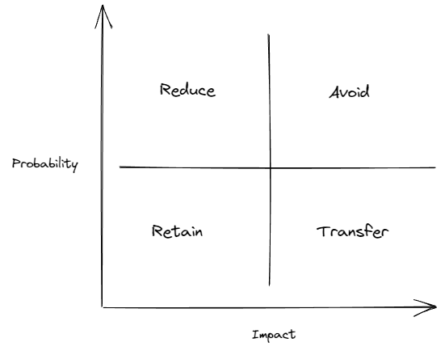

服务不稳定是一类常态，面对此类场景恰当的应对策略应该是什么？退一步说，即使我们能够确保第一方服务的稳定性，我们又应该如何面对网络延迟以及掌控以外的不确定性？这都是本篇文章会谈到的内容

本文是团队内部分享的文字版，敏感信息已经抹去或者重写。我们通过三个实际的线上问题来看看在今后的开发过程中可以如何避免此类问题

## 校验是可选还是必选

**用例1**：学生可以在网站选择指定的日期和时间预约老师进行会议，老师也需要设定在某一时间段内可以并行服务学生的数量，毕竟她的带宽有限。但线上出现了老师在同一时间内被多个学生预约成功的情况，即预约数超出了她可以提供服务的上限。

**用例2**：在用户第一次访问网站前，他需要签署一系列协议。但我们发现有些协议被连续签署了多次，导致后续的功能出现了异常。在重现问题的过程中我们得知，确实可以通过复制浏览器标签的方式来重复签署同一份协议

这两个问题的修复方式是显而易见的：给后端有关接口添加校验。但问题是，它们是否可以算作开发功能的失误？用“九转大肠”问句就是：是故意的还是不小心的？

经典的风险应对模型告诉我们，根据风险的危害和发生概率，我们可以使用四种策略来处理问题：avoid、reduce、retain、transfer

在我看来模型传达给我们的不止于此；
- 对于 retain，我认为它更想表达的不仅仅接纳（什么都不做），而是尽可能用低成本的方式去做；
- 对于 avoid，你可能无法完美 avoid，但也许你可以把风险往其他象限转移，毕竟降低风险也是一种策略

回到这段开头的两个 case 上，我认为在功能设计之初，考虑到有限的使用频率和可承受的风险，以及无从考证的交付压力，不去接口校验没有问题。（我们一直以来缺乏对于数据增长的监控，很多问题的产生，尤其是性能问题都是在稍不留神间达到了代码能够支撑的阈值，这个问题之后再谈）。但我们真就可以什么都不用做了吗？至少我们可以让代码变得灵活一些：不需要去预测未来发生什么，让代码可能应对未来的变化即可：

> 于是，我们倾向于将演进能力构建到软件中，如果项目可以轻松应对变化，那么架构师就不再需要水晶球 ——《演进式架构》人民邮电出版社

> 关键在于，你并不需要去预测什么会变化，你需要知道的是，变化必然会发生。程序应该保证尽可能的灵活性，这样，不管未来发生什么变化，都可以应付得了——《简约之美：软件设计之道》人民邮电出版社 

## 更复杂的问题

如果说前两个用例的症结和方案都清晰可见的话，下面这个用例也许可以带来一些思考。

假设我们需要在页面上展示申请处理进展，进展由步骤（step）构成。步骤的类型分为主步骤（step）和子步骤（sub step），可以混合使用进行串联，如下图所示

顾名思义，进展允许前进也就允许回滚。两类步骤分别有属于自己的回滚接口：

- step 回滚：使用 PUT method 调用 /{progressID}/back
- sub step 回滚：使用 PUT method 调用 /{progressID}/back，但是需要在 payload 里加上需要回滚的 sub step 所属的 step ID

假设目前存在一个如下图所示的步骤序列，当前的步骤位置处于尾声

如果想要把这一系列步骤正确回滚，接口的调用顺序如下：

但在排查一个问题时，我们发现用户侧的实际调用顺序是这样的：

这便导致当中的某个 sub step 被略过，数据没有被正常清除

而为什么会出现这种情况？通过 Application Insights 我们发现，用户在从点击选择发送回滚请求到服务器接收到请求，存在12秒的网络延迟，实际代码只花费了 276ms 来处理这个请求

而恰好 UI 又允许用户在等待请求的返回过程中选择重新取消等待界面，重新点击发送

于是用户在等待的过程中选择不断的重试

## 问题在哪

### 允许重试？

重试没有罪，恰恰相反，重试是我们最重要的机制。服务不稳定是一个常态，重试可以帮助我们解决相当一部分问题。例如我在排查死锁问题时，发现一旦死锁给用户带来负面影响，用户会选择刷新页面“自助”解决问题

甚至重试是应该根植在我们代码中，无论前端还是后端，用于网络请求的 client 应该对于首次失败的请求默认进行重试，无需额外的代码。

> 好的“基础设施”（例如日志、鉴权、重试，以及这里的重试）代码应该是毫无存在感的，很容易、甚至无意识的让人做对很多事

关于重试策略，一篇来自 AWS 社区的文章非常值得我们参考[《Timeouts, retries, and backoff with jitter》](https://aws.amazon.com/builders-library/timeouts-retries-and-backoff-with-jitter/)，重试时我们不仅需要加入 backoff（延迟） 和 jitter（波动） 参数，还需要考虑重试给服务器带来的压力等情况

### 接口不够幂等？

不同的 HTTP method 是自带幂等属性的，例如 GET 天然幂等，而 POST 天然就是不幂等的。对于采用 PUT method 的 back 接口而言，也许幂等性没有做好。但是幂等性不是所有问题的挡箭牌。

想象这么一个场景：假如我们有一个用于上传特殊文件的 POST 接口 A，和只有在文件上传成功之后才能工作的功能 B。如果 B 工作时只能允许有一份上传成功的文件存在，而这个时候又是因为网络原因导致用户选择上传两遍，那么出错的是谁？

- 用户？用户迟迟得不到反馈于是选择重新上传我不认为有什么错
- 接口？上传文件用的 POST 接口天生不就是不幂等的吗？

除此之外幂等性也是需要代价的，在我看来一个幂等接口的完美实现可以参考这篇同样是来自 AWS 的文章[《Making retries safe with idempotent APIs》](https://aws.amazon.com/builders-library/making-retries-safe-with-idempotent-APIs/)，他们在请求中加入了 unique client request identifier 作为
标识符，用于后续服务判断是否已经处理过相同的请求。

上面覆盖的只是其中一类场景，实际的业务场景可能更复杂，例如要应对资源竞争的情况，如果想要了解更多接口的幂等实现，可以参考这篇文章[《How to ensure idempotence》](https://levelup.gitconnected.com/how-to-ensure-idempotence-f436a42bf67d)

## 用户行为的幂等性

如何解决此类问题，尤其是在我们解决做解决方案的时候，需要注意保证用户行为（或者说业务操作）的幂等性，而不是仅仅关注接口本身，因为一个操作通常是由多个请求，甚至前后端的配合同时完成的，例如一个 step 可不可以被回滚多次？假如一个回滚操作需要调用多个接口，部分成功会不会有任何的风险？

如何实现此类幂等性，我的建议是从以下这几个维度考虑：

- **什么都不做优于去做些什么**：我们是不是真的需要去保证幂等性？考虑到风险、概率、交付压力，什么都不做也是可以接受的

- **预防问题优于事后补救**：优先考虑从输入侧解决问题，比如从前端 UI 上控制，或者接口入口处进行校验。因为待问题出现之后再考虑修复数据的代价通常是不可控的，快速失败很重要。

- **低成本优于高成本**：如果真的要做幂等性校验，我们是不是要做端到端的整套功能？大可不必。如果风险不大，我们可以只在日志中抛出错误而不进行 UI 提示。某些校验甚至可以通过建立数据库约束来解决

- **转移成本**：GIGO (Garbage in, garbage out) 原则，不要尝试去猜测并且修复用户数据。校验失败之后我们可以把数据的修复工作交还给用户。举个不恰当的例子，假如某个后续功能需要与一个身份证件相关联，代码如果发现了多个身份证件，我们应该抛出的问题是：“我们发现了多个身份证件，请删除额外的多个身份证件 再重试”，而不是“我们发现了 4 个多个身份证件，请问你需要选用哪一个？”

---

你可能也会喜欢：

- [NodeJS 实战系列：个人开发者应该如何选购云服务](https://www.v2think.com/how-to-pick-up-cloud-service)
- [NodeJS 实战系列：模块设计与文件分类](https://www.v2think.com/module-design-and-folder-category)
- [NodeJS 实战系列：DevOps 尚未解决的问题](https://www.v2think.com/devops-solution-in-nodejs)
- [NodeJS 实战系列：如何设计 try catch](https://www.v2think.com/nodejs-try-catch-best-practice)
- [做一个能对标阿里云的前端APM工具（下）](https://www.v2think.com/apm-tool-2)
- [做一个能对标阿里云的前端APM工具（上）](https://www.v2think.com/apm-tool-1)
- [小心 Serverless](https://www.v2think.com/careful-with-serverless)
- [SQL Server 查询语句优化入门](https://www.v2think.com/sql-server-optimize-tutorial)
- [利用Node.js+express框实现图片上传](https://www.v2think.com/nodejs-express-upload-image)
- [一篇来自前端同学对后端接口的吐槽](https://www.v2think.com/toast-about-backend-API)
- [关于Node.js后端架构的一点后知后觉](https://www.v2think.com/something-about-nodejs-architecture)
- [在Node.js中搭建缓存管理模块](https://www.v2think.com/built-cache-management-module-in-nodejs)