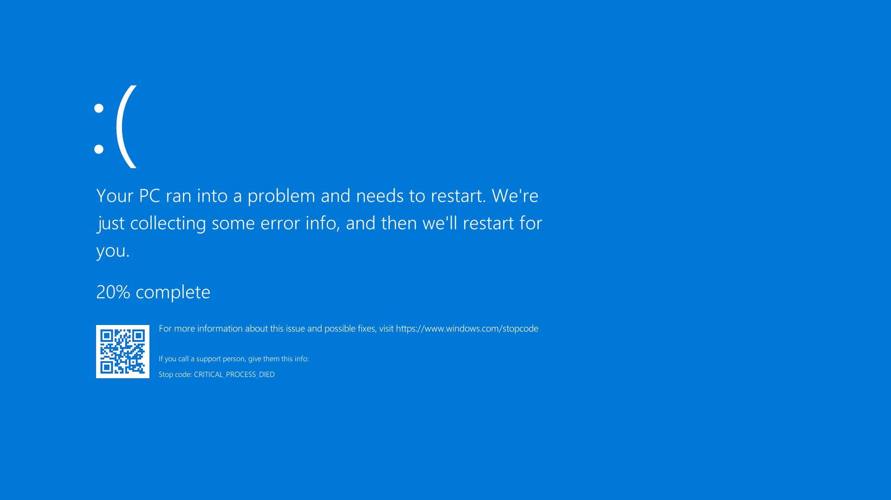

最近给用户提示错误码的提议反复出现在我们的解决方案里，在深思熟虑之后我觉得这并非是一个好的解决方案。

## 错误码不是银弹

我们首先想象一下极端场景，如果在页面出错时（例如接口没有正常返回数据，按钮点击时代码抛出异常）不给予用户任何反馈会怎么样？

用户会产生疑惑，他不确定页面的无响应究竟是发生了错误，还是程序需要一段时间来运行而已。直到他刷新页面多次，执行相同的操作多次都只能得到相同的无反馈之后，才会意识这可能是一个 bug。

所以**界面提示的首要功能是沟通**，告知用户他目前所遇到的问题。

那错误码这个主意怎么样，比如当用户没有权限访问某个菜单选项时在页面上方弹出 “ACCESS\_STATUS\_66” ？

这个主意不怎么样，因为它忽略了沟通应该是双向的：话不仅要从我的嘴里说出来，还需要被你听进去。很明显状态码只是被网站一厢情愿的结果，用户是完全无法理解状态码这类工程师语言的。哪怕是 403，500 这类在互联网公司内人尽皆知的标准状态码，在圈子以外对大部分人来说依然陌生。所以当用户访问的页面不存在时，仅仅呈现出一个大大的 404 字样的页面在我看来并非是友好的做法。应当用通用语言告知他。

有时候“您访问的页面不存在”就足够了；但有时候“您暂无权限访问该页面”还稍有欠缺。**因为我们不仅要告知用户问题，还需要帮助他解决问题**。如果他目前暂无权限，那么他可以如何获得权限？是应该联系管理员，还是应该应该提交工单？**允许用户自主解决问题是做 Tech Support 的终极目标**，因为问题一旦转交给后台的客户人员甚至是工程师来解决，流程注定是漫长且昂贵的。

## 错误码的正确用途

上一小节里的当用户遇到问题时，我们能给出确切的错误信息以及解决方案其实是一种理想情况。在实际处理问题的过程中，会有很多分支出现。

例如可能解决方案需要较长需要独立的页面用于呈现，那么如何让用户通过错误信息关联上解决方案，通过错误码也许是个不错的选择。

编程人员对此再熟悉不过了，例如在调用 API 或者 SDK 出错时你通常得到的是错误码而非具体详情。以 Firebase 为例，在它的 [Error Code 页面](https://firebase.google.com/docs/reference/fcm/rest/v1/ErrorCode)你可以看到对于每一类 Error Code 的解释以及建议采取的行动。这也暗示了解决问题时的窘境：错误背后的原因多种多样，需要终端用户在多个可能性中手动排查

这种做法在面向用户的消费端场景中也适用，例如 iOS 也有针对用户阅读的[错误码页面](https://support.apple.com/zh-cn/HT204770)，并且给出了可能解决问题的详细步骤

使用独立错误页面的另一个好处是，文档可以摆脱与代码的耦合，并且根据用户的反馈快速进行调整让它更好用。

纵然错误码有益处，但它是有门槛的，正如第一小节所说它并非是帮助的用户的最优解。错误码不应该成为我们懒惰的首选项，而是应该是深思熟虑之后的手段。

事实上现在大部分网站采用的模式是可读性的消息与错误码并存，比如 windows 的蓝屏界面：普通用户可以在当下得到解决问题的方法。如果想要知道额外的信息或者需要更进一步的支持，通过错误码也许可以得到更多的帮助：

## 为工程师服务

不是所有问题都可以被预测，我们需要为工程师预留排查未知问题的空间。

但这个问题和这里聊的主题关系不大，在这里我们从产品层面讨论应用应该给用户呈现出什么样的感官体验；而工程师处理问题的高效与否，取决于日志所能提供的信息是否足够丰富。

我们至少需要知道谁（WHO）在什么时候（WHEN）发生了什么问题（WHAT），并且最好告诉我们问题是如何发生的（HOW），而剩下的工作则是围绕它为什么发生（WHY）展开

## 软件的目的是什么？

上面所有谈论的内容都包含了一个隐性前提：软件应该做什么。

在当下谈软件目的其实不太合时宜了，大部分应用都在围绕算法、信息流做设计，没有什么比指标更重要的事情。但是如果我们可以去谈论它的话，软件的出生究竟为了什么？它之所以重要，是因为它决定应用什么可以做，什么不可以做。

到目前为止我听到过两种说法：

在《简约之美：软件设计之道》里，作者指出全部软件都有一个相同的目标：帮助其他人。并且一个人写出优秀软件的潜力，完全取决于他在多大程度上理解了“帮助其他人”的意思。

在最近有关 Steve Jobs 的新书 [《Make Something Wonderful》](https://book.stevejobsarchive.com/)里我们可以看到 Steve Jobs 的观点：

*   Apple, at the core—its core value—is that we believe that people with passion can change the world for the better.
*   Apple is the world’s premier bridge builder between mere mortals and the exploding world of high technology. Apple enables mere mortals around the world to grasp by making it easy to learn and use

你对软件的态度，会决定你手中软件的演进方向

---

你可能会喜欢

- [程序员如何成长](https://www.v2think.com/how-programmer-grow)
- [去年我是怎么解决团队问题的](https://www.v2think.com/how-i-solve-lead-issue)
- [测试覆盖率治不好你的精神内耗](https://www.v2think.com/test-coverage-rethink)
- [昂贵的质量](https://www.v2think.com/expensive-software-quality)
- [理解流程](https://www.v2think.com/understanding-process)
- [帮助团队成长是唯一的出路](https://www.v2think.com/what-is-leadership)
- [开源社区的暗面](https://www.v2think.com/darkside-of-the-opensource)
- [去年做 Tech Leader 犯过最大的错](https://www.v2think.com/tech-leader-mistake)
- [技术写作的困境](https://www.v2think.com/stuck-in-technical-writing)
- [拥抱原则与面对现实](https://www.v2think.com/principles-and-facts)
- [代码与质量的思考与随笔](https://www.v2think.com/think-about-good-code)
- [从对 Vue 中 mixin 的批评，到对模块间依赖关系的探讨](https://www.v2think.com/vue-mixin-module-dependency)

