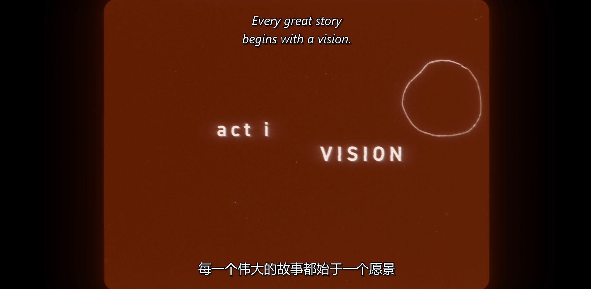
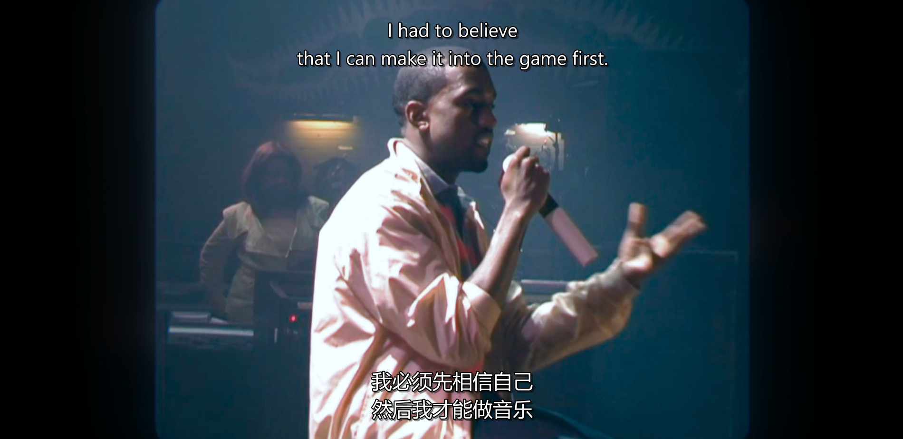
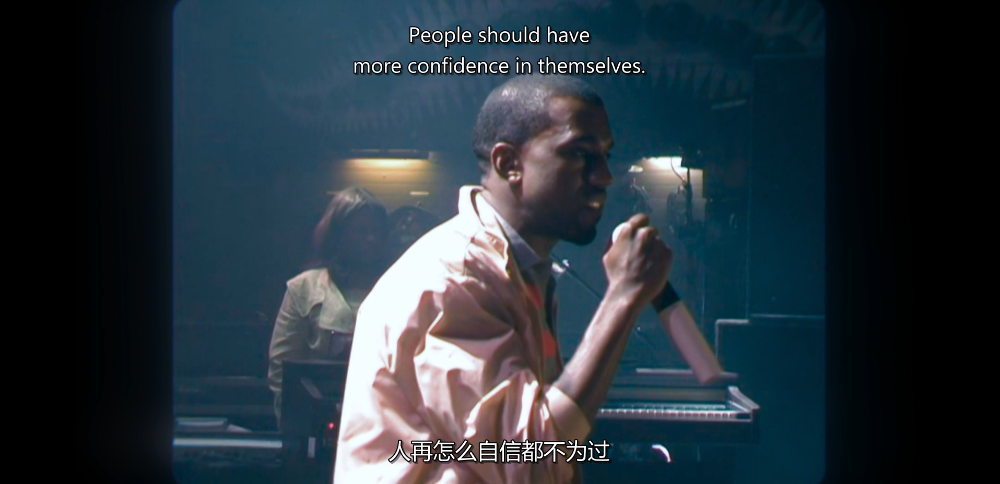

圈外人很难理解圈内偶像的魅力，甚至对于粉丝自己而言，他也不一定可以准确表达出究竟为何爱上爱豆。但难以用理智表达并不会妨碍我们发自内心的热爱。可我还是不禁想问，我们究竟在崇拜什么？以及这份崇拜是否真的值得？

#人肉智能# 是一档不负责任的科技类图书推荐栏目

我想打破标签乃至破除迷信的最好方式，是真正的去了解这个人，去还原他最原始关于人的属性。

让我们先从史蒂夫乔布斯（Steve Jobs）开始。

## 《Make Something Wonderful: Steve Jobs in his own words》

最近史蒂夫乔布斯档案馆 [Steve Jobs Archive](https://stevejobsarchive.com) 出版了一本有关于史蒂夫乔布斯的在线免费图书[《Make Something Wonderful: Steve Jobs in his own words》](https://book.stevejobsarchive.com/)。本书是对史蒂夫乔布斯口述和笔述内容的一次整理汇总。素材的收集渠道包括公开采访、内部演讲、往来邮件；题材更是包罗万象，既涵盖我们所熟知的他关于产品、公司、商业的思考，也包含他的私人成长经历、负面感情甚至音乐嗜好。其中不乏一些早已被人们津津乐道的片段，例如带来「stay hungry stay foolish」的斯坦福大学演讲，也收录了他鲜为人知写给自己的邮件。

虽然本书并非传记，但时间依然是内容的组织线索。那些关于乔布斯、关于苹果的重大事件在本书中被作为里程碑而存在。我们终于可以抛开第三方的转述以及报道，倾听当事人自己对于他所经历的一切有些怎样的评论。更重要的是正如本书副标题所说，你看到的是一个由所想、所感、所说组成的真实的他。

书中相当部分的篇幅都在向你揭示乔布斯麾下的苹果是如何进行产品设计的。早在 1983 年 Lisa 电脑发布之后的一次年度会议上，乔布斯便指出苹果的初衷是设计一款不需要人们学习编程即可上手使用的电脑：

> Apple's strategy is really simple. What we want to do is …… that you can learn how to use in twenty minutes. That's what we want to do

> We're trying to get away from programming. We've got to get away from programming because people don't want to program computers.

在那个时代，乔布斯非常清晰的认识到他应该用何种姿态与 IBM 的个人电脑（PC）进行竞争。他不认为 IBM 的个人电脑能够流行起来成为生产力工具，因为学习繁复的命令行会是大部分普通人难以逾越的门槛。而 Mac 电脑简洁易懂的图形化界面操作会是它的最大优势。乔布斯在这一设计准则上从未产生过动摇，在 17 年后的千禧年给自己的一封邮件中（乔布斯常常通过以给自己写邮件的方式来捕捉想法），他写到苹果使命是融合极致的易用性与顶尖科技，作为桥梁让普通人可以简单上手高科技（Apple enables mere mortals around the world to grasp by making it easy to learn and use）

基于此你会意识到当下人们对于苹果“开放性”的指责并不公允。虽然你和我都不介意通过修改注册表来绕过 Windows 系统的限制，也享受过刷机带来的掌控感，但基于小众（极客）的声音来开发面向大众的产品是不明知的。

苹果是一个入口，为读者提供了一个不同的视角来理解本书的主人公。我们可以由此延申下去，将视角从触手可及的产品转向到他未被大众所知的日常工作中。

人们喜爱商业传奇，乐于将苹果产品的成功归功于乔布斯一人。但他自己并不迷恋英雄主义，并且明白优秀产品离不开优秀团队，这至少与我从媒体渠道得到的关于他专制印象大相径庭。作为苹果和皮克斯的 CEO，他深刻明白自己的应该承担什么样职责：1. 招人（recruit）；2. 定方向（set an overall direction）；3. 威逼利诱（ inspire and cajole and persuade）——第三点想要达成的目的之一是，招募比你更优秀的人。

在本书中这个观点被反复提及。并且乔布斯还意识到，与优秀的人并肩工作只是起点，更重要的是应该创造空间让他们的才能得以充分施展。他提到在皮克斯他是如此依赖这样一群有才华的人，以至于似乎公司的权力结构都颠倒了过来，公司的 CEO 似乎是在为员工打工。但他依然乐在其中，因为他总是能从团队中找到比他擅长某一方面的人，帮助他免去来自该领域的困扰，从而使他专注于其他力所能及的事情。对此我也深有感触，如果你有担任团队 Tech Leader 的经验，你会同意靠谱的团队能够给你和项目的工作质量带来巨大的提升。

在我看来他给苹果注入的价值观产生的影响力一直持续到今天。如果你有兴趣的话，可以阅读哈佛商业评论一篇有关苹果的组织文化是如何服务于创新的文章：[How Apple Is Organized for Innovation](https://hbr.org/2020/11/how-apple-is-organized-for-innovation)

最后，在阅读的过程中你会不停感受到乔布斯在对于美学（aesthetics ）的坚持。相比之下，哲学”、“艺术”、“美”等元素在当下的设计语言中似乎不再重要，甚至产品作者自己（“我”）也变得无足轻重，一切都要以满足潜在顾客（“他”）的心理预期为前提。但乔布斯不这么看待工具与人的关系。在他的设想中，工具应该是一个极具才智的伙伴，去协助人完成更宏大的目标。所以他才不遗余力的把产品打磨的更好，正如本书标题言“Make something wonderful”

> Technology should enhance human creativity. Process matters. Beauty matters. Details matter. The world we know is a human creation—and we can push it forward.

## 《坎耶·维斯特三部曲》 （Jeen-yuhs: A Kanye Trilogy）

你也许不一定熟悉坎耶维斯特（Kanye West）这个名字，但你一定听说过人们亲切的称他为“侃爷”，听说过他与阿迪达斯合作的潮流品牌“椰子”（Yeezy），以及他的前妻金卡戴珊（Kim Kardashian）的种种八卦新闻。

坎耶对于大洋彼岸的我们来说更多代表的是流行符号、话题中心，考虑到他长久以来的争议言行，甚至把他归类为麻烦制造者也不为过，大家更多的是把他和著名八卦媒体 TMZ 的绑定在一起——可人们似乎忘了他的另一重身份：兼具说唱歌手和制作人双重角色的音乐人，一名极为出色的音乐人。当人们的憎恨、喜爱亦或是赋予他的任何形式的标签时，这些评价是否公允？要回答这个问题我们依然离不开去了解“人”本身，这依然是本文想要讨论的主题。

2022 年 Netflix 上线了一部有关坎耶韦斯特的纪录片《Jeen-yuhs: A Kanye Trilogy》，影片共分三集，每集长度接近九十分钟。素材来自坎耶的好友 Coodie 对坎耶长达20年跟踪拍摄的影像纪录。

人们习惯用“一鸣惊人”来形容巨星的横空出世，坎耶第一张专辑（《The College Dropout》）在发行当年即横扫各大奖项（最具分量的莫属 2004 年格莱美将最佳说唱专辑），对无数听众来说的确是一个个大大的惊喜。但对业内人士而言，也许这不过是迟来的一份实至名归而已。在坎耶正式以歌手身份出道之前，他已经是圈内小有名气的音乐制作人，参与合作的对象不乏知名歌手。但实力不等同于成功，坎耶在追逐的音乐梦的路上走的并不顺利。

在那个年代如果你想让你的音乐被听见，你至少需要一份唱片合约。坎耶希望成为当时的头部唱片经纪公司 Roc-A-Fella 的旗下艺人，由他们负责唱片的制作和发行。Roc-A-Fella 的创始人是著名的说唱歌手 Jay-Z，坎耶也是 Jay-Z 专辑 Blueprint 的制作人之一，听上去水到渠成。但想要加入公司，他还必须要征得公司另外两位合伙人的同意。可他们并不看好坎耶作为说唱歌手的职业前景，认为制作人才是他的归宿。

甚至在坎耶争取到这份合约之后他们的态度也并没有太多的改观，经纪公司仍然希望坎耶把更多的时间花在专辑制作工作上，对他个人专辑的发行计划三缄其口，也不给予任何录制唱片的预算。于是坎耶不得不辗转于他曾经合作过的音乐人，借用他们的工作室完成一首首歌曲的录制。其中还包括米福克斯（Jamie Foxx）、卢达克里斯（Ludacris）等明星的支持（现今他们更因参与的影视作品为人所知，而非说唱乐）。

结局并不意外，在坎耶自费三万三千美元制作并发布了单曲《Through the Wire》 的MTV 之后，他终于得到了 Roc-A-Fella 的合伙人 Dame Dash 的认可，并开始着手第一张唱片的正式制作发行。

如果你能跟随影片跟随坎耶走完这一段旅程，你会诧异于坎耶的乐观、自信以及对目标的坚持，例如他会不遗余力的向其他艺人、甚至路人分享自己的音乐，哪怕此时他还默默无闻；你也会收获欣慰：原来“巨星”一样会遭到误解，一样要承受不公，一样要首先预支自己。这些五味杂陈都来自将他“还原”成人本身

在已经有足够生动影像的情况下，转述的文字在这里或多或少都显得有些无力。画面能够更完整的把人物最真实的生活或是工作的状态呈现在你面前，你甚至可以感受到他的悲喜。在观影的过程中你会逐渐意识到，围绕着他的成功或者争议，都是源自最真实的他自己。

坚定的相信些什么，更坚定的为之付出实践，是我们在乔布斯还是坎耶身上看到的珍贵品质。让我想到了 DigitalOcean 的 slogan：dream it, build it, grow it. 说起来很简单，做起来很难。

---

你可能会喜欢

- [人肉智能#003：为什么 Instagram 曾经值得尊敬](https://www.v2think.com/respect-instagram-for-once)
- [人肉智能#002：为人性服务](https://www.v2think.com/recommend-addiction-by-design)
- [人肉智能#001：代码即权力](https://www.v2think.com/recommend-future-politics)