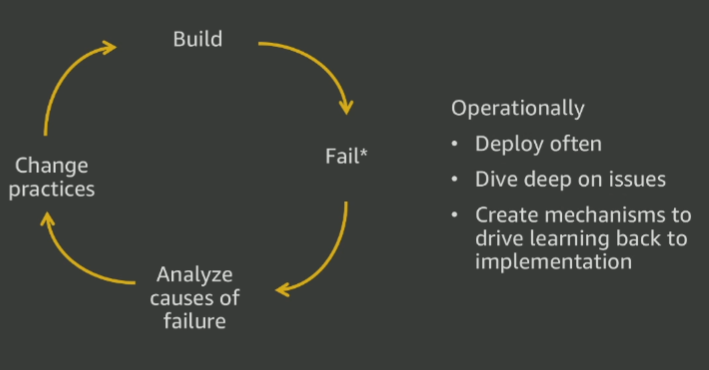

众所周知我所在的团队常年解决线上问题，我也以为我们会在解决一个个具体问题的道路上无聊走到黑。但是最近出现的各种疑难杂症似乎让我们的工作有了一点乐趣，甚至有了更高级的意义。

这些疑难杂症包括但不限于

*   因为网络故障导致邮件发送失败
*   因为数据库磁盘满导致数据出现了读写不一致
*   事件推送出现了延迟
*   因为死锁导致异步任务频繁挂掉

它们有两个特征：

1.  至少从已知的排查结果看，它们并非是由代码导致。我将它们归纳为运维错误（operational errors）——文章[《Error Handling in Node.js》](https://web.archive.org/web/20220418001933/https:/www.joyent.com/node-js/production/design/errors)里对将错误划分为程序错误（programmer errors）和运维错误（operational errors），简单来说前者由代码产生，可以通过修改代码避免；后者与程序无关
2.  与程序无关，也就意味着无法主动解决

如果我们的工作职责是解决问题，而问题却无法得到解决该怎么办？——仅仅用“解决问题”来形容我们的工作并不恰当。更准确的说，我们是在确保业务部门工作的正常推进，而扫除推进过程中的障碍，并不一定要从根源上解决技术问题。

换而言之，当我们面临掌控之外的不确定因素时，与其与难题死磕，更优的选择是让系统变得富有韧性（resilience），即能够迅速让服务从意外状况中恢复过来。高级精密的技术可以是我们的选项之一，但与其事后花大力气补救，有一些改进手段可以在日常开发过程中用低成本的方式与之融合，这些就是本篇要聊的内容，也是标题中强调“基本”这个词的原因

## 快速失败

我们发现有一类空指针问题是由磁盘空间不足之后数据存储失败导致的，比如下面的伪代码

```javascript
var authorName = book.author.name
```

在磁盘空间不足的情况下，book 信息会存储成功，但 author 并不会。而开发者在编写代码以及在设计数据库时又从未考虑到 author 不可空的情况。于是在磁盘问题发生之后，上述语句就会引发空指针问题，因为 name 所依赖的 author 并不存在。

此时想当然面临一个最简单粗暴的解决办法，让代码中的 author 对象变得可空（nullable type）：

```javascript
var authorName = book.author?.name
```

这么做可能会让情况变的更加糟糕，因为它忽略了**错误在分布式系统下的传播性**：虽然此处的空指针问题得以修复，但是为空的 authorName 是否符合下游代码的期待？如果不是，下游代码是否会发生更加严重的错误？经验告诉我们可怕的不是错误，是未知。也许这个错误会导致无法释放资源进而耗尽内存或者连接池，而此时你又无法遇见到它，那么可空的修复方案带来的破坏则会更广。

退一步说即使空 authorName 变量的不足以对代码造成运行中断的危害，但是当用户在页面上发现这一异常行为上报时，我们的排查工作会因为兼容可空变得困难，因为从监控上看没有任何与此有关的错误日志产生。

按照过往的经验，通过监控系统发现错误的效率会高于等待用户上报；同时**越早暴露错误也越能够让损害和修复成本降到最少**，基于此，让错误尽快发生似乎是一个更优解。

甚至允许系统彻底挂掉（crash it）也是快速失败的一种，当然前提是

*   程序能够及时得到重启
*   客户端能够有重连的能力

### 备选方法（Fallback）

还有一类看上去稍稍不那么糟糕的情况是：我预见到了问题的发生，于是我用分支语句准备好了一个备选方案，似乎就可以高枕无忧了？比如下面这段伪代码

```javascript
if (redis_is_health) {
    const book =  getFromCache()
} else {
    const book = getFromDatabaes()
}
```

这则分支试图处理 Redis 不可用的情况，但遗憾的是这类代码依然充满风险。

首先如何能够测试到边缘分支情况？针对 Redis 也许我们可以通过修改 connectionString 让它变得暂时无法访问。但是对于掌控之外的基础设施，甚至更加极端的情况，比如磁盘耗尽问题，我们是无法模拟出完全一致的场景的。又例如在解决文章开头提到的随机死锁问题，为了能够测试到分支代码，我们特意加入了一段“破坏”代码，很显然这种测试方式经不起推敲。

再者因为 fallback 并没有机会在线上环境实际运行，自然并未有人见识到它真正的功效，那么当它实际被启动的那一天，带来的可能是危害而不是帮助。上面有关 Redis 的代码时来自 Amazon 的[一个实际例子](https://aws.amazon.com/builders-library/avoiding-fallback-in-distributed-systems/#Distributed_fallback)，当 Redis 不可用的那一天真的来临时，因为承载了过多请求，数据库成为了各个服务的瓶颈，导致网站直接挂掉。

专注于提高主线代码的可靠性会带来更大的收益

## 重试（Retry）

我们要想通两件事：

*   失败一定会发生："Failures are a given and everything will eventually fail over time"（Dr Werner Vogels CTO of Amazon） 
*   和解决性能问题类似，想要正式处理这些失败，一定是去中心化的：需要分策略的解决不同问题；甚至对于同一个问题，不同调用方处理的方式也不会相同

但千人千面的线上问题并不意味着束手无策。例如当依赖的系统/服务/网络不可用时，简单粗暴且有效的办法就是不断重试。因为你需要想通的第三件事是，它必须要恢复上线，且终会恢复上线。

不要小看了重试，我愿称之为性价比最高的解决手段，因为我们所用到的重要前端类库、后端组件都天然集成有重试机制，我们要做的就是将他们利用起来。

即使手动实现大部分情况技术也并不复杂，这里就不赘述了。但是请千万留意重试策略，切忌无脑向下游发送请求，这样与 DDOS 攻击无异。也会带来不可知的副作用（我们最近便遭遇了一次由此引发的事故，有机会细聊）。具体请参考这篇文章：[Timeouts, retries, and backoff with jitter](https://aws.amazon.com/builders-library/timeouts-retries-and-backoff-with-jitter/)

## 文化支持

Amazon 在 2019 年进行过一次有关如何打造韧性系统的分享：[Amazon's approach to building resilient services](https://www.youtube.com/watch?v=KLxwhsJuZ44&ab_channel=AWSEvents)，这轮分享中有一半的篇幅都在叙述组织文化在其中的作用，这与我们整个组的想法都不谋而合。

我们最大的苦恼是，线上问题被修复之后，同样的问题过一段时间又被爆出。也就是说如果没法把教训传达给功能开发的上游，甚至整个组织。就无法从根源上解决问题。

换而言之，学习能力对于富有韧性的系统来说非常重要，无论是对代码还是人而言都是如此。它也是我所认可的[韧性系统的四基石](https://erikhollnagel.com/ideas/resilience%20assessment%20grid.html)之一



这种思维模式与 DevOps 类似：**团队应该具有主人翁意识（ownship），完整的负责代码的生命周期**，从开发到部署再到后期运维。Tech Leader 和 Principle 等类角色也应该对问题细节了如指掌，以免成为天马行空的架构师（non-practitioner architect）

反过来，如果 tech support 团队和 feature 团队隔离并且背负不同的 KPI，那么可以想象 tech support 最大心愿是产品一个季度上线一次才好，因为没有上线就意味着没有新的线上问题。

同时允许犯错也很重要，继续借用来自 [AWS 分享](https://www.youtube.com/watch?v=pbXEH96zhUg&ab_channel=AWSEvents)中的一帧来展现通常解决问题过程中团队内每个人心理压力的变化


注意在最后的 Confirmation 阶段，开发者的心理压力会陡增形成一片 fear 区域，因为大家担心那段有问题的代码是我写出的，会被秋后算账。

“责备文化”形成带来的压抑感不言而喻，更重要的是它在扼杀改进和创新，因为改动的代码越多犯错的概率也就越大，那我何必自找苦吃呢。