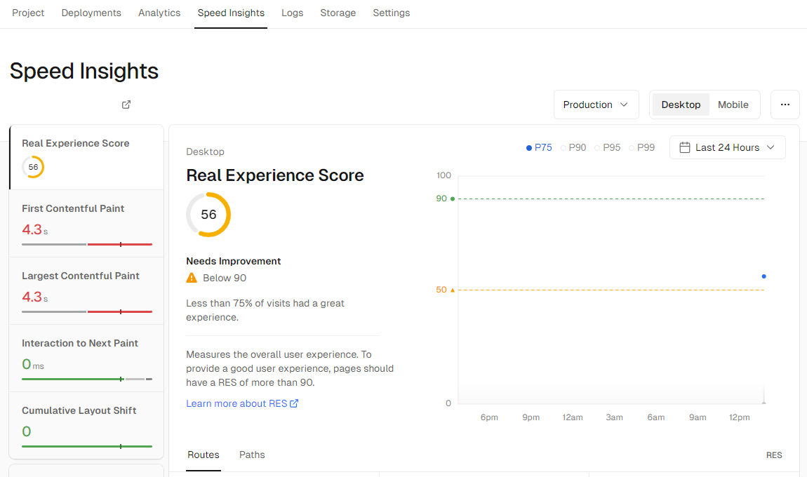

最近两年我不知道你是否和我拥有同样的感受，编程容易了许多，同时乐趣也少了许多

## 一

最近有两个契机让我写这篇文章，一是过去一年我陆续把我所有 side project 后端从 Azure App Service 迁移到 Digital Ocean（以下简称 DC） 的 Droplet（Virtual Machine），再迁移到 DC 的 K8S，目的是剥离应用内托管型（managed）资源；前端顺便也从 Azure Static Web Apps 迁移到 Vercel；二是最近读完《Competing in the Age of AI》，其中关于于 operation model 的论述与近期迁移应用的感受不谋而合

书中把公司价值划分为两部分，首先是商业模型（business model），即为消费者带来了何种价值；其次是运营模型（operation model），即如何将价值传递到消费者手中。运营的难点不在交付本身，而在于如何大规模（scale）、大范围（scope）交付，并且持续对交付方法改进和创新（learning）

同样，如果代码的价值在于上线（通俗说派上用场），无论是对自己还是客户还是用户，那么交付对我们来说同样重要，以上所说的大规模、大范围、以及保证持续改进的交付难点也同样成立。

先上线，剩下的以后再说

## 二

你们有没有想过 [Netlify](https://www.netlify.com/) 和 [Vercel](https://vercel.com/) 究竟是做什么生意的？如果你的答案依然是 JAM stack，只能说明你已经 out 了。不妨去看看 Netlify 官网的 slogan，甚至不用是 slogan，看看网站首页的 title 写的是什么：

> Scale & Ship Faster with a Composable Web Architecture

Netlify 所做的正如上述所标榜的，帮助代码更快的交付上线。换而言之，它们售卖的的是一站式 web 应用的部署解决方案，除 host 和流水线外，还提供免费的用户行为分析、页面性能监控、日志等工具，以及 Redis/SQL/Blob 数据库。

Azure 不是也提供类似的服务吗？问题的关键在于不同平台间的开发者体验，Vercel 能够真正做到上述服务一键集成，你会明显感觉到 Vercel 在加速你的交付，让你更快得到对于产品的反馈。而在 Azure 下开发更像是赤裸裸的买卖，Azure 团队按照他们的理解提供一个最低限度可以使用产品，至于多好用，多大程度能和其它 Azure 服务契合则不在他们的考虑范围内。如下图所示在 Vercel 的 dashboard 上，你可以纵览所有从部署状态到线上监测一系列信息。试想一下如果在 Azure 上集成所有对应的功能并呈现类似的 dashboard 需要付出多少外的精力

## 三

再简单聊聊 DevSpace。这里的 [DevSpace](https://www.devspace.sh/)，也可以是 [tilt](https://tilt.dev/)，可以是 [skaffold](https://skaffold.dev/)、[telepresence](https://www.telepresence.io/)

GitOps 无疑是伟大的，但这种伟大里依然充满了“一板一眼”——我的一次上线需要经过 push 代码、创建 release、推送镜像到GHCR、更新 yaml、通过 ArgoCD 部署。我理解它们是 necessay evil。

相比之下 DevSpace 看上去是反流程的，它可以帮助你在本地直接创建镜像并执行部署，还允许热更新容器内文件。即便是创建镜像，我发现它利用也非是既有的 pipeline，而是借助 buildkit 在我的集群上创建一个 local registry 并将镜像储存在此。

别搞糊涂了，生产环境和开发环境具有完全相反的气质，我们希望生产环境稳定、可追溯，这是 GitOps 的优势所在，但开发过程具有破坏性、需要不停试错，DevSpace 着重解决的则是开发体验问题，对于代码修改它可以带来高效的反馈。

上图已经流传了很多年，图中的 compiling 可以替换成 uploading, deploying，running test 等等。过去十年它是事实，现在应该只是一个笑话

## 四

在 Vercel 和 DevSapce上我们看到了一类区别于传统的开发方式，这里没有 pipeline，没有 IaC，没有手动的统计埋点，无需申请第三方资源，从 GitHub 上导入 repo 的那一刻起，它自动为你匹配部署脚本，寻找项目入口。开发者所需要做的，就是专心编写他所需要的业务代码

模板化的项目是带来这些便利的主要原因，继续往上追溯，主流前端框架自带 CLI 工具的流行功不可没，从大到创建一个新项目小到执行编译，命令行一键即可完成。无论是 React，Vue 还是 Angular，你都不会在官方的教程里找到专门的章节教你为项目编写 webpack 或者 vite 的配置。也许是因为习惯了早年间凡事都需要自己动手的工作方式，我花了很长时间才想通并接受这件事：传统从0到1搭建项目的能力已不再重要。

越来越多的环节像一个个黑盒出现在开发流程中，在此之前如果我对 pipeline 感兴趣，我可以阅读 .github 文件夹中的代码看 action 是如何定义的，而现在我连机会都没有了。连同代码被一同干掉的还有程序员的编程乐趣。站在交付的角度上来说这种乐趣并没有什么道理：为什么我要花上几天的时间只为了研究如何写一段 yaml 把代码送上线运行，更何况这段代码带来不了任何产品收益。

最近另一个类似的体验是，Next.js 编写起来太无趣了，不是说它不够好，而是问题在于它太好到你只能这么写。说起来有些贱，我很怀念那个一种功能有十几个写法，然后这十几个写法还有鄙视链的“坏”时光

当我们再度审视代码的生命周期，**你会发现所有人努力的目标，是想让程序员尽可能少的关心核心业务代码以外的事情**。一切一切都在想方设法优化运营模型。很明显个性化配置和重复劳动在规模化前是不受欢迎的

## 五

也许换个思路会好受一些：当你加入一家公司之后，发现同等体量的应用利用市面上的工具可以做到随时上线；而你们的产品却只能选择在每个周六凌晨部署，并需要若干人值班守候，这听上去让人有些失望是不是。

