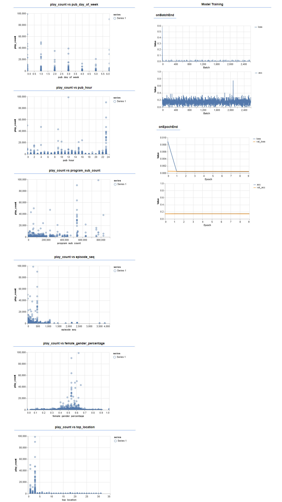

## 我构建的预测模型

在过去的一段时间里我抓去了小宇宙内上万条播客节目的首日播放量的数据，并利用这些数据构建了一个用于预测播客节目播放量的模型。包含以下六个输入参数：

*   节目发布于一周中的哪一天
*   节目发布于一天中的哪个时段
*   节目所属播客的订阅数
*   节目所属播客的听众女性占比
*   节目所属播客的听众占比最高的城市

下图左侧是利用 Tensorflow Visor 渲染的参数与播放量的散点关系图，右侧是将训练过程可视化之后的效果。

你可以在[这里](https://github.com/hh54188/podcast-prediction-model-by-tensoflowjs)找到原始数据与模型有关代码。当然因为只是作为学习和娱乐之用，我不保证数据的绝对有效和采集方式的绝对科学。

在继续阅读下面的文字之前，你需要阅读上述链接中的源代码，代码非常简单不过百行左右。

## 困境

在 100 行的代码中只有不到一半代码切实与编译、训练模型有关，剩下的则是关于数据转换、可视化等等。

如果你之前没有 Tensorflow 的有关经验，会发现代码可以被看懂却无法理解：我知道它在创建对象，我知道它在执行异步操作，但什么是 meanSquaredError？什么是 tensor？什么是 dense？

这是 Tensorflow 带来的最直接的反直觉体验：在传统的编程领域，编程语言或者框架带来差异微乎其微，但是在这里却让人步履维艰——原因在于：1）**过往的的编程经验无法迁移至此**，因为它无关响应，无关跨功能需求；2）在传统的开发工作中代码是贯穿所有的主心骨，而**在 Tensorflow 前代码已然沦落为配角，前期知识的积累才弥足珍贵**。理解二者尤为重要，因为它意味着过往你学习一门技术的方法在此不再有效。

例如本文所抓取的数据都由一个部署在 K8S 上的 NodeJS 应用程序完成。在此之前我从未使用过 K8S。但这并未给我带来太大困恼，使用 Google 搜索 “k8s tutorial” 或者 “k8s nodejs” 就可以找到足够多的入门教程让我跌跌撞撞的将一个 NodeJS 在 K8S 上运行起来（但我依然推荐系统性的学习，这里推荐异步社区引进的图书[《Kubernetes修炼手册》](https://www.epubit.com/bookDetails?id=UB77a9a50084708)。英文原版在亚马逊上名列 Cloud Computing 类目排名第一， 我是在阅读完毕一半的英文版之后才发现的有中文版。）。

但这一套方法在 Tensorflow 面前失灵了，你所能检索到的大部分教程都存在小节开头所提及的同样问题。我甚至得出了一类规律：如果教程里不包含丁点图片，那它根本就不适用于非机器学习专业的编程人员入门。

## 解药

读到这里你大概明白了，机器学习本质上是一门垂直的科学，但和编程存在交集这件事让我们有了“相声不就是说话嘛，所以我有嘴我也行”的错觉

**所以在了解机器学习领域基本知识，而不是单刀直入编程才是学习 Tensorflow 的首要任务。**

### 学习什么（What）

如果我们都同意上述结论的话，那我的下一个问题是：了解到多少程度才算够？因为此时我想提醒你小心落入第二个圈套，掉进“兔子洞”中。

你可以在 YouTube 上搜索到各式各样的机器学习入门：YouTube 上最广为人知的机器学习课程非[斯坦福 Stanford CS229: Machine Learning Cours 系列](https://www.youtube.com/watch?v=jGwO_UgTS7I&list=PLoROMvodv4rMiGQp3WXShtMGgzqpfVfbU&index=1)莫属，这个由前百度公司首席科学家吴恩达亲自授课的系列课程单集播放量均在百万级别以上；如果你只是想从最基本最经典的 Linear Regression 问题开始，可以选择观看 [StateQuest 的系列视频](https://www.youtube.com/watch?v=nk2CQITm_eo&list=PLblh5JKOoLUIzaEkCLIUxQFjPIlapw8nU&index=2)。

但我都不推荐它们，因为它们偏侧理论，与代码无关，要知道在这条学习路径上遇到的每个知识点都可以向专业方向延申的很远，例如在 Tensorflow 的 API 文档中不少的方法说明都保留了对有关论文的引用，但我相信在座各位学习 Tensorflow 的初衷并非是想成为职业的数据科学家，所以恰当的把握理论与实践的边界感颇为重要。

### 如何学习（How）

最近在折腾 Tensorflow 的同时我还在折腾 NextJS 和 K8S，对比之下我发现视频教程，或者说至少可视化这件事对学习 Tensorflow 尤为重要。

这个道理再简单不过了：只有通过图我才能告诉你什么是 hidden layer、只有通过图我才能帮你回顾起矩阵之间的计算是如何运作的。

一个实际例子是早在一年之前我就购买了图书[《JavaScript深度学习》](https://www.ituring.com.cn/book/2813)，当它谈到其中的 back propagation 时把我劝退了。直到一年之后当我再通过 The Coding Train 的 [Neural Networks 教程](https://www.youtube.com/watch?v=XJ7HLz9VYz0&list=PLRqwX-V7Uu6aCibgK1PTWWu9by6XFdCfh&index=2&ab_channel=TheCodingTrain)学习到 back propagation 时才发现它如此的简单。

下图是我的学习笔记，不难看出其中的图解占据了大多数内容：

### 向谁学习（Who）

毋庸置疑专业的科班学习一定是最好的方式。这不是什么臆想，而是缺少系统性的规划下我走了很多的弯路，要不然我怎么知道对理论的学习要适可而止，以及建议优先选择视频教程。

如果你和我一样有前端开发背景，那我推荐 The Code Train 的三个系列教程，刚好可以覆盖不同阶段的学习需求。

*   入门：[Beginner's Guide to Machine Learning in JavaScript with ml5.js](https://www.youtube.com/watch?v=26uABexmOX4&list=PLRqwX-V7Uu6YPSwT06y_AEYTqIwbeam3y&index=2&ab_channel=TheCodingTrain)。用最浅显易懂的代码去享受享受机器学习来带的乐趣。这里你无需提前了解任何机器学习的基础知识
*   进阶：[TensorFlow.js - Intelligence and Learning](https://www.youtube.com/playlist?list=PLRqwX-V7Uu6YIeVA3dNxbR9PYj4wV31oQ)。在这里你会学习到一些 Tensorflow 概念和 Neural Network 的入门，并尝试用 Tensorflow 解决一些基础问题
*   深入：[Neural Networks - The Nature of Code](https://www.youtube.com/watch?v=XJ7HLz9VYz0&list=PLRqwX-V7Uu6aCibgK1PTWWu9by6XFdCfh&index=2&ab_channel=TheCodingTrain)。这里才是硬核的开始，你将重新拾起高等数据的矩阵运算，不利用任何现用类库，从0开始搭建一个 Neural Network

同时我还推荐 [DigitalSreeni](https://www.youtube.com/@DigitalSreeni/videos) 的视频，它不适用于入门，但是可用作参考。他会对一些训练模型中的常见问题和概念做出讲解和进行解答

如果你想寻找一些有关机器学习相似主题的视频教程，比如专门针对 Python 语言，又或者针对 PyTorch 的，我有以下建议：

*   不用考虑累计总时长1小时（其实我想说五小时）以下的视频教程。也许十分钟学会 React 可以，但这次不行。
*   不考虑官方教程——大部分的官方教程像是为了存在而存在，官方不会过多的投入就好像他们知道第三方能做的更好似的，但什么都不做似乎又说不过去。虽然 Tensorflow 官方制作了一系列教程，比如 [Building recommendation systems with TensorFlow](https://www.youtube.com/watch?v=v90un9ALRzw&ab_channel=TensorFlow)，我也相信视频中的讲师是高手中的高手，但他的念稿般的表达能力让我感觉到索然无味，和上面 The Code Train 相比立见高下
*   不考虑中文教程：无论从实效性还是从表达能力上看英文教程都更胜一筹，本质上是因为英文用户的基数足够多，概率上来说贡献者和出现精品的概率也更大。放心，技术文字比四六级阅读理解简单得多

## 未曾改变与已经改变的

正式的文章直至上一小节就已经结束了，最后有感而发聊聊“技术学习”这件事。

我不敢说“终身学习”是这个时代强加给每个人的必修课，但至少是对我们这个职业的“诅咒”。从 Vanilla JavaScript 到 BackboneJS，再到 React 和 TypeScript，没有人会好心好意的告诉你一个时代已经结束，请准备好迎接下一个时代的来临；也没有公司会无偿提供培训来帮助你适应新技术的更迭。“开着飞机换引擎”对于处于这个行业的人来说可能会是持续相当长时间生存状态。这与技术无关，当有一天你转型成为技术管理者或者决策者，关于团队，策略以及交付等等又会成为你清单上的新主题，我想起了贝爷的梗图：Improvise，adapt，overcome

Copilot 的出现并没有解除我们的诅咒，如果你读过我的[前一篇文章《Copilot 编程指南》](https://www.v2think.com/copilot-cheat-sheet)就会知道， AI 可以很好的将我们从琐碎的工作中解脱出来，但是无法代替我们绘制蓝图

幸运的是深度学习依然有效，幸运的是互联网社区中依然有无数人在进行无私的分享。十多年前我通过[博客园的专题页面](https://kb.cnblogs.com/zt/jquery/)从[0开始学习 jQuery](https://kb.cnblogs.com/page/67967/)，只不过如今对象换成了 Tensorflow 渠道变成了 YouTube。

亲自试错（trail and error）永远是解决此类问题的最好方式，我一向反对干瘪的技术培训，因为你无法通过读书去学会游泳。想学？[build something, build something real](https://www.v2think.com/how-programmer-grow).