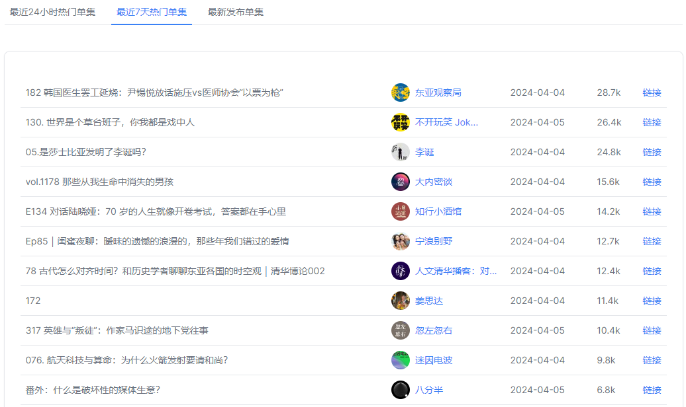

我发现播客越来越成为我探索这个世界的重要渠道。为作为一名重度播客用户，自然希望听到更多不同的声音来帮助我理解周围正在发生的事情。于是我做了这个工具“播客广场”： [https://www.pcspy.net](https://www.pcspy.net/) 

本文首发于[少数派](https://sspai.com/post/87991)

## 从话题发现播客 

对大部分播客而言，直觉上你很难把它们粗暴的划分到单一主题之下。例如如何界定“日谈公园“？旅行、美食、音乐、热点新闻等等其实都被涵盖其中。对个体听众而言，更是很难对播客的每一期节目都照单全收，我喜欢听“大内密谈”里相征聊聊社会话题，喜欢听米地老师聊艺术收藏，但对电子音乐和 Fuji Rock 却并不感兴趣。 

所以我更倾向纵向的去关心某个话题而不是纵向的去深入某个播客。 

另一个选择这么做的原因是，垂直话题内的播客能够帮助我打破信息茧房——在这里我可以听到业内人士的意见，或者与之有关延申出去的话题。相比于局限于事件本身，相比其他“精华”短视频或者“浓缩”版本的只言片语，“兼听”有助于我了解事件全貌并给予自己的判断。且不管嘉宾的立场如何，在情绪消费与输出节奏大行其道的当下，可以听到长达几十分钟的理性对谈就是一件难得可贵的事情。这也是我爱播客很重要的一个地方，爬虫无法入侵、资本无法复制、AI 无法效仿，因为所有都仰仗独一无二的“人”本身。 

但是小宇宙的推荐却难以满足我的愿望，它所遵循的依然是“你听过 XX 所以你可能喜欢 XX”的逻辑，并且推荐粒度是以播客频道为单位——于是我便做了一个用话题来发现播客的工具。所有数据都来源我对小宇宙平台的抓取，不保证与官方同步。 

第一个要回答的问题是话题如何而来？我将话题分为两类，经久不衰系列，例如职场，旅行，感情生活等等；以及当下热门系列，比如正在上映的电影沙丘，或者刚刚发布的小米su7。 

前者的数据来源是我用 Python 的中文 NLP（自然语言处理）类库，对抓取到的播客节目标题进行分词统计得到的结果。当然如果按照单词的使用频率排序，常见话题远比你们如今在网页上看到的多的多。在这里我想对数量予以控制，毕竟有时候琳琅满目的选择会等于没有选择——于是只根据自己的经验选取了一些与当下人们生存状态关联度颇高的词汇，欢迎反馈予以补充。 

而后者的来源则非常简单，参考微博知乎的热搜和热榜即可。无论前者还是后者，收入到当前话题的标准同样直接，即判断节目标题是否含有话题关键词。 

而至于为什么列表展示的内容如此苍白仅有标题，留到下节再说 

## 发现潜力播客 

不知道你有没有考虑过一个这样的问题：大部份的播客节目都在聊什么？ 

在连续几天对抓取的数据进行观察之后，我得出的结论是：节目包罗万象，并无规律可言。播客本质上与博客无异，每个人依旧在乐此不疲地表达自己，遵循自己的想法而不是完成命题作文才是播客的主旋律。比如下图就是抓取到的当下最新发布单集 

根据我的统计，在小宇宙平台上平均每日有400集节目发布上线。当我意识到自己对于它们竟然一无所知的时候其实略感惋惜，因为我本身也和朋友在合作[播客节目](https://www.xiaoyuzhoufm.com/podcast/63968924a07c5e0cda6c72a9)，同时也有自己的[技术博客](https://www.v2think.com/)，深知让作品触达受众的重要性——最近读完《Competing in the Age of AI》，书中把公司价值划分为两部分，首先是商业模型（business model），即为消费者带来了何种价值；其次是运营模型（operation model），即如何将价值传递到消费者手中——在获取到如此多的播客数据之后，也许我能帮助大家在运营方面做点什么，于是就有你们所看到的“单集榜单”和“节目榜单” 

这里所说的“榜单”更多的是指“潜力榜单”，即有价值但也许还尚未被人知晓的节目。如何判断有价值？很遗憾目前只能简单粗暴的从数据出发：如果短时间内有大量的数据增长，无论是粉丝数还是播放量，都表示它在近期内收到大量关注，也许便值得我们一试——这就是页面中“24小时热门”、“7天热门”的由来。如何判断还未被人知晓？抱歉我无法确定，但我相信每个人的信息渠道总是有限的，总有你未知的在等待你发现。 

但总有一些节目需要冷启动不是，所以最新发布的单集也同样在这里得到展示，祝它们好运 

你可能也留意到了，以上所有截图展示的信息都极其有限，例如对于节目单集只有节目标题和播放量或者发布日期会存在于列表中。这么做并非是因为抓取的数据有限，而是希望通过减少额外信息让初出茅庐的节目更容易被发现——因为可以想象在同一个列表中，如果我特意告知听众某集节目来源于某个知名播客厂牌，或者它获得了某个平台多少的荣誉，想当然它看上去更加诱人，同时不免让其他节目黯然失色。 

## One More Thing 

作为一名开发者，我一直信奉 Max Kanat-Alexander 在它编写的图书《Understanding Software》里所倡导的：软件的本质目的是用来帮助他人——我想我可以利用数据做的更多，最简单的方式莫过于把它们分享给需要的人。 

于是我把抓取到的数据以播客为单位汇总起来，只需要通过一个页面即可追踪所有。例如下图就是日谈公园的数据汇总页面 

在目前的版本中我只会对播客的订阅数进行持续更新，对于单集数据仅会抓取自发布起两周内的数据。如果你恰好是节目主播，并且觉得它可能会对于你有所帮助，欢迎邮件或者私信我帮助你开通。考虑到数据的敏感性，请在消息中附上页面截图以确认该播客属于您。 

目前所有的数据都来自于小宇宙，如果未来得到的反馈良好，会考虑持续改进并引入更多平台的数据 

最后，欢迎任何的意见或者建议。并且如果你刚好也是程序员并且有兴趣了解整个程序的架构设计和技术细节，欢迎关注我的技术博客[技术圆桌](https://www.v2think.com/)，会在之后陆续更新。我用抓取到的数据借助 TensorflowJS 训练了出了一个预测播放量的模型，详情请访问[这篇文章《学习 Tensorflow 的困境与解药》](https://www.v2think.com/using-tensorflowjs-to-build-a-prediction-model)