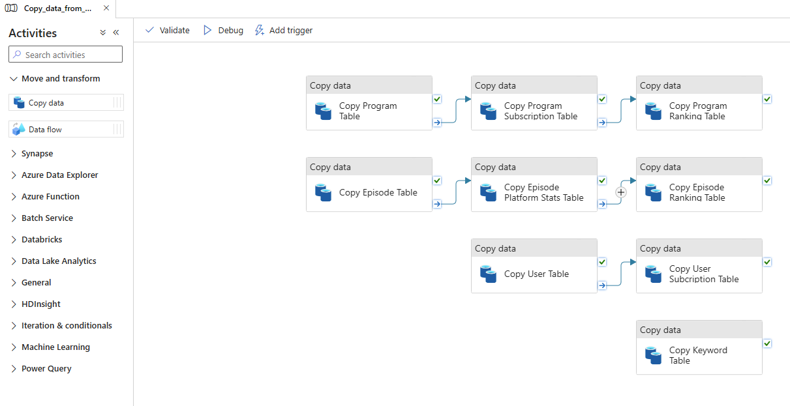
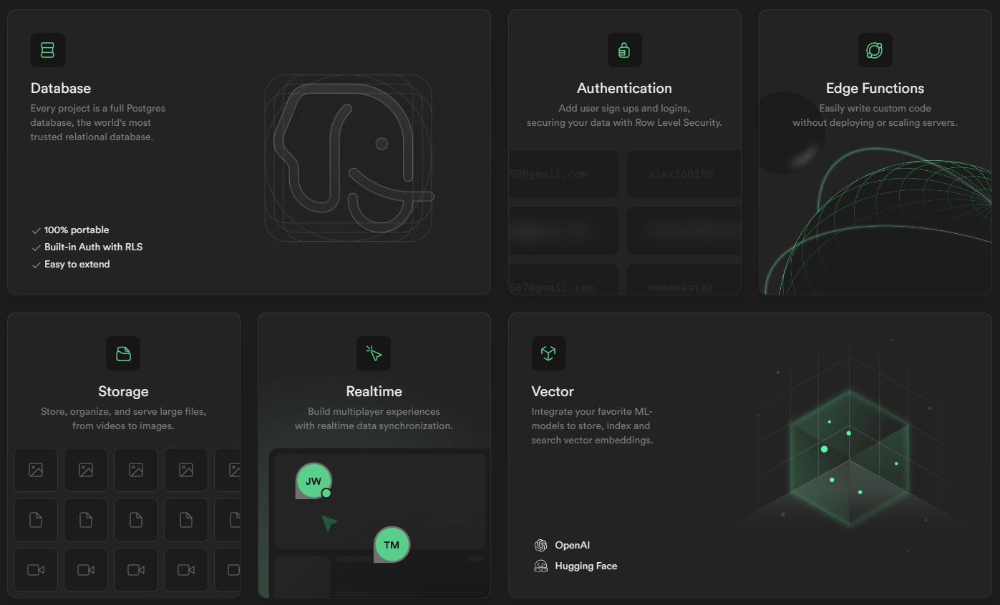

我最近逐渐感受到，作为个体开发者在拓展技术深度上越来越难了

## 难以复刻的大问题

**第一个麻烦是现代框架解决的是“大”问题，而个体开发者遇不上“大”问题**

早些年如果你想从头学习一门前端框架，比如 BackboneJS 或者 EmberJS，一定绕不开从构建一款 Todo 应用开始，它能让你直观感受到 model 与 view 之间是如何相互协作的。现在我们依然保留同样的传统，只不过它不在以 Todo 的形式存在，但依然会出现在文档的 Quick Start 小节中，企图用最少代码最大程度上展现技术的特性。

问题在于早些年前端代码只是作为静态站点点缀般的存在，例如控制交互，填充内容——看看这段[淘宝平台09年的代码](https://a.tbcdn.cn/p/mall/2.0/js/direct-promo.js)你就会理解我在说什么。而如今 JavaScript 代码已经可以做到接管编译、路由、渲染，将应用端到端的呈现出来。最重要的是，它已将处理复杂问题的能力内置其中。然而这些复杂问题，从高并发到匪夷所思的业务场景，Quick Start 里的 demo 无法展现它们的全貌，个体也难以模拟。

K8S 就是一个最好的例子。

去年抱着学习的心态，我把我所有部署在 VPS 上的 side project 迁往 K8S，甚至连应用的部署方式也替换为了 ArgoCD。但实话实话这不是一笔划算的买卖，因为从结果上看，替换为 K8S 之后花费的计算资源更贵了，维护成本（脑袋里需要记住的东西、涉及到的步骤和需要持续维护的环境）也水涨船高。原因在于当架构简单到仅需单个 cluster 就足以支撑的时候，K8S 的边际成本无法被均摊。所以吊诡的事情出现了，你发现体感上新款 K8S 还不如旧款 PM2 好用。

可不可以不关心大问题，全权委托给框架，我只管把 kubectl 命令全文背诵就好？——不行，因为 Copilot 永远记得比你滚瓜烂熟。面对 AI 的挑战，程序员无可避免的要将角色从执行者转变为决策者。

说起来有些玄学，设计方案吃经验，准确来说是“由奢入简易”：解决过大问题之后回过头解决小问题很容易，反之不成立。虽然理论上无数的工程师有无数踩过的坑有待分享，但考虑到 99% 的人并不会把这些经验整理成任何形式的内容分享出来，所以坏消息是经验还是要依靠自己打怪升级获得。

设计方案中颇为重要的另一点是定量而非定性分析。

这是另一个例子：我的[播客广场](https://pcspy.net)网站至今已经抓取了超过了九百万的播客数据，我是应该继续使用 MySQL 作为播客统计工作的数据支撑，还是应该转投 Databricks？我无法回答，因为我对九百万数据体量的理解是空白——这是我最近开始折腾 Databricks 感受到的最大疑惑。当下我可以很轻易的找到资源学习 MySQL 以及 Spark，但我面临的问题不是如何编写他们，而是什么样的场景适合编写他们。这些经验，是我一个人在家里造不出来，也是课本教不了我的。

说一点由此衍生出来的我的有趣观察：判断程序员（甚至是产品经理、项目经理）资深与否的方法之一是观察他对于数值的理解。8个人的团队多还是少？50毫秒的 MySQL 查询时间快还是慢？在将浏览器加载资源耗时提升1秒之后留给我的空间还有多少？

> They won’t fear it until they understand it. And they won’t understand it until they’ve used it.——电影《奥本海默》

**理想的技术决策是用理性表达代码——这么做是因为我选择这么做，而不是我只会这么做，更不应该是我觉得该这么做**。

大问题带来的挑战不仅仅是规模这件事本身，还有体量产生的副作用：拥有十万行代码应用的难点可能是混乱的代码组织和依赖关系，也可能是无处不在的坏味道，但一定不是框架本身。在我的工作经历中这是常态，同理入门教程无法带给我们这方面的训练。

## 你不再重要

第二个问题是，研发也许无需我再亲力亲为。

以 NextJS 为例，我对它的赞叹来自于两点：1）完备的功能设计；2）井然有序的文档。前者依赖的是对框架职责和前端开发的充分理解，后者需要投入的维护成本和决心也不容小觑

由此产生的副作用是工作变得无聊起来，当下需要实现或者是未来需要考虑的，都可以在文档中按图索骥找到答案。以至于有时候你不得不怀疑某些 NextJS 功能被过度设计了，例如它[极富层次的缓存机制](https://nextjs.org/docs/app/building-your-application/caching)。但我宁愿相信本质上这依然是我有限的眼界与大方案之间匹配错位造成的。

更重要的变化在于，十年前如果我们想要实现等价的缓存效果，尊循的是[理解、设计、实现](https://v2think.com/let-us-talk-about-resource-load)的实践；而如今 NextJS 已经为你实现，甚至 [LLM](https://useanything.com/) 可以代替你理解方案细节，我要做的仅仅是提出问题做出选择即可。

同样的情况还发生在上面所说九百万数据的例子中，再更早之前我考虑过使用 Big Query 进行数据统计，但问题在于如何将存储在 Digital Ocean 上的数据同步到 Big Query，是用 replica 还是日志？如今入坑 Databricks 之后利用 Azure Data Factory 无需编程就可以完成上述需求，但至于它是如何实现的我依然一无所知。

你以为它们的“魔爪”就此为止了？这才刚刚开始——**当下应用和框架的关系已经悄悄发生了倒置：不再是应用去集成框架，而是应用被内嵌在框架中**。

如何理解我所说的内嵌：开发一款应用需要什么？web 框架、登录、存储、缓存；兴许还有流水线、测试环境、日志监控等等。在很长一段时间内这些是繁重且琐碎的工作，依赖团队去完成，而如今它们是市面上 BaaS 甚至是框架标配，例如你用 [Deno](https://deno.com/) 写完应用之后不用担心部署在哪，它们提供额度范围内的免费 hosting 服务，正如 Vercel 之于 NextJS。下图是 supabase 的卖点，其他的 BaaS 也都大同小异

当然前提是你需要植入 SDK，甚至使用指定的框架进行开发，也就是说只有接受平台的规训，才能发挥平台的最大潜能。这就是我所说的嵌入，你只不过是它其中的一环。

纠正一下，我不是在抱怨没有源码可以阅读，而是每当想到铺天盖地的预制菜做量大管饱，还性价比高，我做饭的乐趣就荡然无存：因为如果我选择亲手去实现，那么可以预见接下来代码产出中的大部分，已经被无数人实现过无数遍了，甚至我自己也驾轻就熟。那为何费时费力的和自己过不去呢。虽然我知道在大公司造轮子依然是正义，虽然我知道技术深度避免被 AI 取代的核心竞争力，但现状依然令人沮丧。

于是我发现自己处于一个非常尴尬的位置，向下专研技术的动力在减弱，向上没有太多的大问题有待解决，大部分时候我像是一个方案整合商。

## 答案在哪

我不知道该如何回答这些问题，这些年还有很多变化在潜移默化的发生，例如我们发现有客户已经在利用低代码构建大型应用。最终团队的协作方式，工作流会怎么被这些变化塑造还没有人知道，震荡在持续中。但我坚持认为 [AI 还无法替代你](https://www.v2think.com/copilot-cheat-sheet)。

至少有一件事是板上钉钉的：去拥抱它们，学习它们，观察它们。出路在探索中发现，而不是对它们视而不见。