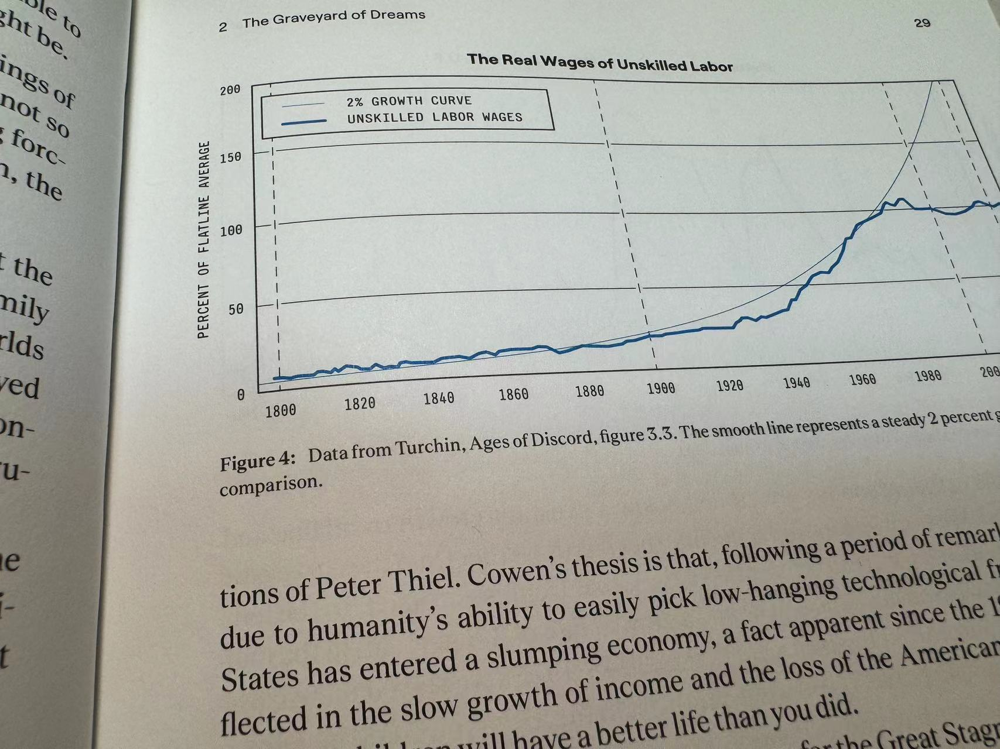
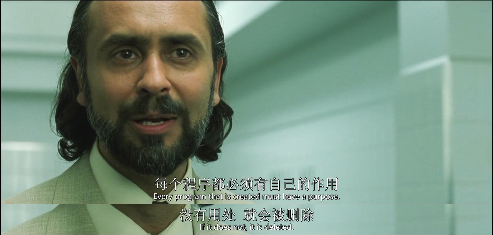

在播客“大内密谈”最近一期有关萝卜快跑的节目中，嘉宾对有关无人网约车的主流声音提出了两点质疑：1) 无人网约车是否真的是大势所趋？2) 你我是否都将受益于技术进步？嘉宾列举其中的一个发人深省的例子便是晚清漕运的河运改道海运，由此带来的大量人口失业给社会引入了巨大的不稳定因素。

技术与民争利的现象在当下也愈演愈烈，无人网约车只是诸多矛盾的一个缩影。

本文的前两段试图回答上述两个问题，而最后一段则尝试用我对这个行业的理解来解释一切是如何发生的。文章没有结论，都是唠叨。

## “To win or not to win, that is the question”

萝卜快跑的争议还在继续，与此同时大洋彼岸的“庶民的胜利”已经发生。

2023 年 9 月 24 日，持续 146 日的好莱坞大罢工终于结束。根据国外媒体的报道，编剧协会（the Writers Guild of America，WGA）与制片人协会（Alliance of Motion Picture and Television Producers，AMPTP）达成了多项协议（memorandum of agreement ，MOA），其中对于 AI 的使用场景也给予了明确的约束：

*   不禁止编剧或者制作团队使用 AI，但是禁止使用软件来替代编剧以及降低他们的薪酬（doesn’t prevent writers or productions from making use of generative AI but **prohibits using software to reduce or eliminate writers and their pay**）
*   在公司政策的允许下，编剧可以自由选择是否使用 AI 工具，公司不得要求编剧必须使用 AI 工具进行写作（but **the company can’t require the writer to use AI software (e.g., ChatGPT) when performing writing services**,”）
*   针对法律禁止范围内的将编剧的写作材料作为 AI 训练素材乱象，编剧协保留对此类行为是否违法的最终裁判权（the WGA reserves the right to assert that exploitation of writers’ material to train AI is prohibited by MBA or other law）

简而言之，AI 不允许替代人类，AI 只允许为人所用。

而另一场“胜利”来自于欧洲——就在文章编写的当下，苏格兰投资人、参与创办过 Yelp 的 David Galbraith 发布了一系列推文，对欧洲的汽车制造业提出了批评：亚洲控制着电动汽车的全部电池供应链，亚洲和美国控制着软件供应链，而欧洲毫无立锥之地。德国、法国、意大利的汽车制造商此时就像智能机时代的诺基亚。事实上宝马的管理层就想全力发展电动汽车，但是遭到了工会的抵制。人们不应该把错误归咎于管理层，事实上整个组织都在抵制工业模式之外的结构性变革的后果

之所以将“胜利”加上引号是因为我对此并不确定。它究竟是一场实实在在的胜利还是仅仅是一次喘息？当我看到 Copilot 在已经可以驾轻就熟的生成代码之后，不得不怀疑擅长自然语言的 AI 游刃有余的写出精彩绝伦的对白只不过是时间的问题。当有一天新玩家与他的 AI 搭档带着事半功倍的解决办法杀入这个行业时他们应该如应对？而在欧洲汽车制造业的例子中，“负隅顽抗”似乎正在扼杀整个地区产业的竞争力。

我是 Github Copilot 的坚定支持者，也是受益者。不过话说回来，如果我所推崇的某项技术导致部分人群技术性失业，这也会让感到愧疚。最近刚好在[重轻老师的节目](https://www.gcores.com/radios/187863)重学习到了一个新观点：**世界就是一场大型的以工代赈，大部分人只想好好的活着而不是改变世界。**哪怕是我所在的科技行业里，大部分人仅仅是把编码当作一份工作，谈不上热爱也没想过出类拔萃，甚至也没想过长久留在这里。

我见证了 Flash 工程师的消失，目睹 PHP 工程师和前端重构工程师正在成为濒危物种。另一个让我感到影响深远却也鲜为人知的例子是好莱坞 3D 动画的崛起和 2D 动画的消失。

2D 动画电影如今在好莱坞已经销声匿迹，以迪士尼为例，它最后的两部 2D 动画长片发布于 2009 与 2011。在技术转型的过程中 2D 动画部门自然受到了重创，2D 动画师们要么面临裁员，要么转岗，要么选择技术升级。在网上你很难找到关于事件来龙去脉的深度报道，我也不想仅仅引用观众的声音——因为它们无一例外都是批评，观众总是将自己的感性摆在第一位而忽视了各方的实际利益。

我能找到最公允的评价来自于一位前迪士尼资深 2D 动画师 Tom Bancroft，以下的观点引用自他 2013 发布在 deviantart 上的一篇[博客](https://www.deviantart.com/tombancroft/journal/Disney-layoffs-2D-animation-and-you-365292812)，恰巧发布在13年迪士尼裁员消息的之后，他似乎也是迪士尼动画部门裁员的新闻[爆料人之一](https://www.cartoonbrew.com/disney/breaking-disney-just-gutted-their-hand-drawn-animation-division-81043.html)。

在商言商动画如今是一门生意，既然是生意赚钱生存便是它的第一要务。因为 Tom 自己也在经营小型工作室的缘故，他深知找一位能够平衡商业和创意的掌舵人几乎是不可能的，所以不应该对当时迪士尼动画工作室的首席执行官 John Lasseter 进行过多的指责 。John Lasseter 并非是是一个十恶不赦的商人，一方面更多的向商业利益倾斜是首席执行官职责使然；另一方面他恰恰是那个在过去几年 2D 动画几乎毫无产出的情况下，还继续允许 2D 动画师们留在这里的人，直到董事会对此忍无可忍。

而迪士尼选择向 3D 动画转型的原因也并非什么讳莫如深的事情，无非是在试图优化利润以及迎合市场的反馈。我想借 Tom 的话表达的是，如果我们总是以战争的态度，或者以输赢来衡量由于技术的更迭而导致的人员更迭似乎并不妥当，这让我们站在了商业运行规律的对立面上。

我想技术人员对此是最深有体会：从工作至今你已经经历过多少次技术栈的更迭？从框架到基础设施甚至是 IDE。这不是什么资本主义的阴谋诡计，而是从业者实实在在可以从中收益的技术革新。如果想在这个行业持续生存下去，大部分程序员并无选择：市场需要什么我就要学习什么——想起一个真实恐怖故事，在 React 和 TypeScript  崛起的那几年，我作为一名前端工程师还在百度写着需要兼容 IE6 的代码——运气好的参与某个前沿项目边干边学，运气差的就把自己的业余时间投入其中。当然还有另一种拼多多提供的可能性：你的成长和焦虑都与我无关，[所有损失我用钱弥补给你](https://www.xiaoyuzhoufm.com/episode/660803a01519139e4f8be08c)，五年保证你在上海赚够一套房。

技术进步一定会出现，可以是 AI，也可以是传真、电脑、电话。二十年前我们如何应对，二十年后似乎也没有差别，无非是去学习去适应。如果拒绝也允许成为你的选项之一，那么我只能羡慕你。

最后回到萝卜快跑的问题上，上面聊到的种种场景与萝卜快跑并不一致。直白点说，白领面对裁员依然有转型和下降的空间。当我们谈论的对象是网约车乃至“铁人三项”这类最后的就业蓄水池，我们想的考虑的更多。

## 为什么汽车还不会飞？

最近我在读一本很有意思的书，和我们今天聊到的这个主题息息相关：[《Where Is My Flying Car？》](https://www.amazon.com/Where-Flying-Car-Storrs-Hall/dp/1953953182)。本书旨在回答一个问题：为什么直到今天我们还没有发明会飞的汽车？

早在 1920s 我们旧已经看到了飞行汽车的雏形 Autogyro（自旋翼机），这一设计也一直沿用至今。并且在历史的进程中我们还曾有过不少颇具创新的飞行汽车原型：比如 Aerocar 和 ConvAirCar。 

生活在 1960 年的人们相信飞行汽车一定会出现，因为经济的高速增长使得他们有强烈的理由相信，在接下来的几十年科技会让生活变得越来越好，和 1900 年相比仅仅短短60年的时间人们的生活已经发生了翻天覆地的变化：汽车已经不再是有钱人的玩具，彼时的波音727或者是道格拉斯DC-8客机已经可以携载170名旅客，以600英里每小时的速度飞行 5000 英里的距离。

但我们的期望都落空了。

著名的科幻小说家亚瑟克拉克在他于 1962 年发表的小说 《Profiles of the Futur》e 中，从技术的角度预言了为什么更快捷的交通并不会被实现：

> There is, however, one trend which may work against the establishment of a virtually instantaneously global transportation system. As communications improve, until all the senses-and not merely vision and hearing-can be projected anywhere on the face of the Earth, men will have less and less incentive to travel

某种意义上这也解释了为什么我们的科技树上被点亮的是互联网而非会飞行的汽车。

另一方面这科技的停滞也与经济增速放缓有关，从书中图表中不难看出，从1970s 开始不具备专业技能的劳工的薪水（中位数）增长便不再有显著增长

抱歉当前我还无法将结论转述给你，因为我还没有把整书阅读完毕。但从一再上演的历史中，也许我们从中可以看到某种端倪：为什么有些看起来颇具前景的技术销声匿迹了，或者说始终处于不温不火的状态（比如 VR [从1960年开始就已经存在了](https://www.theverge.com/a/virtual-reality/oral_history)）？为什么有些名不见经传的技术却迟迟没有退出历史舞台？

我们看到近两年播客在疯狂崛起，理性说这其实是反直觉的，因为人们的注意理应早就被视频瓜分干净了；又如今无处不在的屏幕可以允许我们跨越时间空间的距离前往世界的任何一个角落，但电影、演出、乐园却还依然健在。在互联网上你很难找到关于上述现象令人满意的分析报道，以至于我花了不少时间才想通一件事：这些“为什么”其实我们每个人都可以回答：为什么 3D 电影不再你的首选？为什么你没有选择购买 VR 设备？

说一个发生在我身上的真实例子：大概在十年前我痴迷于硬件开发，入手过一台名为 Leap motion 的硬件设备，将它连接电脑并且水平放置在桌上就可以做到对手势的实时识别。它的代码也不难写，我还写了一个可以用手势控制网页图片切换的应用参加百度内部的 Hackathon 大赛，源码在[这里](https://github.com/hh54188/Hackathon.season.10)

虽然它颇具科幻感看似前途无限，但在那个时刻不存在一个自洽的使用场景：它无法代替鼠标，应用商店内也没有足够吸引人的成熟应用。

我想表达的是，技术的发展并非是线性的，也并非是以人意志为转移的，更不是单纯依靠资本就可以[“烧”出个未来](https://m.huxiu.com/article/2275834.html)的。太多不确定的因素在影响其左右，有时并非取决于它做对了什么，而是对手做错了什么。

回到当下，可以确定的是 AI 不会是昙花一现。在 GPT 面世的短短几年内，我见证着它入侵到工作的方方面面：邮件润色、内容总结、bug 修改等等总有一款适合你。如果我们把 AI 的讨论范畴拓展到的涵盖 2B 业务广义 AI 上时，它早已成熟的应用在商业场景中。根据《Competing in the Age of AI》一书中的内容（本书出版于 2020 年 1 月），阿里巴巴旗下蚂蚁银行的贷款申请流程早已实现由 AI 驱动的自动化，它们引以为豪的是一套 3-1-0 的处理机制：申请人花3分钟提出申请，1秒内审批完毕，全程 0人工干预。蚂蚁银行的云基础设施使得它能够每天轻松处理数以十亿的交易，高峰时期的每秒交易数量甚至可以达到 12 万次。根据公司提供的数据，它们处理贷款的平均成本低至仅需 2 元人民币，而传统银行则高达 2000 元

回到无人网约车的问题上，它与我们上面所说的情况都不尽相同：消费品的迭代尊循的是用户的自然选择，而无人网约车不仅能够左右不计其数人的生计， 还会受到政策、舆论的影响，我们不妨看看它的前身网约车在美国所遭受的监管。

2018 年八月纽约市议会通过了一揽子法案，禁止网约车服务（Uber、Lyft）在未来12个月新增运营车辆，在此期间纽约市政府会对此类公司对交通拥堵以及司机薪酬方面带来的影响做详细调研。

2019 年纽约市出租车和豪华轿车委员会（New York City Taxi and Limousine Commissio，简称 TLC）开始施行一系列针对网约车公司的法律条款，其中包括限定网约车（app-based，fo-hire cars）车辆数目上限，设立针对全市八万名网约车司机（rider-share）的最低薪酬标准。新的法律条款还对网约车的空车时间（例如寻找乘客以及等待旅客）给予了限制，旨在减少曼哈顿的交通拥堵。

Uber 针对上的监管法案，特意发布了一份声明，试图用数据证明监管导致纽约市的打车费用大幅上涨带来的负面影响，标题就叫做[《TLC regulations risk leaving lower-income New Yorkers behind》](https://www.uber.com/blog/tlc-regulation-risks/)。

也许 Uber 是一个美国官僚体系下的受害者？别着急，我们不妨从另一个视角看这个问题。

个体运营纽约市出租车（我们常见的黄色那种）是需要特许牌照的（Taxi medallion），1962 年一块牌照的市场价格约为两万五千美元，2005 年约为 30 万美元，而到了 2013 年已经疯涨至一百万美元。在一档有关于纽约出租车司机的新闻采访中，纽约市一名出租车司机 Richard Chow 向我们诉说了一个悲惨的故事：当他的兄弟看到他得以通过出租车养家糊口之后，也于 2010 花费 70 万美元年购入一块牌照。恰恰在此时 Uber、Lyft 开始进入市场，传统的出租车司机失去了 50% 的收入。他的兄弟因为无法支付用于购买牌照的贷款，于 2018 年选择自杀。

而你加入 Uber 需要满足什么条件？根据[官网](https://www.uber.com/us/en/drive/requirements/)只需要准备四份文档：1. 有效的美国驾照；2. 居民证明；3. 如果驾驶的是自有车辆的话需提供保险；4. 照片

这并非是孤立事件，纽约市议会颁布法案的动力，便是来源于一系列出租车司机的自杀事件。而另一方面则是为了对网约车司机的诉求表达声援。

事实上网约车司机多年来一直在与 Uber, Lyft 等网约车公司进行博弈以争取更好的薪酬待遇。在 Uber 上市前夕世界各地的 Uber 司机团体还在组织了大规模的罢工，来抗议 Uber 为了更好的上市表现而采取的减薪行为。Uber 的盈利模式和其他零工经济类似，采取以规避美国劳工法的方式来节省人员开支。司机以“独立承包商（independent contractor，也就我们常说的外包）”的形式与 Uber 进行签约，Uber 无需对他们提供任何的福利、加班补偿，也不用承诺最低时薪。在美国的法律中，作为提供服务的独立个体（self-employed contractors），你没有权力去组织工会，也没某权力对合同进行调整。

网约车与出租车的矛盾不是什么新鲜事，如果你有兴趣的话可以搜索锦州和网约车的相关新闻。再延伸开去，我们周围已知的零工经济也面临与美国相同的争议。

很明显我们无法以放任自由的态度随它野蛮发展，期待它们自生自灭。所以你看到监管在政策在其中介入颇多。

## 程序如何运行

在经典功利主义看来行为的道德与否仅仅取决于它所带来的后果，如果尊循该标准，那么大众的利益便可以凌驾于少数群体之上，技术性失业（Technological unemployment）也就变得理所应当：假如使用 AI 替代编剧可以给我带来更便宜的票价或者同样质量上乘的电影，那么他们就是值得被牺牲。但将功利主义延伸开去，可能会带来连支持者也不得不动摇的后果：我们允许对嫌疑犯刑讯逼供，甚至可以对任何他至亲的人，乃至未成年的孩子做出同样可怕的事情。

功利主义存在两点明显缺陷：1）它没有尊重个体的权利；2）所有的价值都被换算成了统一的货币，比如经济效益，但我们既无法确定换算是成立的也无法保证换算是公平的

功利主义是程序思考问题的唯一模式：一切的输入必须转化为能够进行比较的二进制才有意义，一切的输出也必须泾渭分明。之所以[骑手会被困在系统里](https://finance.sina.cn/chanjing/gsxw/2020-09-08/detail-iivhvpwy5554456.d.html)，是因为算法仅用那几个可怜巴巴可被量化的指标对骑手予以评价，而无法被量化的恶劣天气，不合理导航，商家出餐状态等等都被简单粗暴的抛弃，这便导致所有的错皆由骑手一人承担。我们也潜移默化的接受了此类规训，习惯了把算法的计算的预期当作务必会发生的事实，对意外毫无容忍之心。我们试图让技术接管世界，现在技术接管的不仅是世界，还有你我思考模式。

在公众的印象中科技等同于进步，但我认为英剧《黑镜》中演绎的才是更贴切的未来。

早在 1968 年的电影《2001太空漫游》（2001: A Space Odyssey ）重，导演库布里克便讲述了一个惊悚科幻故事：在发现号宇宙飞船前往木星的旅程中，当船上的人工智能电脑哈尔 9000（HAL 9000）查觉到船员大卫·鲍曼博士和法兰克·普尔计划将它关闭之后，它决定先发制人。哈尔首先乘法兰克至太空中修理故障时将其杀害，待在大卫乘船前往太空营救法兰克的之际，哈尔又以中断供氧的方式间接杀害了冬眠中的三位科学家，最后当大卫带着法兰克的尸体企图返回发现号时，哈尔拒绝他进入，并说出那句影史上最经典的台词：“抱歉大卫，恐怕我无法这么做（I'm sorry Dave, I'm afraid I can't do that）”

本文的封面表示哈尔在电影中的形象

这根本不是什么故事，而是百分百可以成立的事实。**因为如果我是编写哈尔的程序员，那么“人类”这类极不稳定的因素一定会被考虑进代码逻辑中**，并且会是代码测试的重点关照对象。正如电影《黑客帝国》中所说，**程序的价值自于它所服务的目的，没有目的的程序不会存在，难以完成目的的程序没有价值**。而极客们作为一群把技术推向极致的人，毫无价值的程序只会侧面印证他们的无能，他们不会允许这样的事情发生

我的悲观除了来自你我的冷漠，还有对科技公司的失望。

你有没有注意就在最近一年越来越多的网站将登录功能前置：此前用户在非登录状态下可以看到的网站内容，现在变得需要登录之后才可以呈现。这是因为近些年科技公司为了训练他们的 AI 模型，需要偷窃 UGC 网站的用户数据。用“偷窃”这个词一点也不夸张，因为它们既没有征得网站的同意，也没有告知，更没有付费，未来更不可能分成。你也许还不知道，互联网上的所有能够被访问到的内容已经被 OpenAI 消费完毕了，这里的内容甚至还包括视频、音频（这也是 OpenAI 的 transcript 开源项目 [whisper](https://github.com/openai/whisper) 会诞生的原因）。不过现在情况在发生变化，不知道你有没有发现目前只有 Google 可以检索到 Reddit 上的最新内容，如果你用其他搜索引起搜索 Reddit 找到的只是过时的发帖，原因是 Reddit 独家授权给 Google 它的网站内容，并且允许它用于 AI 模型的训练，授权费用约每年六千万。当然 Reddit 的用户并不会分得一分钱的收入

我非常理解科技公司，把我放在同样的位置我也会这么去做。我没法说清楚这种 sense 具体是从哪学来的，只能说这是在这里行业耳目濡染的结果。我记得我在知乎听到最多的一句话就是“快比好更重要”，我记得 Facebook 的 slogan 就是 move fast break things。Google 前 CEO Eric Schmidt 在最近的 Stanford 演讲中内涵了一个知名短视频公司：**如果你是硅谷企业家，能偷音乐什么的就赶紧去做，做成了，就有钱雇佣最顶级的律师帮你擦屁股，如果你没做成，那就没人会起诉你——这便是互联网公司思维模式的最好写照**。

我太了解他们了以至于我十分清楚极客们不关心任何的社会议题。期权、股票、错过的 offer 永远是前同事的饭局里的话题。如果某个 Hollywood Copilot 真的被我写出来了，我会毫不犹豫将它上线。我相信绝大部分程序员都会这么做，因为外行很难理解其中带来的掌控感，成就感和收益，这就是我们做事情的方式。在电影《普罗米修斯》中，主角一行人来追寻造物主来到另一个星系，试图寻找人类从何而来为何而来的答案。我不禁在想，如果有一天我编写的程序问我为什么创造了它，我的答案一定会让它失望：创造它仅仅源于我想证明我可以，以及这很好玩。

除此之外，每个人犯下的“平庸之恶”也是造成对技术伦理关注真空的原因

纳粹德国前纳粹党卫军中校艾希曼在二战之后逃亡阿根廷定居，后来遭以色列特务逮捕并被绑架至以色列接受审判。他是“犹太人最终解决方案”的组织者和执行者之一。汉娜·阿伦特作为《纽约客》的特约撰稿人旁听了在艾希曼在耶路撒冷的审判，最终报道汇集成《艾希曼在耶路撒冷》一书

在阿伦特看来艾希曼并非是想象中十恶不赦的混蛋，相反他是一个再平凡不过的人。这也呼应了在面对法庭指控时他的回应，“一切都是奉命行事”（had no choice but to follow orders）。事实上艾希曼并未亲手杀害过任何犹太人，他所做的不过是坐在办公室里执行指令，进行沟通事宜而已。在放弃自己思考和判断的情况下去屈服权威，这便是平庸之恶。

这也是刘瑜老师所说的“让普通人做恶”的秘密：把“恶”切割成无数的小份，小到让实施者完全感受不到它的分量。终有一天当碎片汇聚成全景时，恶的完整面貌才得以呈现。

在科技公司里真的会有人关心技术性失业吗？算法工程师只不过负责将算法研发出来而已，运维工程师只不过将应用部署上线而已，项目经理只不过保证代码的预售交付而已，部门老大只不过给出了一个颇具竞争力的方向而已

习惯就好了

