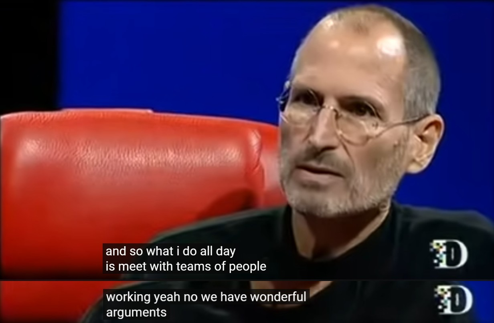
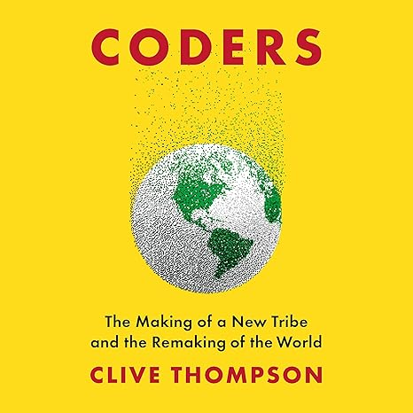

极客在如今是一个令人既熟悉又陌生的词汇，每个人或多或少都能说出一些极客的名字，但除此之外似乎我们已经不愿再刻意提及了。这个现象是如何潜移默化发生的？

## 学院派陷阱

最近引起讨论最多的文章非 Paul Graham 的[《Founder Mode》](https://paulgraham.com/foundermode.html)莫属。你也许不知道 Paul Graham 是谁，但你一定听说过他所著的图书《黑客与画家》，以及他所创立的孵化器 YCombinator。正如该文章标题所示，Paul  认为创业公司的管理方式不应该尊循职业经理人模式，即通过图表或层层汇报了了解公司全貌；而是应该回归到创始人模式（Founder Mode），即参与到每一个细节中。事实上后者也正是 Steve Jobs 治理苹果公司的模式。有兴趣的话你们可以搜寻一段名为 Steve Jobs talks about managing people 的[访谈](https://www.youtube.com/watch?v=f60dheI4ARg&ab_channel=ragni)，视频中乔布斯更愿意将苹果比作一家创业公司，并不厌其烦的参与到各类决策中

Paul 文章中所提倡的在现代商学院看来根本就是反模式，学院派认为 CEO 就应该“雇佣最好的人然后让他们放手去干”，“微管理”（micromanage）只会让团队和 CEO 自己都陷入狼狈。而打他们脸的是 Paul 所提出的观点并非空穴来风，是来自 Airbnb CEO Brian Chesky 对亲身经历的分享。

我并不是想借 Paul 去批评学院派（Paul 的本意也并非如此），相反在我成长为一名合格 Tech Leader 的过程中，[从学院派的建议中收获颇多](https://www.v2think.com/how-i-solve-lead-issue)。**真正让我感触的是，Paul 在文章中分享的现象——过分仰仗他者，崇拜方法论——似乎在潜移默化的成为工作方式的一部分**，**并且在我的周围蔓延**。这让我感到不安，因为这并非是我们习以为常的工作方式。

然而我们是谁？我们习以为常的工作方式又是怎样的？

## 从程序员到极客

程序员是怎样一群人？

在早期参加 Tech Lead 培训的过程中有一篇名为[《Opinion: The unspoken truth about managing geeks》](https://www.computerworld.com/article/1555366/opinion-the-unspoken-truth-about-managing-geeks.html)的文章让我印象深刻。文章恰到好处的概括了程序员为人处事的原则：他们打心底有一种特殊关于 “尊重（respect）” 的观念，这种对人的尊重与对方的地位、职位、爱好、谈吐毫无瓜葛，他们只会尊重能够把事情搞定的人。

最近在我阅读的另一本书《Coders》（中文版名为《天才程序员》）中，我找到了对此更为精准的描述

**“real programmers respect only running code”**

程序员是如此的痴迷代码以至于他们会做出许多反常识的职场行为，例如讨厌晋升到管理岗位。因为一旦对代码驾轻就熟之后，相比之下人只会带来更多的不确定性和挫败感，从这个角度上看 Tech Leader 可以被划分为两类，能够掩饰和无法掩饰自己无奈的。

挫败感的绝大部分源于程序员的“效率”被不情愿的降低了，例如他不明白为什么明明单枪匹马可以解决的问题，现在要花更多的时间去指导他人来完成，并且往往效果还不尽如人意。对效率的痴迷是刻在程序员骨子里的，注意这里的效率不仅仅包括狭义上的交付速率或者代码运行效率，还包括广义上的投入产出比：能工作的代码相比无法工作的代码是高效的，自动相对于手动是高效的，用10行代码实现某个功能比使用100行代码是更高效的，能够干十件事的代码比只能够干一件事的代码是更高效的。你几乎可以用它来解释一切你观察到的“怪异行为”，例如你总能在身边找到一小撮人能够自发改善工作流程，包括但不限于重构、制作小工具、分享捷径——这不是什么大爱无疆，只不过程序员天然无法容忍事倍功半而已。

相比对于代码的尊重，程序员对人的态度只可谓一般。他们会直言不讳的指出设计和代码中的问题，但实话实说这类声音大部分听起来都略显刻薄，一方面因为“委婉”并不是我们的强项，甚至沟通都不算是；另一方面对效率的狂热不自觉的会让我们变得咄咄逼人，类似的场景你一定 code review 现场或者 v2ex 论坛上常常看到。程序员之所以相轻道理就在于此，他们总是认为自己的代码才是正义。好在大部分时候他们是对的，如果言语无法说服你则会毫不犹豫的将代码搬上台面。马克扎克伯格在 Facebook 上市之际发表的一封公开信中写到：黑客们不会花上好几天来争论一个想法是否成立或者最佳实践是什么，而是会通过编写一个原型来验证它们的可行性。在 Facebook 的办公区域内你耳边总会游荡着一句口头禅“代码胜于雄辩（Code wins arguments）”……黑客文化是开放的也是优绩主义的（meritocratic）——**优绩主义非常重要，它曾经是这个行业的生存法则**（稍后我们聊“曾经”）。

优绩主义指在公平竞争的前提下，奖励应当依据人所付出的努力以及随之产生的成就高低来确定。例如学校就跟应该录取成绩最好的学生，最有能力的人就应该获得最高的薪水，它的本意旨在鼓励个体付出。但在当前的社会语境下它颇具负面意味，因为精英阶层会越来越相信他们的成功是自己的努力成就了他们自己，而忽略了家庭、机会、出生给他们带来的优势，由此心生傲慢。在编程的上下文中它趋于中性，它指你所有的回报、话语权仅仅与你的编码能力有关。这也解释了文章开头所说为什么我对于纸上谈兵的反感，talk it cheap, show me the code. 不过话说回来家庭、出生依然会对个人的编码能力带来影响

极客和程序员的区别是什么？

本质上他们都是一群技术的自由主义者，只不过极客将自由推向了极致——普通程序员对正确性的讨论永远是基于既有的技术框架，而极客们理解的正确性存在于他们脑袋的设想中，如果没有达到预期，那就持续改造直到满足需求，由此颠覆（或者说是破坏）便自然发生。这类成就通常会转化为他们的社会资本，所以说极客有另一层无法被抹去的底色：杰出人士。无论是身处公司、行业、还是某个垂直的编程领域中，对于业内人而言极客被人所津津乐道的是带来的技术突破；而在公众眼中极客近乎等同于成功企业家，要么他们打造的产品让千万人爱不释手，要么创造了千万级别的营收，说到底“极客”标签不是自我加冕的皇冠，而是来自他人的肯定。

每一代人心中的都有自己的极客，雷军可以是，乔布斯也算，而我心中独一无二的人选便是游戏 DOOM 的缔造者卡马克（Carmack）及罗梅罗（Romero），他们没日没夜的编写代码，以可乐和披萨为食，榨干机器的每一滴资源，毫无顾忌的 diss 公司里每一个看着不爽的人甚至炒老板鱿鱼——简直就是 i 人程序员的理想生活。

虽然“极客”二字是赢家的专利，但我坚持认为其内核却是普世的，如果我问你你所遇见的同事中是否存在极客，我相信你总能给我一两个名字。例如他们会自愿投入大量的业余时间来探索一个不起眼的配置如何影响全局，并且第二天用漫不经心的口吻的告诉你性能得到的了多大的提升。这一切难以理解却又值得理解，“怪异”使得他们闪闪发光。

程序员的优绩主义代表公平同时也代表着残酷，想要赢得尊重就只能写好代码。高职级、丰富的经验甚至成为了减分项，它们意味着你离一线越来越远，你活在过去多余活在现在。

## 10倍程序员的消失

顾名思义，十倍（10×）程序员能够带来相比于普通程序员的高达十倍的投入产出比。这不是什么夸张的修辞，在这个天才遍布的行业里，十倍也许只是个保守的数字。

先说结论：我明白每位程序员都期望自己成为团队里的摇滚明星，谁不享受力王狂澜的掌控感呢？但在现代软件工业中，我们应该尽力避免类似事情的发生。如果你读过《凤凰项目》一书就明白我在说什么：十倍程序员会和周围的环境达成一种默契，他乐意承担艰巨的任务，具有风险的任务也倾向指定分配给他。但长此以往无论这对于他个人还是对于团队都是无益的，疲于奔命在成为他工作常态的同时他也成为了团队的单点依赖。

**从长线维护和团队视角出发，软件工程的理念与个人诉求是冲突的，程序员倾向把自己想象成独一无二的手艺人，而软件工程则希望每个人都是可以被替换的螺丝钉**。极客也好十倍程序员也罢，他们的代码并非无懈可击。我见过不少人因为无法容忍时间与空间上的浪费，转而热衷于压榨代码的每一种可能性，但代价是他们植入的奇技淫巧让代码的可读性大打折扣。如果精心打磨的代码成了某几个人的专利，那么这类人应该被称为反派更合适，说到底，我们已经不再身处于那个卡马克和罗梅罗所处的软件作坊时代，现代软件开发需要的是大规模协作；软件成本的开销不再集中于发明创造阶段而是散布于持续迭代中。

当编码在被工业化重塑的同时，程序员群体也难以独善其身

技术精英至今依然存在，他们受雇于我们耳熟能详的顶尖大厂中。如果你去阅读有关 Facebook 与 Google 公司文化的图书（如《打造 Facebook》、《重新定义团队》），他们会很骄傲的告诉你他们只招聘世界上最好的人。精英们也切实在发挥他们的影响力，当下大多数开发者所收益的技术都来源于他们的开源。但别忘了他们只是金字塔顶部的那一小部分人，古典极客们受热情和好奇心来到这个行业，而如今（这两年不再成立了）每个人都想挤破脑袋进入这个行业的原因只不过是因为它可能带来阶级跃迁。当代软件行业早已是一个劳动密集型行，每个人不过是软件流水线上的蓝领工人而已，但这对我们每个人来说未必是坏事。

当下你需要行业资本才能够扎根于此，这些资本务必是为人所接受的通用货币，例如职称，项目经验，而“极客”这个词什么都代表不了。如果他的编程能力真的足够优秀，“架构师”、“Tech Leader”、“创始人”都是更为精准的称谓，又或者说出例举他参与的开源项目更直接了当。再举一个例子：假如你工作在阿里，刚好我告诉你我认识的一位编程好手跳槽去了你们公司，你想到的一定是第一时间去内网查他的职级。如果他工作十年才 P7，那么你一定会质疑我对于他“好”的评价。

“极客”像是行业在蛮荒时代对一群野蛮人的描述，他们的属性、职业等等都是模糊的。**而如今当职能足够细分、官僚体系足够森严、留给个体自由发挥的空间日渐减少之后，“极客”似乎被一种更高级的理性消解掉了**。

但优绩主义不会消失，只要代码还存在中断的可能性，只要快与慢尚存在区别，就总会有人试图改善它，也许这是极客得以延续的另一种方式。

---

最后，我们也录制了一期有关“极客”的的播客节目，你可以在那里听到更多的内容和不一样的观点，欢迎[点击收听](https://www.xiaoyuzhoufm.com/episode/670cd576d9a875d5a936bd6a)